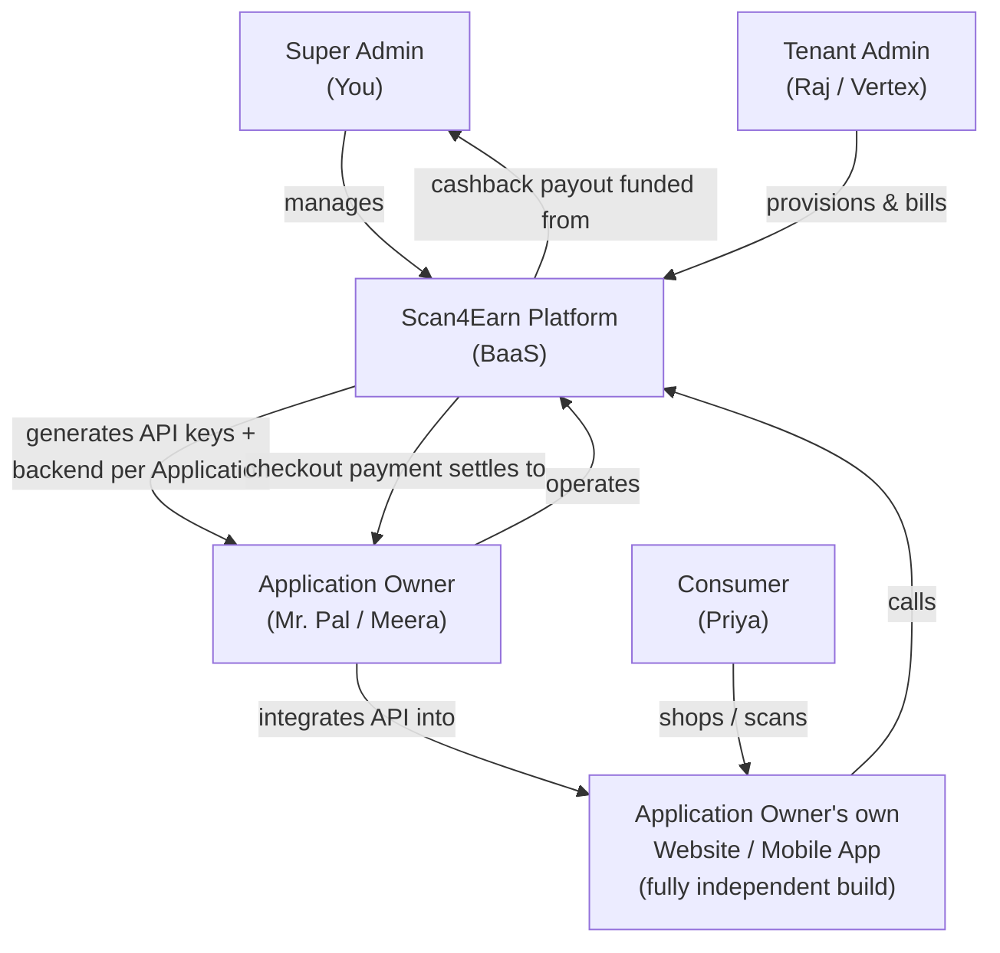
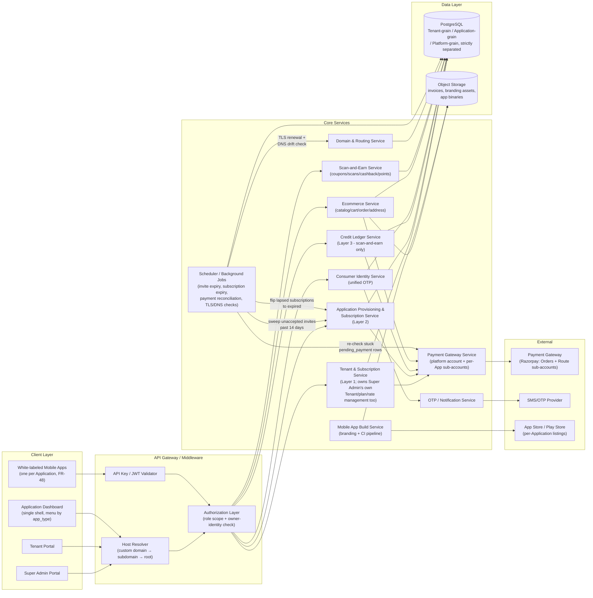
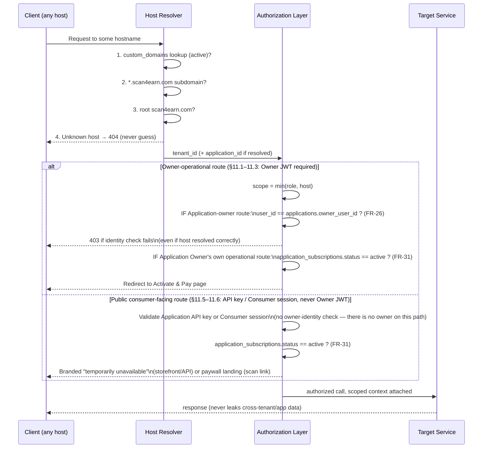
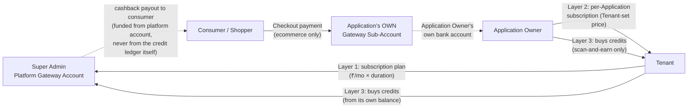
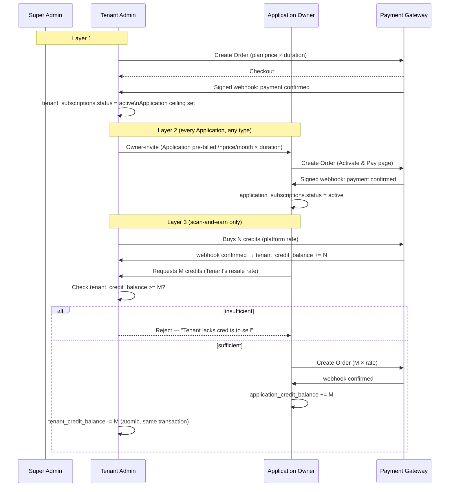
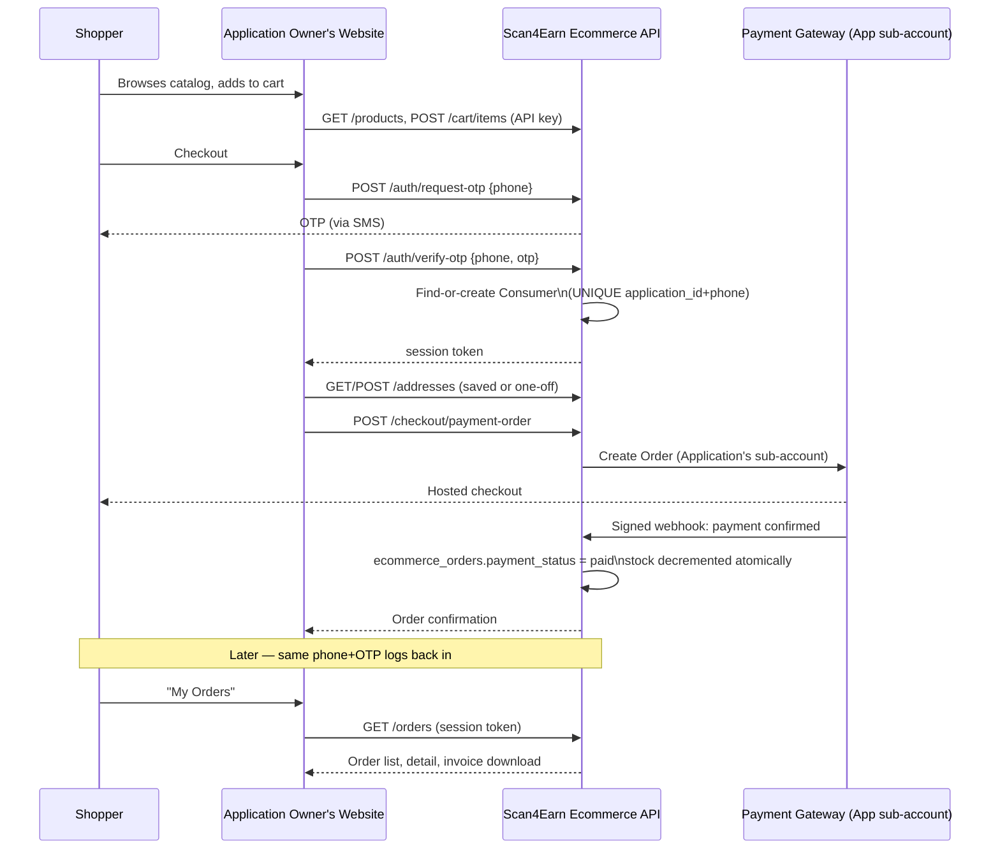
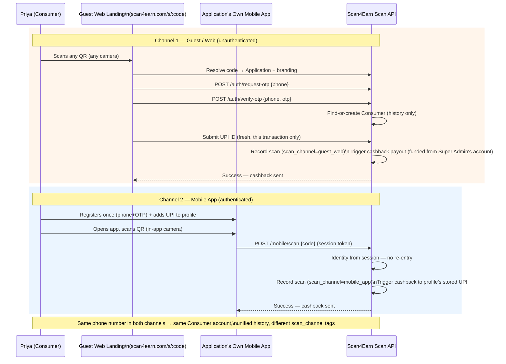
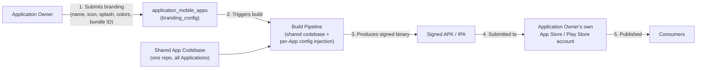

# Scan4Earn — High-Level Design (HLD)

**Status:** Draft v2 — companion to `product-plan/PRD.md` (Final) and `product-plan/ideal-application-flow.html`; expands the API surface into a full per-caller inventory (Super Admin / Tenant Admin / Application Dashboard / Common / Public Consumer)
**Owner:** Sumant Mishra
**Scope:** Technical architecture, component breakdown, money/data flow diagrams, and the full exposed API surface for Ecommerce and Scan-and-Earn Applications.
**Not in scope here:** product rationale/requirements (see PRD), phased delivery plan (see `phases/phase1..9/prd.md`), UI/visual design.

---

## 1. Architecture Principles (carried from the PRD, restated as design constraints)

1. **Three-tier isolation is enforced in code, not just UI.** Super Admin and Tenant Admin queries physically cannot join into Application-grain tables — this is a middleware/authorization-layer guarantee, checked in CI.
2. **One Application, one owner, one dashboard shell.** `app_type` (`ECOMMERCE`/`SCAN_AND_EARN`/`HYBRID`) is a runtime flag, not a different codebase.
3. **Four money flows never share a settlement account** except where explicitly designed to (Layers 1–3 settle to the platform; Checkout settles to the Application Owner). See §6.
4. **The consumer-facing website/app is never Scan4Earn's to build.** Every Application-facing API is designed to be consumed by a client Scan4Earn does not own.
5. **Everything payment-related is signed-webhook-confirmed**, never trusted from a client callback.

---

## 2. System Context Diagram

**Reading this diagram:** the platform is the hub, but the consumer never talks to the platform directly except via (a) the Application Owner's own site/app, or (b) the one permanent guest-scan landing page. This is the BaaS boundary — everything the platform can see architecturally stops at "did an API call happen," never "what does the storefront look like."

---

## 3. Component / Service Breakdown

### Service responsibilities

| Service | Owns | Never touches |
|---|---|---|
| Tenant & Subscription Service | `subscription_plans`, `tenant_subscriptions`, Tenant CRUD | Application-grain tables |
| Application Provisioning & Subscription Service | `applications`, `application_subscriptions`, owner-invite lifecycle | Cross-Application data |
| Credit Ledger Service | `platform_credit_rate`, `tenant_credit_rate`, `tenant_credit_balance`, `application_credit_balance`, `*_credit_requests`, `*_credit_transactions` | Real cashback payouts (that's Payment Gateway Service, funded from the Super Admin's own account) |
| Consumer Identity Service | `users` (role `CUSTOMER`), OTP issuance/verification, `user_upi_details` | Super Admin, Tenant Admin, or Application Owner login — those are each a single account owned by their own service (TENSVC / APPSVC respectively), never a shared identity pool |
| Ecommerce Service | `products`, `categories`, `ecommerce_orders`, `ecommerce_carts`, `customer_addresses`, invoices | Scan/coupon logic |
| Scan-and-Earn Service | `coupons`, `coupon_batches`, `scans`, `points_transactions`, `cashback_transactions`, `redemption_requests` | Ecommerce catalog/orders |
| Payment Gateway Service | Gateway Orders, Route sub-accounts, signed-webhook verification, idempotency | Business logic — it only moves money and reports status |
| Domain & Routing Service | `custom_domains`, TLS lifecycle, DNS drift checks | Anything past host→tenant/application resolution |
| Mobile App Build Service | `application_mobile_apps`, branding config, CI build triggers | Runtime API logic (calls back into Consumer/Ecommerce/Scan services like any other client) |
| Scheduler / Background Jobs | Recurring sweeps only — no data of its own: invite-expiry (Phase 1), subscription-expiry → paywall trigger (Phase 4), payment reconciliation against the gateway (Phase 3/4/5/8), TLS renewal + DNS drift re-checks (Phase 6) | Any business logic — it only triggers the owning service's own state transition, never mutates data directly |

---

## 4. Request Resolution & Authorization Architecture

**Design guarantee:** host resolution, role/identity, and billing status are independent, sequential checks — never conflated into one, and never assumed to imply each other. A correctly resolved host is necessary but never sufficient (FR-5/FR-10, admin tiers never see business data). The **owner-identity check (FR-26)** applies only on the Owner-operational branch — the public consumer branch has no such concept, since a shopper or scanner never carries an Owner JWT. The **billing-status check (FR-31)** applies on *both* branches independently: an owner whose Application has lapsed is redirected to the single Activate & Pay page on their own dashboard, while the same lapse simultaneously blocks anonymous consumer traffic on the storefront/API and the scan landing page — two different response shapes (an internal redirect vs. a branded public page) enforcing the same underlying gate.

**Known latency window (accepted tradeoff):** the billing-status check reads `application_subscriptions.status`, which the Scheduler (§3) flips to `expired` on a periodic sweep after `end_date` passes — it is not computed live from `end_date` on every request. This bounds the gate's accuracy to the sweep interval rather than the exact second of expiry. If tighter enforcement is ever required, switch this check to a live `end_date` comparison instead of the batch-flipped status column.

---

## 5. Data Architecture — Grain Model

Every table lives at exactly one grain. No query may join across grains upward (Application → Tenant → Platform is fine for FK integrity; the reverse, an admin-tier query reaching into Application data, is a build-breaking CI violation).

| Grain | Representative tables | Who may query |
|---|---|---|
| **Platform** | `features`, `permissions`, `subscription_plans`, `platform_credit_rate` | Super Admin only |
| **Tenant** | `tenants`, `tenant_credit_balance`, `tenant_credit_rate`, `credit_requests`, `tenant_subscriptions`, `product_templates`, `custom_domains` | Super Admin (all rows), Tenant Admin (own rows) |
| **Application** | `products`, `coupons`, `coupon_batches`, `ecommerce_orders`, `scans`, `points_transactions`, `cashback_transactions`, `stock_movements`, `webhooks`, `api_usage_logs`, `application_credit_balance`, `application_credit_transactions`, `customer_addresses`, `application_payment_accounts`, `application_mobile_apps` | **Only** a session whose `user_id` = that Application's `owner_user_id` |
| **Application** *(narrow Tenant Admin carve-out, DR-3)* | `application_subscriptions`, `application_credit_requests` | Application Owner: full row. **Tenant Admin: billing/administrative columns only** (price, duration, status, renewal date, requested amount, request status — never balance amounts or any operational table) — required by FR-6d/FR-20, since the Tenant Admin is the one who sets Layer-2 pricing and approves/rejects Layer-3 credit requests. This is the one intentional exception to "Application-grain = owner-only"; it does not extend to `application_credit_balance`, `application_credit_transactions`, or any order/scan/cashback/inventory table. |
| **End user** | `users` (role `CUSTOMER`), `user_upi_details` (rescoped to `application_id`) | Application Owner (aggregate/list), the Consumer themself (own record only) |

Full column-level detail: see PRD §7 (DR-1 through DR-23, including the DR-3 carve-out above). This HLD does not repeat it — it exists to show *where the boundary lives architecturally*.

---

## 6. Money Flow Architecture

Four independent flows. Diagrammed together once so the boundaries are unmistakable:

| Flow | Trigger | Settles to | Gateway capability needed |
|---|---|---|---|
| Layer 1 | Tenant subscribes/renews a plan | Platform account | Standard Orders API |
| Layer 2 | Application Owner activates/renews | Platform account | Standard Orders API |
| Layer 3 | Tenant buys credits; Application buys credits from Tenant | Platform account | Standard Orders API (ledger movement is internal, not a gateway transfer) |
| Checkout | Shopper places a paid order | **Application Owner's own account** | Marketplace/sub-account capability (e.g. Razorpay Route) — genuinely different integration from the other three |

**Critical separation:** Layer 3's credit ledger is an *entitlement* system (who may create how many coupons). The actual cashback payout to a consumer is a *separate* disbursement, always funded from the Super Admin's own configured payout account — never from a Tenant's or Application's credit balance directly. Conflating these two in implementation is the single highest-risk design mistake this HLD calls out.

---

## 7. Billing & Credit Cascade — Sequence

---

## 8. Consumer Identity & Ecommerce Checkout — Sequence

---

## 9. Scan-and-Earn — Two Channels — Sequence

---

## 10. White-Labeled Mobile App Build Pipeline

**Operational note (see PRD NFR-12):** step 2–4 repeats **per Application, per codebase release** — there is no OTA shortcut in this version. This is the most expensive recurring workflow in the whole system and should be tracked as an ongoing release-engineering cost, not a one-time build.

---

## 11. Exposed API Surface — Full Inventory by Caller

Every API in the platform belongs to exactly one of six callers. The **Functionality** column states what the endpoint does in one line; the **Auth** column states who/what may call it. There is no shared "staff" identity pool anywhere in this system — Super Admin, Tenant Admin, and Application Owner are each **exactly one account**, full stop (Consumer is the only many-per-Application role). Sections 11.1–11.4 each carry their own role-specific login and are never reachable by a Consumer session or a bare Application API key (per §4's identity check). Sections 11.5–11.6 are the actual BaaS deliverable — the APIs an Application Owner integrates into their own website/app.

### 11.1 Super Admin APIs
Base: `scan4earn.com/api/admin/*`. Auth: **Super Admin JWT** only — rejected for every other role (FR-5). Owned by the Tenant &amp; Subscription Service (§3).

Login is a shared endpoint with Tenant Admin (`/api/auth/*` — see §11.4), disambiguated by hostname via the Host Resolver (§4): root `scan4earn.com` always resolves to the one Super Admin account, never to a Tenant's.

| Method | Path | Auth | Functionality |
|---|---|---|---|
| POST | `/tenants` | Super Admin JWT | Create a new Tenant (name, email, subdomain slug) |
| GET | `/tenants` | Super Admin JWT | List all Tenants with admin-grain fields only (status, Application count, subscription) |
| GET | `/tenants/:id` | Super Admin JWT | Tenant detail — billing/status only, never its Applications' operational data |
| PATCH | `/tenants/:id/status` | Super Admin JWT | Suspend / reactivate a Tenant |
| GET | `/plans` | Super Admin JWT | List the subscription-plan catalog |
| POST | `/plans` | Super Admin JWT | Create a new plan (name, price/month, max Applications) |
| PUT | `/plans/:id` | Super Admin JWT | Edit a plan |
| PATCH | `/plans/:id/deactivate` | Super Admin JWT | Retire a plan (existing subscribers unaffected) |
| GET | `/credit-rate` | Super Admin JWT | View the current platform-wide INR-per-credit rate |
| PUT | `/credit-rate` | Super Admin JWT | Update the platform-wide rate (future purchases only, never retroactive) |
| GET | `/credit-requests` | Super Admin JWT | List Tenants' credit purchase requests (all payment states) |
| GET | `/credit-requests/:id` | Super Admin JWT | Detail of one Tenant credit request, incl. payment/gateway reference |
| GET | `/features` | Super Admin JWT | List global feature flags |
| POST | `/features` | Super Admin JWT | Create a new global feature flag |
| PATCH | `/features/:id` | Super Admin JWT | Enable/disable a feature flag, set default |
| GET | `/templates/system` | Super Admin JWT | List system-level (cross-Tenant) product templates |
| POST | `/templates/system` | Super Admin JWT | Create a new system template |
| GET | `/dashboard/stats` | Super Admin JWT | Platform-wide counts: Tenants, Applications by type, active subscriptions, credits sold, pending requests — **never** an order/scan/cashback figure (FR-4/NFR-1) |
| GET | `/tenants/health` | Super Admin JWT | Sortable/filterable per-Tenant health list: name, Application count, subscription status, last payment (FR-19 rich, Phase 7) — distinct from the aggregate `/dashboard/stats` above |
| GET | `/audit-logs` | Super Admin JWT | Platform-wide audit trail |

### 11.2 Tenant Admin APIs
Base: `{tenant's portal domain}/api/tenant/*`. Auth: **Tenant Admin JWT** — a Super Admin JWT is a different role and is not substitutable here; an Application Owner JWT is rejected outright (FR-10). One account per Tenant, no team/staff concept (owned by the Tenant &amp; Subscription Service, §3).

Login is a shared endpoint with Super Admin (`/api/auth/*` — see §11.4), disambiguated by hostname via the Host Resolver (§4): this Tenant's subdomain/custom domain always resolves to this Tenant's one admin account, never Super Admin's or another Tenant's.

| Method | Path | Auth | Functionality |
|---|---|---|---|
| GET | `/profile` | Tenant Admin JWT | View/update the Tenant's own profile and branding |
| GET | `/plans` | Tenant Admin JWT | Browse the Super Admin's plan catalog to choose from |
| POST | `/subscribe` | Tenant Admin JWT | Subscribe to a plan + duration → creates a gateway Order (Layer 1) |
| GET | `/subscription` | Tenant Admin JWT | View own current plan, status, renewal date, Application ceiling |
| POST | `/applications` | Tenant Admin JWT | Provision a new Application: `app_type`, name, branding, **and its Layer-2 billing terms** (`price_per_month`, `duration_months`) |
| GET | `/applications` | Tenant Admin JWT | Administrative list of own Applications — name, client, type, status, owner, credits consumed, subscription tier (never operational data — FR-9) |
| GET | `/applications/:id` | Tenant Admin JWT | Administrative detail of one Application (same restriction) |
| POST | `/applications/:id/invite` | Tenant Admin JWT | Send the owner-invite email/OTP (14-day expiry) |
| POST | `/applications/:id/invite/resend` | Tenant Admin JWT | Resend an unaccepted invite |
| DELETE | `/applications/:id` | Tenant Admin JWT | Cancel a never-accepted Application (frees the plan's Application slot) |
| GET | `/credits/balance` | Tenant Admin JWT | View own credit balance (bought from Super Admin) |
| POST | `/credits/request` | Tenant Admin JWT | Request N credits from Super Admin → gateway Order (Layer 3) |
| GET | `/credits/transactions` | Tenant Admin JWT | Own credit transaction ledger |
| GET | `/credit-rate` | Tenant Admin JWT | View own resale rate for Applications (or platform default if unset) |
| PUT | `/credit-rate` | Tenant Admin JWT | Set own resale rate |
| GET | `/applications/:id/credit-requests` | Tenant Admin JWT | List an Application's pending credit requests |
| POST | `/applications/:id/credit-requests/:reqId/approve` | Tenant Admin JWT | Manual override only — normal path is auto-approval on confirmed payment (RD-7) |
| GET | `/templates` | Tenant Admin JWT | List/manage product templates available to own Applications |
| POST | `/templates` | Tenant Admin JWT | Create a template (editable only until first product is added, per PRD §1) |
| GET | `/dashboard/stats` | Tenant Admin JWT | Own rollup: client count, Applications used/plan ceiling, credit balance/burn, pending invites/requests — **never** an order/scan/cashback figure (FR-10/NFR-1) |
| POST | `/domains` | Tenant Admin JWT | Register a custom domain for the reseller portal (Tenant-level, `application_id = NULL`) |
| GET | `/domains` | Tenant Admin JWT | List own custom domains + verification/TLS status |

### 11.3 Application Dashboard APIs (Owner-facing, both Ecommerce and Scan-and-Earn management)
Base: `{application's effective domain}/api/app/*`. Auth: **Application Owner JWT** — must equal `applications.owner_user_id` (§4); rejected for Tenant Admin and Super Admin, even for the Application's own Tenant. One shared endpoint set; which group actually returns data depends on `app_type`. **Status** compares each endpoint against what exists in the codebase today: **New** = does not exist yet, **Needs Modification** = exists but must change (ownership model, new gating, new fields), **No Change** = exists and is reused as-is under the new owner-JWT scoping.

**Login (one account per Application — or per owner, if the same person owns more than one, §11.3's Auth column note above)**
| Method | Path | Auth | Functionality | Status |
|---|---|---|---|---|
| POST | `/auth/request-otp` | Public (rate-limited) | Send OTP to this Application's one owner account | No Change *(existing `appAuth.routes.js`, re-scoped from `APP_MANAGER`/`APP_VIEWER` to the single `APPLICATION_OWNER` role, DR-5)* |
| POST | `/auth/verify-otp` | Public (rate-limited) | Verify OTP, issue Owner JWT | No Change |
| POST | `/auth/refresh` | Refresh token | Refresh session | No Change |
| GET | `/auth/context` | Owner JWT | Current Application/role context for the logged-in owner | No Change |
| POST | `/auth/logout` | Owner JWT | Invalidate session | No Change |

**Profile, API keys &amp; self-service docs**
| Method | Path | Auth | Functionality | Status |
|---|---|---|---|---|
| GET | `/profile` | Owner JWT | View the Application's own branding, name, currency, `app_type` | Needs Modification *(existing `getApiConfig`-style read, needs `app_type` added)* |
| PUT | `/profile` | Owner JWT | Update branding, name, currency | Needs Modification |
| GET | `/api-config` | Owner JWT | View API config (enabled channels, rate limits, key previews) | No Change *(existing `apiConfigController.getApiConfig`)* |
| PUT | `/api-config` | Owner JWT | Update API config | No Change *(existing `updateApiConfig`)* |
| POST | `/api-config/regenerate-mobile-key` | Owner JWT | Rotate the scan-and-earn (mobile) API key | No Change *(existing `regenerateMobileKey`)* |
| POST | `/api-config/regenerate-ecommerce-key` | Owner JWT | Rotate the ecommerce API key | No Change *(existing `regenerateEcommerceKey`)* |
| POST | `/api-config/enable-mobile-api` | Owner JWT | Enable the scan-and-earn API channel | Needs Modification *(existing `enableMobileApi`; should now default from `app_type` rather than a free toggle)* |
| POST | `/api-config/enable-ecommerce-api` | Owner JWT | Enable the ecommerce API channel | Needs Modification *(existing `enableEcommerceApi`; same reason)* |
| GET | `/api-usage` | Owner JWT | API usage statistics | No Change *(existing `getApiUsage`)* |
| GET | `/api-docs` | Owner JWT | Self-service Swagger-style endpoint reference | Needs Modification *(existing `apiDocsController.getApiDocs`; must filter by `app_type` per FR-28–30 and add the new consumer-auth/address/checkout/invoice groups)* |

**Billing — Layer 2 (every Application, any type)**
| Method | Path | Auth | Functionality | Status |
|---|---|---|---|---|
| GET | `/billing/subscription` | Owner JWT | View own subscription status, price, renewal date | New |
| POST | `/billing/activate` | Owner JWT | Pay to activate — the single Activate &amp; Pay page (FR-11a) | New |
| POST | `/billing/renew` | Owner JWT | Renew before or after expiry (same page, FR-11f) | New |

**Credits — Layer 3 (scan-and-earn / hybrid only)**
| Method | Path | Auth | Functionality | Status |
|---|---|---|---|---|
| GET | `/credits/balance` | Owner JWT | View own `application_credit_balance` | New |
| POST | `/credits/request` | Owner JWT | Request M credits from own Tenant → gateway Order | New |
| GET | `/credits/transactions` | Owner JWT | Own credit transaction ledger | New |

**Checkout payment sub-account (ecommerce / hybrid only)**
| Method | Path | Auth | Functionality | Status |
|---|---|---|---|---|
| GET | `/payment-account` | Owner JWT | View own gateway sub-account onboarding/KYC status | New |
| POST | `/payment-account/onboard` | Owner JWT | Start/continue gateway sub-account onboarding (NFR-11) | New |

**Catalog — products, categories, tags, templates (ecommerce / hybrid only)**
| Method | Path | Auth | Functionality | Status |
|---|---|---|---|---|
| GET | `/products` | Owner JWT | List own products | No Change *(existing `products.routes.js`)* |
| GET | `/products/:id` | Owner JWT | Product detail | No Change |
| GET | `/products/:id/attributes` | Owner JWT | Template-driven attribute values for a product | No Change |
| POST | `/products` | Owner JWT | Create a product against the Application's one active template | Needs Modification *(existing; must enforce the template-lock-after-first-product rule, PRD §1)* |
| PUT | `/products/:id` | Owner JWT | Update a product | No Change |
| DELETE | `/products/:id` | Owner JWT | Remove a product | No Change |
| GET | `/categories` | Owner JWT | List own categories | New *(owner-side CRUD; only a read-only consumer version exists today)* |
| POST | `/categories` | Owner JWT | Create a category | New |
| PUT | `/categories/:id` | Owner JWT | Update a category | New |
| DELETE | `/categories/:id` | Owner JWT | Delete a category | New |
| GET | `/tags` | Owner JWT | List own tags | No Change *(existing `tag.routes.js`)* |
| GET | `/tags/:id` | Owner JWT | Tag detail | No Change |
| POST | `/tags` | Owner JWT | Create a tag | No Change |
| PUT | `/tags/:id` | Owner JWT | Update a tag | No Change |
| DELETE | `/tags/:id` | Owner JWT | Delete a tag | No Change |
| GET | `/templates` | Owner JWT | View the Tenant-provided template library plus any own custom template | Needs Modification *(existing template list; must enforce "one template per Application" and lock-after-first-product, PRD §1)* |
| POST | `/templates` | Owner JWT | Create a custom template for this Application (allowed by PRD §1) | New |
| PUT | `/templates/:id` | Owner JWT | Edit a template — rejected once any product using it exists | New |

**Inventory (ecommerce / hybrid only)**
| Method | Path | Auth | Functionality | Status |
|---|---|---|---|---|
| POST | `/products/:id/stock` | Owner JWT | Adjust stock quantity | No Change *(existing `inventory.routes.js`)* |
| GET | `/products/:id/stock/movements` | Owner JWT | Stock movement history for one product | No Change |
| GET | `/inventory/low-stock` | Owner JWT | Products below their low-stock threshold | No Change |
| GET | `/inventory/out-of-stock` | Owner JWT | Products with zero stock | No Change |

**Orders (ecommerce / hybrid only)**
| Method | Path | Auth | Functionality | Status |
|---|---|---|---|---|
| GET | `/orders` | Owner JWT | Full order list for this Application (unrestricted, unlike the "own orders only" consumer session version in §11.5) | Needs Modification *(existing `staffOrdersController.listOrders`; re-scope from Tenant-permission model to owner-JWT model, add `payment_status`/`invoice_url`)* |
| GET | `/orders/:id` | Owner JWT | Order detail | Needs Modification *(existing `getOrder`; same reasons)* |
| PATCH | `/orders/:id/status` | Owner JWT | Transition order status — the only caller ever allowed to do this (FR-42) | Needs Modification *(existing endpoint currently reachable by the shopper's own header — must become owner-only)* |
| GET | `/orders/:id/invoice` | Owner JWT | Owner's own re-download of a generated invoice | New |
| GET | `/orders/export` | Owner JWT | Export order/GMV data as CSV over a date range (PRD §6.5, FR-21 dashboard polish) | New |

**Coupon batches (scan-and-earn / hybrid only)**
| Method | Path | Auth | Functionality | Status |
|---|---|---|---|---|
| GET | `/coupon-batches` | Owner JWT | List own coupon batches | No Change *(existing `batchRoutes.js` GET /)* |
| GET | `/coupon-batches/:id` | Owner JWT | Batch detail | No Change |
| POST | `/coupon-batches` | Owner JWT | Create a batch | Needs Modification *(existing POST / already debits atomically with proper insufficient-balance rejection — verified against the real code; the actual change needed is redirecting the debit source from `tenant_credit_balance` to `application_credit_balance`, FR-13/DR-17)* |
| POST | `/coupon-batches/:id/assign-codes` | Owner JWT | Assign/generate codes for a batch | No Change *(existing `couponGeneratorService` already generates CSPRNG non-enumerable codes — verified against the real code; NFR-4 exists to guard against regressing this, not to fix it)* |
| POST | `/coupon-batches/:id/activate` | Owner JWT | Activate a batch | No Change |
| POST | `/coupon-batches/:id/print` | Owner JWT | Mark a batch printed | Needs Modification *(existing, under `/coupons/batch/:batch_id/print` today — consolidate into one `coupon-batches` namespace)* |
| POST | `/coupon-batches/:id/deactivate` | Owner JWT | Deactivate a batch | Needs Modification *(existing, same consolidation)* |
| GET | `/coupon-batches/:id/stats` | Owner JWT | Batch-level stats | No Change |

**Coupons (scan-and-earn / hybrid only)**
| Method | Path | Auth | Functionality | Status |
|---|---|---|---|---|
| GET | `/coupons` | Owner JWT | List own coupons | No Change *(existing `rewards.routes.js`)* |
| GET | `/coupons/:id` | Owner JWT | Coupon detail | No Change |
| POST | `/coupons` | Owner JWT | Create a single coupon | Needs Modification *(credit-gate + non-enumerable code, same as batch creation)* |
| POST | `/coupons/multi-batch` | Owner JWT | Create coupons across multiple batches | Needs Modification *(same gating)* |
| PATCH | `/coupons/:id/status` | Owner JWT | Change coupon status | No Change |
| POST | `/coupons/activate-range` | Owner JWT | Bulk-activate a serial range | No Change |
| POST | `/coupons/activate-batch` | Owner JWT | Bulk-activate a batch | No Change |
| POST | `/coupons/bulk-activate` | Owner JWT | Bulk-activate arbitrary coupons | No Change |
| PATCH | `/coupons/:id/print` | Owner JWT | Mark one coupon printed | No Change |
| POST | `/coupons/bulk-print` | Owner JWT | Bulk-print | No Change |
| POST | `/coupons/deactivate-range` | Owner JWT | Bulk-deactivate a serial range | No Change |

**Scans (scan-and-earn / hybrid only)**
| Method | Path | Auth | Functionality | Status |
|---|---|---|---|---|
| GET | `/scans/history` | Owner JWT | Full scan history for this Application | Needs Modification *(existing; must surface the new `scan_channel` tag, DR-22)* |
| GET | `/scans/analytics` | Owner JWT | Scan/cashback/points KPIs | Needs Modification *(existing `getAppAnalytics`; split ecommerce vs scan-and-earn KPI sets and add a channel breakdown)* |

**Redemptions &amp; cashback (scan-and-earn / hybrid only)**
| Method | Path | Auth | Functionality | Status |
|---|---|---|---|---|
| GET | `/redemptions` | Owner JWT | List redemption requests for this Application | Needs Modification *(existing `redemptionAdmin.routes.js` GET /; re-scope from Tenant-grain to Application-grain)* |
| GET | `/redemptions/summary` | Owner JWT | Redemption summary counts | Needs Modification *(same re-scoping)* |
| GET | `/redemptions/:id` | Owner JWT | Redemption detail | Needs Modification |
| POST | `/redemptions/:id/approve` | Owner JWT | Approve a redemption | Needs Modification |
| POST | `/redemptions/:id/reject` | Owner JWT | Reject a redemption | Needs Modification |
| GET | `/cashback/transactions` | Owner JWT | Own Application's cashback transaction log | Needs Modification *(existing `cashbackAdmin.routes.js` GET /transactions; re-scope the same way)* |

**Dashboard &amp; customers**
| Method | Path | Auth | Functionality | Status |
|---|---|---|---|---|
| GET | `/dashboard/stats` | Owner JWT | KPI set matching `app_type` (PRD §6.5) — the only tier where these numbers exist | Needs Modification *(existing `dashboard.routes.js` GET /stats; must split by `app_type` and add billing/credit summary cards)* |
| GET | `/customers` | Owner JWT | List this Application's Consumer accounts (profile-level) | New |
| GET | `/customers/:id` | Owner JWT | One Consumer's profile, order/scan history within this Application | New |

**Webhooks (outbound events to the Application Owner's own systems)**
| Method | Path | Auth | Functionality | Status |
|---|---|---|---|---|
| POST | `/webhooks` | Owner JWT | Register a webhook endpoint | No Change *(existing `webhooks.routes.js`)* |
| GET | `/webhooks` | Owner JWT | List registered webhooks | No Change |
| PUT | `/webhooks/:id` | Owner JWT | Update a webhook | No Change |
| DELETE | `/webhooks/:id` | Owner JWT | Remove a webhook | No Change |
| GET | `/webhooks/:id/logs` | Owner JWT | Delivery log for a webhook | No Change |
| POST | `/webhooks/:id/test` | Owner JWT | Send a test event | No Change |

**Custom domain (this Application's own, B2 — PRD §6.6/FR-25)**
| Method | Path | Auth | Functionality | Status |
|---|---|---|---|---|
| GET | `/domains` | Owner JWT | List this Application's own custom domain(s) + verification/TLS status | New |
| POST | `/domains` | Owner JWT | Map a custom domain directly to this Application (`application_id` = this Application) | New |
| POST | `/domains/:id/verify` | Owner JWT | Trigger TXT/CNAME re-check for a pending domain | New |
| DELETE | `/domains/:id` | Owner JWT | Remove a mapped domain | New |

**White-labeled mobile app (scan-and-earn / hybrid only)**
| Method | Path | Auth | Functionality | Status |
|---|---|---|---|---|
| POST | `/mobile-app/branding` | Owner JWT | Submit branding config (name, icon, splash, colors, bundle ID) | New |
| POST | `/mobile-app/build` | Owner JWT | Trigger a build via the pipeline (§10) | New |
| GET | `/mobile-app/status` | Owner JWT | Build/publish status | New |

### 11.4 Common / Shared Platform APIs
Not tied to one tier — infrastructure every portal and every consumer surface depends on.

**Authentication (shared by Super Admin and Tenant Admin — one login mount, disambiguated by hostname, never a shared identity: root domain → the one Super Admin account, a Tenant's own domain → that Tenant's one admin account)**
| Method | Path | Auth | Functionality | Status |
|---|---|---|---|---|
| POST | `/auth/request-otp` | Public (rate-limited) | Send OTP to whichever single account the resolved host belongs to | No Change *(existing `auth.routes.js`)* |
| POST | `/auth/verify-otp` | Public (rate-limited) | Verify OTP, issue a JWT scoped to that account's role (Super Admin or Tenant Admin) | No Change |
| POST | `/auth/refresh` | Refresh token | Refresh session | No Change |
| GET | `/auth/context` | Super Admin or Tenant Admin JWT | Current role/Tenant context for the logged-in account | No Change |
| POST | `/auth/logout` | Super Admin or Tenant Admin JWT | Invalidate session | No Change |

| Method | Path | Auth | Functionality |
|---|---|---|---|
| GET | `/tenant-branding` | Public | Resolves the calling hostname → Tenant/Application branding, used by every portal on page load (§4) |
| POST | `/webhooks/gateway/subscription` | Gateway signature | Signed webhook receiver — Layer 1 &amp; Layer 2 subscription payments |
| POST | `/webhooks/gateway/credits` | Gateway signature | Signed webhook receiver — Layer 3 credit purchases (Tenant and Application) |
| POST | `/webhooks/gateway/checkout` | Gateway signature | Signed webhook receiver — ecommerce checkout payments (routed to the correct Application sub-account) |
| GET | `/health` | Public | Liveness/readiness probe |

### 11.5 Public Consumer-Facing APIs — Ecommerce
Base path pattern: `{application's effective domain}/api/ecommerce/v1/*` (resolved via the Host Resolver, §4) — the actual BaaS deliverable an Application Owner integrates into their own website. Auth: **API key** = Application-level key (server-to-server); **Consumer session** = phone+OTP-issued token.

**Consumer Authentication**
| Method | Path | Auth | Functionality |
|---|---|---|---|
| POST | `/auth/request-otp` | API key | Send OTP to a phone number for this Application |
| POST | `/auth/verify-otp` | API key | Verify OTP → find-or-create Consumer account, issue session token |

**Catalog** *(existing, per `ecommerceApi.routes.js` / `ecommerce_api_endpoints.json`)*
| Method | Path | Auth | Functionality |
|---|---|---|---|
| GET | `/products` | API key | List/search products, paginated |
| GET | `/products/:id` | API key | Product detail |
| GET | `/products/:id/stock` | API key | Real-time stock info |
| GET | `/templates` | API key | The Application's single active product template |
| GET | `/categories` | API key | List categories |
| GET | `/categories/:id/products` | API key | Paginated products in a category |

**Cart &amp; Wishlist** *(existing)*
| Method | Path | Auth | Functionality |
|---|---|---|---|
| GET | `/cart` | Consumer session | Get current cart |
| POST | `/cart/items` | Consumer session | Add item (increments on conflict) |
| PUT | `/cart/items/:productId` | Consumer session | Set quantity |
| DELETE | `/cart/items/:productId` | Consumer session | Remove item |
| DELETE | `/cart` | Consumer session | Clear cart |
| GET | `/wishlist` | Consumer session | Get wishlist |
| POST | `/wishlist` | Consumer session | Add to wishlist |
| DELETE | `/wishlist/:productId` | Consumer session | Remove from wishlist |

**Address Book** *(new — DR-18)*
| Method | Path | Auth | Functionality |
|---|---|---|---|
| GET | `/addresses` | Consumer session | List saved addresses |
| POST | `/addresses` | Consumer session | Create address |
| PUT | `/addresses/:id` | Consumer session | Update address |
| DELETE | `/addresses/:id` | Consumer session | Delete address |
| POST | `/addresses/:id/set-default` | Consumer session | Mark as default |

**Checkout &amp; Payment** *(new — DR-19/20, FR-40/41)*
| Method | Path | Auth | Functionality |
|---|---|---|---|
| POST | `/checkout/payment-order` | Consumer session | Create a gateway Order against the Application's own sub-account for the cart total |

**Orders &amp; Invoices** *(existing + extended — FR-42/43)*
| Method | Path | Auth | Functionality |
|---|---|---|---|
| POST | `/orders` | Consumer session | Place an order (from cart or explicit items) |
| GET | `/orders` | Consumer session | List the calling Consumer's **own** orders only (filter by status) |
| GET | `/orders/:id` | Consumer session | Order detail with items — own order only |
| POST | `/orders/:id/cancel` | Consumer session | Cancel — only while in an owner-configured cancellable status |
| GET | `/orders/:id/invoice` | Consumer session | Download generated invoice |

### 11.6 Public Consumer-Facing APIs — Scan &amp; Earn
Two distinct channels (§9) sharing the same Application/Consumer data model but different auth and base paths — the other half of the BaaS deliverable, integrated into the Application's mobile app and/or the permanent guest landing page.

**Channel 1 — Guest/Web** (public, unauthenticated except in-flow OTP) — Base: `scan4earn.com/s/:code`. *(existing `publicScan.routes.js` / `publicCashback.routes.js`, extended)*
| Method | Path | Auth | Functionality |
|---|---|---|---|
| GET | `/s/:code` | Public | Permanent scan landing page — resolves code → Application, applies current branding |
| POST | `/public/cashback/start` | Public | Begin a guest cashback session for a scanned code |
| POST | `/public/cashback/:sessionId/mobile` | Public | Submit phone number |
| POST | `/public/cashback/:sessionId/verify-otp` | Public | Verify OTP — find-or-create Consumer (history only, §6.10) |
| POST | `/public/cashback/:sessionId/upi` | Public | Submit UPI ID — **fresh every time** (RD-11), never read from/written to profile |
| POST | `/public/cashback/:sessionId/confirm` | Public | Finalize — triggers cashback payout from the Super Admin's own account |

**Channel 2 — Mobile App** (authenticated, session-based) *(existing `mobileAuth`/`mobileScan`/`mobilePoints`/`mobileTransactions`/`cashbackMobile` routes, extended)*
| Method | Path | Auth | Functionality |
|---|---|---|---|
| POST | `/mobile/auth/request-otp` | API key (app-embedded) | Request OTP for registration/login |
| POST | `/mobile/auth/verify-otp` | API key | Verify OTP → find-or-create Consumer, issue session token |
| POST | `/mobile/auth/refresh` | Refresh token | Refresh session |
| POST | `/mobile/auth/logout` | Consumer session | Invalidate session |
| GET | `/mobile/auth/me` | Consumer session | Current profile summary |
| GET | `/mobile/profile` | Consumer session | Full profile (incl. UPI) |
| PUT | `/mobile/profile` | Consumer session | Update profile |
| POST | `/mobile/profile/upi` | Consumer session | Add/update stored UPI (mobile-app-only concept — Channel 1 never persists this) |
| POST | `/mobile/scan` | Consumer session | Submit a scanned code — identity from session, no re-entry (FR-45) |
| GET | `/mobile/scan/history` | Consumer session | Own scan history (tagged `mobile_app`, unified with any `guest_web` history — FR-46/47) |
| GET | `/mobile/scan/:id` | Consumer session | Scan detail |
| GET | `/mobile/scan/stats/summary` | Consumer session | Personal scan/earning summary |
| GET | `/mobile/points/transactions` | Consumer session | Points ledger |
| POST | `/mobile/points/redeem` | Consumer session | Create a redemption request |
| GET | `/mobile/points/redemptions` | Consumer session | List own redemption requests |
| GET | `/mobile/cashback/balance` | Consumer session | Current cashback balance (if points-style accrual is enabled) |
| GET | `/mobile/cashback/history` | Consumer session | Cashback transaction history |
| POST | `/mobile/cashback/retry/:transactionId` | Consumer session | Retry a stuck payout |
| GET | `/mobile/transactions` | Consumer session | Combined points + cashback transaction feed |

**Removed entirely (DR-4):** `/mobile/auth/dealer/request-otp`, `/mobile/auth/dealer/verify-otp`, and every route in `dealer.routes.js` / `dealerMobile.routes.js` — no dealer role, no dealer-assisted scanning, anywhere.

---

## 12. Non-Functional Design Notes

- **Idempotency:** every payment webhook handler (Layers 1–3 and Checkout) keys off `gateway_order_id`; a retried delivery must be a no-op on the second call. Enforced via a unique constraint + upsert pattern, not just application-level "if already processed" checks.
- **Atomicity:** the Layer 3 credit transfer (Application buys from Tenant) must debit `tenant_credit_balance` and credit `application_credit_balance` in the **same DB transaction** — no intermediate state where credits exist in neither or both ledgers.
- **Rate limiting:** the unified OTP endpoint (`/auth/request-otp`, `/mobile/auth/request-otp`, `/public/cashback/:id/mobile`) is the single highest-abuse-risk surface in the whole API set — rate-limit per phone number, per Application, and per IP independently (NFR-13).
- **Reconciliation:** a scheduled job re-checks any `pending_payment` row past a threshold against the gateway's own status API — covers all four money flows uniformly (NFR-9).
- **Scan-and-earn settlement isolation:** the cashback payout code path must never read from `application_credit_balance` or `tenant_credit_balance` — it only ever debits the Super Admin's own configured payout account. A code review checklist item, not just a design note.
- **Mobile app release cadence:** because every Application's app is a separate binary (FR-48), the build pipeline (§10) should support batched/queued builds and track per-Application app-store review turnaround as an SLA-relevant metric.

---

## 13. Open Design Risks / Follow-ups

- The exact gateway (Razorpay Route vs. an alternative) for per-Application checkout sub-accounts needs a spike — Route's linked-account onboarding flow (KYC document collection) has to be designed into the Application Owner's activation journey, not bolted on after.
- `user_upi_details` rescoping (Tenant → Application) is a real migration against existing data — needs a backfill plan, not just a schema change (DR-21).
- Invoice generation (PDF) — pick a rendering approach (server-side HTML→PDF vs. a templating library) — not decided here.
- Mobile app build pipeline (§10) — CI platform choice (Fastlane, EAS, custom) not decided; this HLD only fixes the *shape* (per-Application branding config → per-Application binary → per-Application store listing).

---

## 14. References

- `product-plan/PRD.md` — full requirements (FR/DR/NFR/RD), source of truth for *what* and *why*.
- `product-plan/ideal-application-flow.html` — narrative/visual product blueprint.
- `product-plan/phases/phase1..9/prd.md` — delivery sequencing.
- `scan4earn-server/ecommerce_api_endpoints.json`, `scan4earn-server/openapi.yaml`, `scan4earn-server/src/routes/*.js` — existing implementation this HLD extends (grounded, not invented, per the route inventory checked while writing this document).
