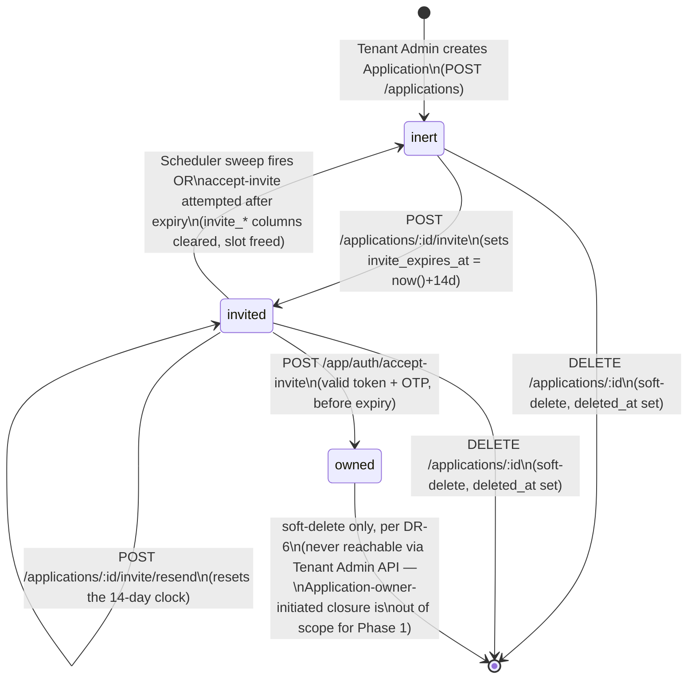
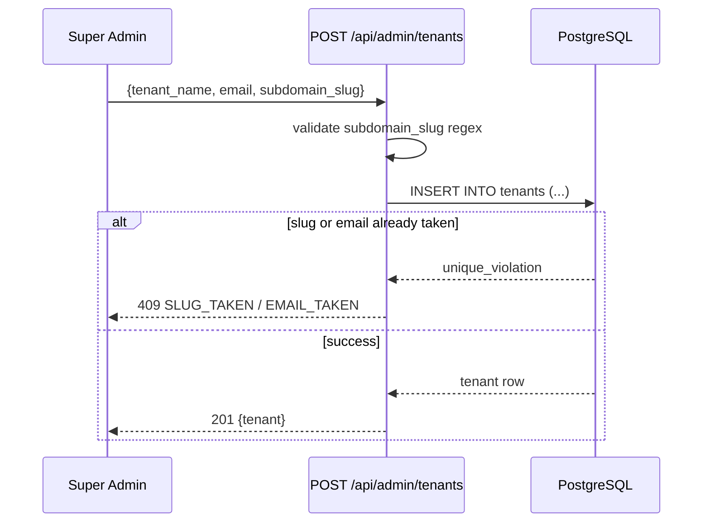
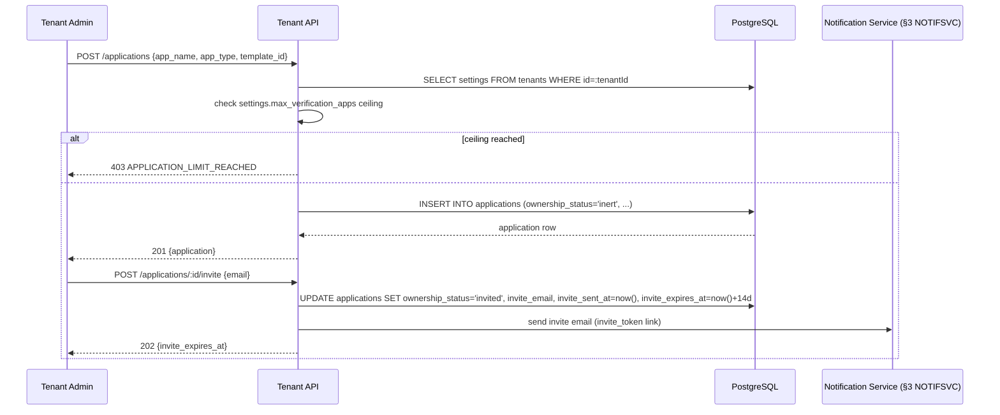
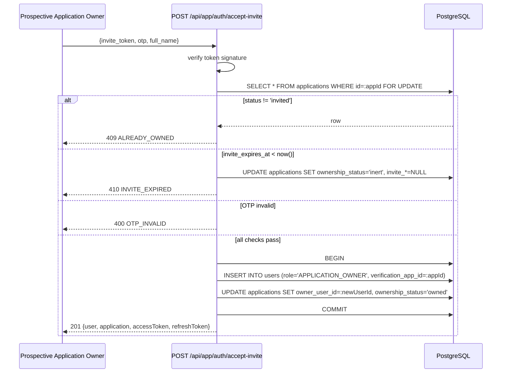
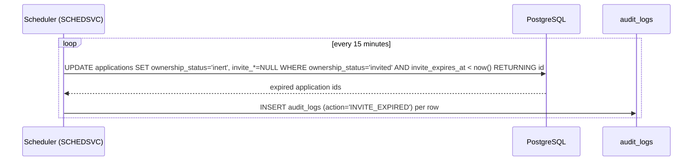
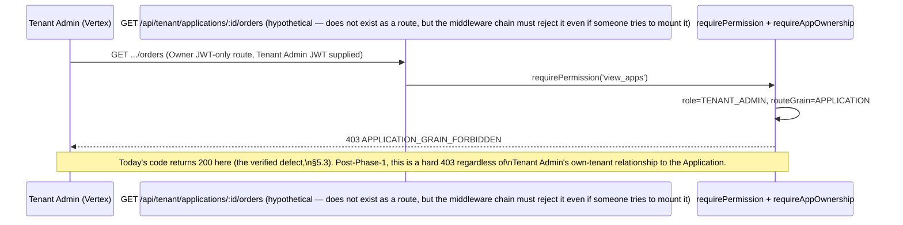

# Phase 1 — Low-Level Design: Roles, Ownership & Data Boundary Foundation

**Companion to:** `phases/phase1/prd.md`, master `../../PRD.md` (FR-1,2,3,4,5,6,7,8,9,10,11,14,16,18 · DR-1..DR-6 · NFR-1,2,6 · RD-1,2,3), `../../HLD.md` (§3 Scheduler, §4 Authorization Architecture, §5 Data Architecture, §11.1–§11.4)
**Ground truth verified against:** `scan4earn-database/full_setup.sql`, `scan4earn-server/src/middleware/{auth,appAuth}.middleware.js`, `scan4earn-server/src/routes/{auth,appAuth,dealer,dealerMobile}.routes.js`, `scan4earn-server/src/controllers/rewards.controller.js`, `scan4earn-database/migrations/README.md`

---

## 1. Scope

This phase rewrites the identity/authorization skeleton the entire product depends on, with zero billing, zero dashboard UI, and zero domain routing yet. Concretely: (a) rename/reshape `verification_apps` into the `applications` concept with a single `owner_user_id`, formalize `application_id` on every business table; (b) drop the `DEALER` role and its three tables entirely, collapse `APP_MANAGER`/`APP_VIEWER` into one `APPLICATION_OWNER` role, and remove `TENANT_USER` (single-account-per-tier — see PRD Non-goals and the session's "no staff pool" correction); (c) close a **real, verified, currently-exploitable defect**: today's `requirePermission()` and `requireAppOwnership()` middleware explicitly let a `TENANT_ADMIN` bypass all Application-scoped permission checks ("`TENANT_ADMIN` has full access within their tenant" — `auth.middleware.js:143`), which directly violates DR-3/FR-10/NFR-1/RD-3; and (d) build the owner-invite lifecycle (send → accept → 14-day expiry sweep).

---

## 2. Database Schema

### 2.1 Current-state verification (what's really in `full_setup.sql` today)

- `verification_apps`: has `app_type` (CHECK `SCAN_AND_EARN|ECOMMERCE|HYBRID`, default `SCAN_AND_EARN`), `slug` (unique per tenant), `deleted_at`, and the composite-FK anchor `UNIQUE (id, tenant_id)` already in place (from the prior "APP DIMENSION" migration folded into `full_setup.sql`). It has **no `owner_user_id` column at all**.
- `users.role` CHECK constraint (`users_role_check`, last redefined in the "APP MANAGER ROLE" block) currently allows: `SUPER_ADMIN, TENANT_ADMIN, TENANT_USER, DEALER, CUSTOMER, APP_MANAGER, APP_VIEWER`.
- `users` companion constraint `check_user_with_required_data` currently requires `(APP_MANAGER|APP_VIEWER)` rows to carry **both** `tenant_id` and `verification_app_id` — i.e. today's app-scoped staff are tenant-owned employees, not independent owners. This must change: `APPLICATION_OWNER` must carry `verification_app_id` only, `tenant_id IS NULL`, matching how `CUSTOMER`/`DEALER` are scoped today (and matching the final `APPLICATION_OWNER` row we're introducing).
- `dealers`, `dealer_points`, `dealer_point_transactions` exist and must be dropped.
- Migrations folder (`scan4earn-database/migrations/`) is **intentionally empty** per its own README — "while the app is at its initial state (no production data yet), every schema change lives directly in `../full_setup.sql`." **Decision (see §11):** ship this phase's schema changes as edits to `full_setup.sql` directly (in a new, clearly-labeled section, following the existing pattern of prior folded-in migrations like "APP MANAGER ROLE"), not as a numbered file under `migrations/`. The SQL below is written so it is copy-paste-identical either way.

### 2.2 Full DDL — append to `scan4earn-database/full_setup.sql` as a new section titled `-- PHASE 1: ROLES, OWNERSHIP & DATA BOUNDARY (applications rename, owner_user_id, dealer removal)`, placed immediately after the existing "APP MANAGER ROLE" block (~line 2827) and before the next section.

```sql
-- ============================================
-- PHASE 1: ROLES, OWNERSHIP & DATA BOUNDARY
-- ============================================

-- 1. Rename verification_apps -> applications (user-facing + code-facing rename).
--    All existing FKs (products.verification_app_id, coupons.verification_app_id, etc.)
--    follow the rename automatically in Postgres; no FK redefinition needed.
ALTER TABLE verification_apps RENAME TO applications;

-- Rename the app_name column's semantic twin nowhere else needs changing;
-- the id/tenant_id/app_type/slug columns keep their existing names.

-- 2. owner_user_id: exactly one owner per Application (DR-2).
--    Nullable until the owner-invite is accepted (pre-acceptance inert state).
ALTER TABLE applications
  ADD COLUMN IF NOT EXISTS owner_user_id UUID REFERENCES users (id) ON DELETE SET NULL;

CREATE UNIQUE INDEX IF NOT EXISTS uq_applications_owner_user_id
  ON applications (owner_user_id) WHERE owner_user_id IS NOT NULL;
-- One user can never own more than one Application via this column alone;
-- FR-14 (an owner who owns 2+ Applications) is modeled by that owner
-- having a SEPARATE users row per Application they own (see §2.4) — the
-- owner-invite email is the same real person, but each Application's
-- owner_user_id points at its own distinct `users` row, consistent with
-- users.verification_app_id (renamed application_id, see 2.5) being a
-- per-row, single-Application scope. This mirrors CUSTOMER's existing
-- per-Application identity pattern (DR-18/FR-18) and requires no FK change.

-- 3. Application lifecycle status (inert / invited / owned) — see §4 State Machine.
ALTER TABLE applications
  ADD COLUMN IF NOT EXISTS ownership_status VARCHAR(20) NOT NULL DEFAULT 'inert';

DO $$
BEGIN
  IF NOT EXISTS (SELECT 1 FROM pg_constraint WHERE conname = 'check_applications_ownership_status') THEN
    ALTER TABLE applications
      ADD CONSTRAINT check_applications_ownership_status
      CHECK (ownership_status IN ('inert', 'invited', 'owned'));
  END IF;
END $$;

-- 4. Owner-invite tracking (RD-2's 14-day expiry needs its own audit trail;
--    reusing `applications` columns directly keeps the sweep job's query a
--    single-table scan).
ALTER TABLE applications
  ADD COLUMN IF NOT EXISTS invite_email VARCHAR(255);
ALTER TABLE applications
  ADD COLUMN IF NOT EXISTS invite_sent_at TIMESTAMP WITH TIME ZONE;
ALTER TABLE applications
  ADD COLUMN IF NOT EXISTS invite_expires_at TIMESTAMP WITH TIME ZONE;
ALTER TABLE applications
  ADD COLUMN IF NOT EXISTS invite_accepted_at TIMESTAMP WITH TIME ZONE;

CREATE INDEX IF NOT EXISTS idx_applications_invite_expiry
  ON applications (invite_expires_at)
  WHERE ownership_status = 'invited';
-- ^ this is the exact index the Scheduler's expiry-sweep query (§5.2) uses.

-- 5. DR-6: soft-delete only, already covered by the existing `deleted_at`
--    column added in the prior APP DIMENSION migration — no new column
--    needed. Add the guard that nothing may hard-delete an owned Application
--    with financial history (documented as an app-layer rule, not enforceable
--    in pure SQL without trigger complexity disproportionate to this phase;
--    see §11 Open Questions).

-- 6. DR-1: formalize application_id as the join key everywhere. The column
--    is physically named `verification_app_id` on every existing table
--    (products, coupons, coupon_batches, ecommerce_orders, scans,
--    points_transactions, cashback_transactions, stock_movements, webhooks,
--    api_usage_logs) and is already NOT NULL / FK'd to verification_apps.id
--    on every one of those tables per the existing schema — renaming the
--    referenced table (step 1) does not require touching these FKs. Per
--    Phase 1 PRD's DR-1 note ("code/DB columns may keep the existing name
--    internally if a rename is too invasive; user-facing terminology must
--    say Application"), we do NOT rename these ten columns in this phase —
--    only application-facing API/UI copy changes "verification app" to
--    "Application". (Flagged as an assumption in §11.)

-- 7. DR-4: drop dealer role + tables entirely.
DROP TABLE IF EXISTS dealer_point_transactions CASCADE;
DROP TABLE IF EXISTS dealer_points CASCADE;
DROP TABLE IF EXISTS dealers CASCADE;

-- 8. DR-5 + role model rewrite: collapse APP_MANAGER/APP_VIEWER into
--    APPLICATION_OWNER; remove DEALER; remove TENANT_USER (single-account-
--    per-tier — no Tenant "team" concept, per this session's correction).
--    APPLICATION_OWNER now carries verification_app_id ONLY (tenant_id IS
--    NULL), matching CUSTOMER's existing scoping shape — this is a genuine
--    behavior change from today's APP_MANAGER/APP_VIEWER (which required
--    BOTH ids), because an Application Owner is an external business, not
--    Tenant staff.
DO $$
BEGIN
  IF EXISTS (SELECT 1 FROM pg_constraint WHERE conname = 'users_role_check') THEN
    ALTER TABLE users DROP CONSTRAINT users_role_check;
  END IF;
  ALTER TABLE users ADD CONSTRAINT users_role_check
    CHECK (role IN ('SUPER_ADMIN', 'TENANT_ADMIN', 'APPLICATION_OWNER', 'CUSTOMER'));
END $$;

DO $$
BEGIN
  IF EXISTS (SELECT 1 FROM pg_constraint WHERE conname = 'check_user_with_required_data') THEN
    ALTER TABLE users DROP CONSTRAINT check_user_with_required_data;
  END IF;
  ALTER TABLE users ADD CONSTRAINT check_user_with_required_data
    CHECK (
      (role = 'SUPER_ADMIN' AND tenant_id IS NULL AND verification_app_id IS NULL)
      OR (role = 'TENANT_ADMIN' AND tenant_id IS NOT NULL AND verification_app_id IS NULL)
      OR (role IN ('CUSTOMER', 'APPLICATION_OWNER') AND tenant_id IS NULL AND verification_app_id IS NOT NULL)
    );
END $$;

-- 9. Data migration for existing rows (required because the CHECK rewrite
--    above will reject any pre-existing DEALER/TENANT_USER/APP_MANAGER/
--    APP_VIEWER row the instant it's applied):
--    a) Any existing APP_MANAGER/APP_VIEWER row: promote to APPLICATION_OWNER
--       and null out tenant_id (it must not carry both ids anymore).
UPDATE users
  SET role = 'APPLICATION_OWNER', tenant_id = NULL
  WHERE role IN ('APP_MANAGER', 'APP_VIEWER');
--    b) Any existing DEALER row: no equivalent role exists post-Phase-1.
--       Soft-delete rather than hard-delete (preserves any FK history that
--       still points at these users elsewhere in the schema).
UPDATE users
  SET is_active = false, deleted_at = CURRENT_TIMESTAMP
  WHERE role = 'DEALER';
--    c) Any existing TENANT_USER row: same treatment — no team concept
--       survives Phase 1. Deactivate; do not delete (audit_logs.user_id
--       and other historical FKs may reference them).
UPDATE users
  SET is_active = false, deleted_at = CURRENT_TIMESTAMP
  WHERE role = 'TENANT_USER';
-- Run the three UPDATEs above BEFORE the CHECK-constraint DO blocks in a
-- real deploy ordering (the block order above is documentation order, not
-- execution order — see the migration file skeleton in §11 for the actual
-- statement sequence, which reorders 9 before 8).

-- 10. Composite-FK anchor already exists via uq_verification_apps_id_tenant;
--     Postgres auto-renames the constraint's underlying index alongside the
--     table rename in step 1, but the CONSTRAINT NAME itself does not
--     auto-rename. Rename it for consistency (cosmetic, not functional):
ALTER TABLE applications RENAME CONSTRAINT uq_verification_apps_id_tenant TO uq_applications_id_tenant;
```

### 2.3 Indexes added (summary, all included inline above)
- `uq_applications_owner_user_id` — enforces "one login per Application" at the DB layer (RD-1), not just app logic.
- `idx_applications_invite_expiry` — partial index, only rows in `invited` status; this is what makes the Scheduler's sweep query (§5.2) an index-only scan instead of a full table scan as the Applications table grows.

### 2.4 On "one owner, multiple Applications" (FR-14) — schema note
An Application Owner who owns two Applications (e.g. Mr. Pal: Paint Coupons + Pals Paint Store) is represented as **two separate `users` rows**, one per Application, each with its own `id`, its own `verification_app_id` (= that Application's id), and its own `owner_user_id` pointer from that Application back to this specific `users` row. Both rows share the same `email`/`phone_e164` (the same real person), but `email` is **not** globally unique across `APPLICATION_OWNER` rows the way it is for `SUPER_ADMIN`/`TENANT_ADMIN` — the existing partial unique index `idx_users_email_unique` (unique where `email IS NOT NULL`, no scoping) would incorrectly block this. **Required accompanying change:**

```sql
-- Rescope the email-uniqueness index: SUPER_ADMIN/TENANT_ADMIN remain
-- globally unique by email; APPLICATION_OWNER/CUSTOMER are unique only
-- per Application (matching the phone_e164-per-tenant pattern already
-- used elsewhere in this schema).
DROP INDEX IF EXISTS idx_users_email_unique;

CREATE UNIQUE INDEX IF NOT EXISTS idx_users_email_unique_platform
  ON users (email)
  WHERE email IS NOT NULL AND role IN ('SUPER_ADMIN', 'TENANT_ADMIN');

CREATE UNIQUE INDEX IF NOT EXISTS idx_users_email_unique_per_application
  ON users (verification_app_id, email)
  WHERE email IS NOT NULL AND role IN ('APPLICATION_OWNER', 'CUSTOMER');
```

The single-login-session experience (owner logs in once, sees a switcher across their Applications, per FR-14/Phase-2's UI) is a Phase 2 dashboard-layer concern: the login flow resolves ALL `users` rows matching the submitted email/phone across `APPLICATION_OWNER`-role rows and, on successful OTP, issues a JWT whose claims are re-mintable per-Application (the switcher calls a re-issue endpoint scoped to whichever Application the owner clicks into — see §3.1). Phase 1 only needs the data model to support this; the switcher UI itself is out of scope here.

### 2.5 Column naming decision: `application_id` vs. `verification_app_id`
Per the Phase 1 PRD's own DR-1 note, this LLD's Decision (§11) is: **do not rename the physical column** `verification_app_id` on the ten business tables in this phase. Renaming ten tables' FK columns (plus every query, ORM mapping, and index referencing them) is a large, purely-cosmetic, high-blast-radius change with zero functional benefit in Phase 1, since no external consumer (API contract) ever sees this column name directly — HLD's API tables never expose `verification_app_id` as a request/response field name; they use `application_id` in JSON payloads only (mapped at the controller/serializer layer). **Action required in Phase 1:** every controller serializer must map `verification_app_id` (DB) → `application_id` (API response JSON) and accept `application_id` (API request JSON) → `verification_app_id` (DB param) — a thin translation layer, not a schema rename. Flagged explicitly in §11 as a decision, not an oversight.

---

## 3. API Contracts

All groups below are Phase 1 scope per HLD §11.1–§11.4 (Super Admin CRUD basics, Tenant Admin's Application provisioning + invite, the shared `/api/auth/*` and dedicated `/api/app/auth/*` login groups). Billing fields (§11.2's `/subscribe`, `/credits/*`) are explicitly NOT part of this phase's contracts — see Phase 1 PRD's Explicitly-Out-of-Scope list. **FR-1's Tenant credit-request approval mechanism and FR-3's global feature-flag/product-template management are deliberately NOT re-specified here** — both already exist today (`credits.routes.js`, `feature.routes.js`) with correct `SUPER_ADMIN`-only authorization and zero Tenant-Admin-bypass exposure (verified against the real route files); Phase 1 carries them forward completely unchanged, no contract or code change required.

### 3.1 Shared Login — `POST /api/auth/*` (Super Admin + Tenant Admin, existing `auth.routes.js`, **Needs Modification**)

No path/method changes. **Behavior changes required:**
- `authController.requestOTP`/`verifyOTP` must no longer resolve or accept `TENANT_USER` as a valid target role (that role is being removed — §2.2 step 8/9c already deactivates existing rows).
- `GET /api/auth/context` response must drop the `permissions` array's role-bypass semantics described in §5 below — this is a controller/serializer change, not a route change.

| Field | Request `POST /request-otp` | Response `200` | Response `429` |
|---|---|---|---|
| Body | `{ "email": string }` — resolves to whichever `SUPER_ADMIN` or `TENANT_ADMIN` row this hostname's context permits (root domain → the one `SUPER_ADMIN`; Tenant subdomain → that Tenant's one `TENANT_ADMIN`) | `{ "status": true, "message": "OTP sent" }` | `{ "status": false, "message": "Too many OTP requests. Please try again later." }` (existing `otpRateLimit`: 50/15min) |

| Field | Request `POST /verify-otp` | Response `200` | Response `401` |
|---|---|---|---|
| Body | `{ "email": string, "otp": string }` | `{ "status": true, "data": { "accessToken": string, "refreshToken": string, "user": { "id": uuid, "role": "SUPER_ADMIN"\|"TENANT_ADMIN", "tenant_id": uuid\|null } } }` | `{ "status": false, "message": "Invalid or expired OTP", "code": "OTP_INVALID" }` |

`GET /context`, `POST /refresh`, `POST /logout` — unchanged contracts, `authenticate` middleware guarded (existing).

### 3.2 Application Owner Login — `POST /api/app/auth/*` (existing `appAuth.routes.js`, **Needs Modification**)

Identical shape to §3.1, scoped to `APPLICATION_OWNER` only (today accepts `APP_MANAGER`/`APP_VIEWER`/`DEALER`/`CUSTOMER` implicitly via the generic `role` claim — must now reject anything except `APPLICATION_OWNER` and `CUSTOMER`, and `CUSTOMER` only for the Consumer-facing mount, not this one).

| Field | Request `POST /request-otp` | Response `200` | Response `403` (new) |
|---|---|---|---|
| Body | `{ "phone_e164": string }` OR `{ "email": string }` — must resolve to a `users` row with `role = 'APPLICATION_OWNER'` and `ownership_status` context via its `applications` row | `{ "status": true, "message": "OTP sent" }` | `{ "status": false, "message": "No Application Owner account found for this contact", "code": "OWNER_NOT_FOUND" }` — returned if the invite was never accepted (no `APPLICATION_OWNER` row exists yet); never leaks whether an Application exists at all |

**New guard on `POST /verify-otp` for this mount specifically:** if the resolved `applications.ownership_status != 'owned'` at verification time (e.g. invite expired between OTP-request and OTP-verify), reject with `409 { "code": "OWNERSHIP_LAPSED" }` rather than issuing a JWT for an Application that reverted to inert mid-flow.

### 3.3 Super Admin — Tenant CRUD (`/api/admin/tenants*`, **New** route file `tenant.routes.js` mounted under `/api/admin`, controller logic largely exists today under `modules/super-admin/controllers/tenant.controller.js` per this session's earlier exploration — re-mount, don't rewrite from scratch)

| Method | Path | Request Body | Response `201`/`200` | Error cases |
|---|---|---|---|---|
| POST | `/tenants` | `{ "tenant_name": string, "email": string, "subdomain_slug": string, "contact_person": string? }` | `{ "status": true, "data": { "tenant": { "id", "tenant_name", "subdomain_slug", "status": "active" } } }` | `400 SLUG_INVALID` (fails `check_subdomain_slug_format` regex `^[a-z0-9][a-z0-9-]{1,48}[a-z0-9]$`) · `409 EMAIL_TAKEN` (`tenants.email UNIQUE`) · `409 SLUG_TAKEN` (`unique_tenant_subdomain_slug`) |
| GET | `/tenants` | — (query: `?status=active\|inactive&page=&limit=`) | `{ "data": { "tenants": [...], "pagination": {...} } }` — fields: `id, tenant_name, subdomain_slug, status, created_at`. **Never** includes any Application-grain aggregate (that's Phase 3's FR-19 enhancement) | — |
| GET | `/tenants/:id` | — | Tenant detail, same field set as list + `contact_person`, `email` | `404 TENANT_NOT_FOUND` |
| PATCH | `/tenants/:id/status` | `{ "status": "active"\|"inactive" }` | `{ "data": { "tenant": {...} } }` | `400 INVALID_STATUS` · `404 TENANT_NOT_FOUND` |

### 3.3a Super Admin — Platform Dashboard (`GET /api/admin/dashboard/stats`, **New**, backs Phase 1 PRD's FR-4 — this endpoint is in-scope for Phase 1 even though most of its fields are zero until later phases populate them)

| Method | Path | Response `200` |
|---|---|---|
| GET | `/dashboard/stats` | `{ "data": { "tenant_count": int, "application_count": { "total": int, "ecommerce": int, "scan_and_earn": int, "hybrid": int }, "active_subscriptions": 0, "credits_sold": 0, "pending_credit_requests": int (real, from existing `credit_requests` table — FR-8 says this mechanism carries forward unchanged), "tenant_health": [{ "tenant_id", "tenant_name", "application_count", "subscription_status": null, "last_payment": null }] } }` |

`active_subscriptions`/`credits_sold`/per-Tenant `subscription_status`/`last_payment` are hardcoded `0`/`null` in Phase 1 (no `subscription_plans`/`tenant_subscriptions.plan_id` exist yet — Phase 3 populates them for real). `tenant_count`, `application_count`, and `pending_credit_requests` are real counts from tables that already exist today. Response schema is stable across phases — Phase 3 only changes the *values*, never adds/removes fields, so the Super Admin dashboard UI (Phase 1 or Phase 7) never needs a breaking-change deploy when Phase 3 lands.

### 3.4 Tenant Admin — Application Provisioning + Invite (`/api/tenant/applications*`, **Needs Modification** — real controller is `rewards.controller.js#createVerificationApp`, re-mounted/renamed)

| Method | Path | Request Body | Response | Error cases |
|---|---|---|---|---|
| POST | `/applications` | `{ "app_name": string, "app_type": "ECOMMERCE"\|"SCAN_AND_EARN"\|"HYBRID", "template_id": uuid, "description": string?, "primary_color": string?, "secondary_color": string?, "currency": string? }` — **no billing fields this phase** (Phase 4 adds `price_per_month`/`duration_months` to this same payload) | `201 { "data": { "application": { "id", "app_name", "app_type", "slug", "ownership_status": "inert", "api_key_preview": "msk_...(hashed elsewhere)" } } }` | `400 VALIDATION_ERROR` (missing `app_name`/`template_id`, invalid `app_type` — reuses existing `VALID_APP_TYPES` check) · `403 APPLICATION_LIMIT_REACHED` (today's `settings.max_verification_apps` check — Phase 3 replaces this with the plan-ceiling check; Phase 1 keeps today's mechanism as-is) |
| GET | `/applications` | query: `?status=&type=` | `{ "data": { "applications": [{ "id", "app_name", "app_type", "status": ownership_status, "owner_email": invite_email or null }] } }` — FR-9's administrative list; explicitly excludes any order/scan/product/customer field | — |
| GET | `/applications/:id` | — | Same fields as list, single object, plus `invite_sent_at`/`invite_expires_at`/`invite_accepted_at` | `403` if `:id` belongs to another Tenant (`tenant_id` mismatch) · `404 APPLICATION_NOT_FOUND` |
| POST | `/applications/:id/invite` | `{ "email": string }` | `202 { "data": { "invite_expires_at": ISO8601 } }` — sets `invite_email`, `invite_sent_at = now()`, `invite_expires_at = now() + 14 days`, `ownership_status = 'invited'` | `409 ALREADY_OWNED` (Application already has `ownership_status = 'owned'`) · `409 INVITE_ALREADY_PENDING` (re-invite must use the resend endpoint below, not this one, to avoid silently resetting the 14-day clock without an explicit action) · `404 APPLICATION_NOT_FOUND` |
| POST | `/applications/:id/invite/resend` | `{}` | `202` — resets `invite_sent_at = now()`, `invite_expires_at = now() + 14 days` (fresh 14-day window), same `invite_email` | `409 ALREADY_OWNED` · `400 NO_PENDING_INVITE` (nothing to resend if `ownership_status = 'inert'`, never invited yet — use the invite endpoint instead) |
| DELETE | `/applications/:id` | — | `200` — only permitted while `ownership_status IN ('inert', 'invited')`; soft-deletes (`deleted_at = now()`), frees the plan-ceiling slot | `409 CANNOT_DELETE_OWNED` (an owned Application is never Tenant-deletable — DR-6 + RD-3's "no reassignment without owner consent") |

### 3.5 Application Owner — Invite Acceptance (`POST /api/app/auth/accept-invite`, **New**)

This is distinct from the login OTP flow (§3.2) — it is the one-time action that transitions `inert/invited → owned` and creates the `APPLICATION_OWNER` `users` row.

| Method | Path | Request Body | Response `201` | Error cases |
|---|---|---|---|---|
| POST | `/accept-invite` | `{ "invite_token": string, "otp": string, "full_name": string }` — `invite_token` is a signed, single-use token embedded in the invite email link (JWT or opaque token referencing `applications.id` + `invite_email`, expiring at `invite_expires_at`, verified server-side against that column, not just the token's own embedded expiry, so a manually extended token can't outlive the DB row) | `{ "data": { "user": { "id", "role": "APPLICATION_OWNER" }, "application": { "id", "app_name", "ownership_status": "owned" }, "accessToken": string, "refreshToken": string } }` | `400 OTP_INVALID` · `410 INVITE_EXPIRED` (`invite_expires_at < now()` — also proactively flips `ownership_status` back to `inert` right here as a belt-and-suspenders check, not solely relying on the sweep job having already run) · `409 ALREADY_OWNED` (token replay after a previous successful accept) |

---

## 4. State Machine — Application Ownership Lifecycle



**Guards:**
- `inert → invited` requires `ownership_status = 'inert'` (idempotency: calling invite twice on an already-`invited` Application is rejected with `409`, forcing the caller to use `/resend` explicitly — this is a deliberate API design choice so "did this silently reset my 14-day clock" is never ambiguous from the caller's side).
- `invited → owned` requires: token signature valid, token's embedded `application_id` matches the DB row, `invite_expires_at >= now()` **at the moment of verification** (not cached), OTP correct, and `ownership_status = 'invited'` (not already `owned` — replay guard).
- `owned` is a terminal, one-way state in Phase 1 — there is no API to un-own an Application (RD-3's "no reassignment without the current owner's consent" implies a future consent-flow endpoint, explicitly out of scope here; if a real business need arises before that flow exists, it is a manual DB operation performed by an engineer, never a self-service API call).

---

## 5. Business Logic / Algorithms

### 5.1 Owner-invite acceptance (pseudocode, backs §3.5)

```
FUNCTION acceptInvite(invite_token, otp, full_name):
  claims = verifyAndDecodeToken(invite_token)  // signature + structural validity only
  IF claims invalid: RETURN 400 OTP_INVALID  // do not distinguish "bad token" from "bad OTP" in the error surface (avoid token-guessing oracle)

  app = SELECT * FROM applications WHERE id = claims.application_id FOR UPDATE
  // FOR UPDATE: two near-simultaneous accept attempts on the same invite
  // (e.g. the email link clicked twice in two tabs) must serialize, not race.

  IF app.ownership_status != 'invited':
    RETURN 409 ALREADY_OWNED  // covers both "already owned" and "reverted to inert" cases with one message class; log which internally for support triage

  IF app.invite_expires_at < now():
    UPDATE applications SET ownership_status='inert', invite_email=NULL,
      invite_sent_at=NULL, invite_expires_at=NULL, invite_accepted_at=NULL
      WHERE id = app.id
    COMMIT
    RETURN 410 INVITE_EXPIRED

  IF NOT verifyOTP(app.invite_email, otp):
    RETURN 400 OTP_INVALID

  // All checks passed — create the owner identity and flip ownership atomically.
  BEGIN TRANSACTION
    owner_user = INSERT INTO users (email, full_name, role, verification_app_id, is_active)
      VALUES (app.invite_email, full_name, 'APPLICATION_OWNER', app.id, true)
      RETURNING id
    UPDATE applications
      SET owner_user_id = owner_user.id, ownership_status = 'owned',
          invite_accepted_at = now()
      WHERE id = app.id
  COMMIT

  RETURN 201 { user: owner_user, application: app, accessToken, refreshToken }
```

### 5.2 Invite-expiry sweep (Scheduler job, per HLD §3's `SCHEDSVC → APPSVC: "sweep unaccepted invites past 14 days"`)

```
JOB inviteExpirySweep:
  CRON: every 15 minutes  (see §9 INVITE_SWEEP_INTERVAL_MINUTES — a 14-day
        deadline does not need a tighter cadence than this; matches the
        acceptable-latency-window precedent already set in HLD §4 for the
        subscription-expiry sweep)

  RUN:
    UPDATE applications
    SET ownership_status = 'inert',
        invite_email = NULL, invite_sent_at = NULL,
        invite_expires_at = NULL, invite_accepted_at = NULL
    WHERE ownership_status = 'invited'
      AND invite_expires_at < now()
    RETURNING id, tenant_id, app_name
    -- uses idx_applications_invite_expiry (partial index, §2.3) —
    -- index-only scan regardless of total Applications table size.

  FOR EACH returned row:
    emit audit_logs entry (action='INVITE_EXPIRED', metadata={application_id, app_name})
    // No email notification to the Tenant Admin is specified upstream —
    // flagged as an open question in §11; Phase 1 ships silent expiry,
    // visible only via the administrative Application list's status field.
```

### 5.3 Authorization middleware — closing the real DR-3/FR-10/NFR-1/RD-3 defect

This is the single most important algorithm in this phase. Today's code (verified, §"Ground truth" header) has two independent bypasses that must both close:

```
// ── requirePermission() rewrite ──────────────────────────────────────────
// TODAY (auth.middleware.js): SUPER_ADMIN and TENANT_ADMIN skip this check
// entirely — "TENANT_ADMIN has full access within their tenant". This is
// the literal bug: it means any route wrapped only in requirePermission()
// (e.g. today's /verification-apps/:id/orders, /analytics) is reachable by
// a Tenant Admin with zero further check.
//
// FIXED:
FUNCTION requirePermission(requiredPermissions, mode):
  RETURN middleware(req, res, next):
    IF req.user.role == 'SUPER_ADMIN':
      IF routeGrain(req) == 'APPLICATION':
        RETURN 403 { code: 'APPLICATION_GRAIN_FORBIDDEN' }  // NFR-1: hard stop, not a permission lookup
      RETURN next()  // Platform/Tenant-grain admin routes: unchanged bypass

    IF req.user.role == 'TENANT_ADMIN':
      IF routeGrain(req) == 'APPLICATION':
        IF routeIsInDR3CarveOut(req):  // application_subscriptions / application_credit_requests, billing columns only — Phase 3/4/5 populate the actual carve-out logic; Phase 1 ships the classification function returning "not yet implemented" (403) for these two tables since no billing tables exist yet
          RETURN 403 { code: 'APPLICATION_GRAIN_FORBIDDEN' }  // Phase 1: carve-out tables don't exist yet — always 403 here regardless
        RETURN 403 { code: 'APPLICATION_GRAIN_FORBIDDEN' }  // every other Application-grain route: hard stop, no bypass
      RETURN next()  // Tenant-grain admin routes: unchanged bypass

    // APPLICATION_OWNER / CUSTOMER: existing permission-array check, unchanged
    ... (existing logic below this point in the real file is untouched)

// ── requireAppOwnership() rewrite ────────────────────────────────────────
// TODAY: only checks APP_MANAGER/APP_VIEWER; explicitly lets
// SUPER_ADMIN/TENANT_ADMIN/TENANT_USER through untouched ("not app-scoped").
// This is bug #2 — it assumes Tenant-level roles never reach app-scoped
// routes at all, which requirePermission() was supposed to prevent, but
// didn't (bug #1). Defense in depth requires this function to ALSO check.
//
// FIXED:
FUNCTION requireAppOwnership(req, res, next):
  IF req.user.role NOT IN ('APPLICATION_OWNER'):
    RETURN 403 { code: 'APPLICATION_GRAIN_FORBIDDEN' }
    // Removed: the old "not app-scoped, let it through" early-return for
    // SUPER_ADMIN/TENANT_ADMIN/TENANT_USER. Every route this middleware
    // guards is, by definition, Application-grain — there is no role that
    // should pass through untouched anymore, since TENANT_USER no longer
    // exists and TENANT_ADMIN's access to this route class was the bug.

  IF req.user.verification_app_id != req.params.id:
    RETURN 403 { code: 'APP_MISMATCH' }  // unchanged — this half was already correct

  RETURN next()

// ── routeGrain() classifier (new helper, used above) ─────────────────────
FUNCTION routeGrain(req):
  // Table allow-list per HLD §5 grain model. Implemented as a static map
  // from route-file/controller-module to grain, checked at router-mount
  // time (see §8), NOT computed from the URL string at request time — a
  // string-based classifier is exactly the kind of thing that silently
  // drifts as routes are added. The map itself is the CI-enforceable
  // artifact NFR-1 requires (see §10's CI test).
  RETURN ROUTE_GRAIN_MAP[req.baseUrl] // 'PLATFORM' | 'TENANT' | 'APPLICATION'
```

**NFR-1's CI check, concretely:** a build-time test iterates every mounted route in `server.js`, looks up its grain via the same `ROUTE_GRAIN_MAP` used at runtime, and asserts: every `APPLICATION`-grain route's middleware chain includes `requireAppOwnership` (or, for Phase 3+, the explicit DR-3 carve-out check) — if a new route is added under an `APPLICATION`-grain path without that middleware, CI fails the build. This is the concrete mechanism behind Phase 1 PRD's "NFR-1: covered by an automated CI check."

---

## 6. Sequence Diagrams

### 6.1 Super Admin creates a Tenant



### 6.2 Application provisioning + owner-invite send



### 6.3 Owner-invite acceptance



### 6.4 Invite-expiry sweep (Scheduler)



### 6.5 Rejected cross-tenant / cross-application access attempt (error path)



---

## 7. Validation & Error Catalog

| Code | HTTP | Trigger | Message |
|---|---|---|---|
| `SLUG_INVALID` | 400 | `subdomain_slug` fails `^[a-z0-9][a-z0-9-]{1,48}[a-z0-9]$` | "Subdomain slug must be lowercase alphanumeric with hyphens, 3-50 chars" |
| `SLUG_TAKEN` | 409 | `unique_tenant_subdomain_slug` violation | "This subdomain is already in use" |
| `EMAIL_TAKEN` | 409 | `tenants.email` unique violation | "A tenant with this email already exists" |
| `TENANT_NOT_FOUND` | 404 | `:id` doesn't resolve | "Tenant not found" |
| `INVALID_STATUS` | 400 | status not in `active`/`inactive` | "Status must be 'active' or 'inactive'" |
| `VALIDATION_ERROR` | 400 | missing `app_name`/`template_id`, or invalid `app_type` | field-specific message (existing `validateRequiredFields`/`ValidationError` pattern) |
| `APPLICATION_LIMIT_REACHED` | 403 | `settings.max_verification_apps` ceiling hit | "Application limit reached for this plan" |
| `APPLICATION_NOT_FOUND` | 404 | `:id` doesn't resolve, or resolves but belongs to another Tenant (never distinguish the two — no existence leak across Tenants) | "Application not found" |
| `ALREADY_OWNED` | 409 | invite sent/resent/accept-invite attempted on an already-`owned` Application | "This Application already has an owner" |
| `INVITE_ALREADY_PENDING` | 409 | `/invite` called while `ownership_status = 'invited'` | "An invite is already pending — use resend instead" |
| `NO_PENDING_INVITE` | 400 | `/invite/resend` called while `ownership_status = 'inert'` | "No pending invite to resend — send a new invite first" |
| `CANNOT_DELETE_OWNED` | 409 | `DELETE /applications/:id` on an `owned` Application | "Cannot delete an Application that already has an owner" |
| `OWNER_NOT_FOUND` | 403 | `/app/auth/request-otp` for a contact with no `APPLICATION_OWNER` row | "No Application Owner account found for this contact" |
| `OWNERSHIP_LAPSED` | 409 | `/app/auth/verify-otp` succeeds but `ownership_status != 'owned'` (expired mid-flow) | "This Application's ownership status changed — please contact your reseller" |
| `OTP_INVALID` | 400 | wrong/expired OTP on any of the four OTP-verify endpoints | "Invalid or expired OTP" |
| `INVITE_EXPIRED` | 410 | `accept-invite` called after `invite_expires_at` | "This invite has expired — ask your reseller to send a new one" |
| `APPLICATION_GRAIN_FORBIDDEN` | 403 | Super Admin or Tenant Admin session hits any Application-grain route | "Access denied" (deliberately generic — never confirm/deny the target Application's existence or Tenant ownership to a caller who already shouldn't be here) |
| `APP_MISMATCH` | 403 | Application Owner JWT's `verification_app_id` != `:id` in path | "Access denied: you are not assigned to this Application" |
| `TOKEN_EXPIRED` | 401 | existing JWT expiry (unchanged) | "Token expired" |

---

## 8. File / Module Plan

| File | Action | Notes |
|---|---|---|
| `scan4earn-database/full_setup.sql` | **Modify** | Append §2.2's DDL block + §2.4's index rescoping, in the position specified. |
| `scan4earn-database/migrations/001_phase1_roles_and_boundary.sql` | **New (optional, see §11)** | Same SQL as §2.2/§2.4, packaged as a numbered migration if the team decides production data already exists by the time this ships. |
| `scan4earn-server/src/routes/dealer.routes.js` | **Delete** | DR-4. |
| `scan4earn-server/src/routes/dealerMobile.routes.js` | **Delete** | DR-4. |
| `scan4earn-server/src/controllers/` — dealer-specific controller file(s) (grep `dealer` in `controllers/` to enumerate; not yet inventoried by filename in this session) | **Delete** | Same reason. |
| `scan4earn-server/src/server.js` | **Modify** | Remove lines 31-32 (`dealerRoutes`/`dealerMobileRoutes` requires) and 212-216 (their `app.use(...)` mounts). Add new mounts: `app.use('/api/admin/tenants', tenantRoutes)`, `app.use('/api/tenant/applications', applicationRoutes)`. |
| `scan4earn-server/src/routes/tenant.routes.js` | **New** | Wraps §3.3's endpoints; delegates to existing `modules/super-admin/controllers/tenant.controller.js` logic (re-verify it doesn't already assume billing fields this phase must not include — flagged in §11). |
| `scan4earn-server/src/routes/application.routes.js` | **New (renamed from the `verification-apps` portion of `rewards.routes.js`)** | Wraps §3.4's endpoints; the coupon/campaign-specific portion of `rewards.routes.js` (batch/coupon endpoints) is untouched and stays for Phase 2/5. |
| `scan4earn-server/src/controllers/rewards.controller.js` | **Modify** | `createVerificationApp` → rename to `createApplication` (or keep internal name, adjust exported route binding); add `invite`/`invite/resend`/delete-guard logic per §3.4; response serializer maps `verification_app_id`→`application_id` per §2.5. |
| `scan4earn-server/src/routes/auth.routes.js` | **Modify** | No route/method changes; controller-level role validation tightened per §3.1. |
| `scan4earn-server/src/routes/appAuth.routes.js` | **Modify** | Add `POST /accept-invite` (§3.5); tighten role validation per §3.2. |
| `scan4earn-server/src/controllers/appAuth.controller.js` | **Modify** | Add `acceptInvite` handler (§5.1's pseudocode). |
| `scan4earn-server/src/middleware/auth.middleware.js` | **Modify** | Rewrite `requirePermission` and `requireAppOwnership` per §5.3. Remove the `TENANT_USER` read-only-role special case (lines ~50-58 per this session's earlier read) — that role no longer exists. Remove the `DEALER`-specific comment/branch in `authenticate` (~line 78-80). Add `routeGrain()` classifier + `ROUTE_GRAIN_MAP`. |
| `scan4earn-server/src/middleware/appAuth.middleware.js` | **Modify** | Remove any `DEALER`/`APP_MANAGER`/`APP_VIEWER`-specific branches (none found explicitly in this file during grounding, but re-verify at implementation time); tighten `authorize`/`requireRole` role lists. |
| `scan4earn-server/src/jobs/inviteExpirySweep.job.js` | **New** | §5.2's cron job; register with whatever job scheduler the codebase already uses (not yet inventoried this session — check for an existing `node-cron`/`bull`/similar dependency in `package.json` before introducing a new one). |
| `scan4earn-server/src/__tests__/phase1-*.test.js` | **New** | Per §10. |

---

## 9. Configuration

| Env var | Default | Purpose |
|---|---|---|
| `INVITE_EXPIRY_DAYS` | `14` | RD-2's expiry window — configurable so a staging environment can use a shorter window for faster testing without a code change. |
| `INVITE_SWEEP_INTERVAL_MINUTES` | `15` | §5.2's cron cadence. |
| `JWT_ACCESS_SECRET` | *(existing, no change)* | Already used by both `auth.middleware.js` and `appAuth.middleware.js`. |
| `INVITE_TOKEN_SECRET` | *(new, required)* | Separate signing secret for the invite-acceptance token (§3.5) — kept distinct from `JWT_ACCESS_SECRET` so an invite-token leak can't be reused as a session token and vice versa. |

---

## 10. Test Plan

Mapped 1:1 to Phase 1 PRD's Definition of Done, plus edge cases:

1. **Migration drops dealer tables and role value; `users.role` CHECK updated.**
   - Assert `dealers`/`dealer_points`/`dealer_point_transactions` do not exist post-migration.
   - Assert inserting a `users` row with `role='DEALER'` now fails the CHECK constraint.
   - Assert a pre-existing `DEALER` row (seeded before migration) is `is_active=false` and `deleted_at` set post-migration, not hard-deleted.
2. **`applications.owner_user_id` nullable-until-accepted, invite-expiry job in place.**
   - Create Application → assert `owner_user_id IS NULL`, `ownership_status='inert'`.
   - Send invite → assert `ownership_status='invited'`, `invite_expires_at ≈ now()+14d`.
   - Accept before expiry → assert `owner_user_id` set, `ownership_status='owned'`.
   - **Edge case — accept exactly at day 14:** seed `invite_expires_at = now()` (boundary), assert the comparison `invite_expires_at < now()` at accept-time is exclusive — an accept attempt in the exact same instant as expiry should succeed if it beats the sweep, and the sweep's own `<` comparison must never expire a row whose deadline is still in the future by even one second (no off-by-one on either side).
   - **Edge case — invite double-accept:** accept once successfully, replay the same `invite_token` → assert `409 ALREADY_OWNED`, and assert no second `users` row was created (idempotency of the whole transaction, not just the status check).
   - Run the sweep job against a seeded `invited` row with `invite_expires_at` in the past → assert it flips to `inert` and clears all four `invite_*` columns.
3. **Tenant Admin JWT gets 403 on every Application-grain endpoint, including Applications it provisioned itself** (Phase 1's DoD explicitly notes this holds *fully* in Phase 1 since no billing carve-out tables exist yet):
   - For every route in `ROUTE_GRAIN_MAP` classified `APPLICATION`, fire a request with a valid Tenant Admin JWT for the Tenant that owns that Application → assert `403 APPLICATION_GRAIN_FORBIDDEN` on all of them, with zero exceptions.
   - **Edge case — Tenant Admin querying the (future) DR-3 carve-out tables before they exist:** since `application_subscriptions`/`application_credit_requests` don't exist until Phase 4/5, any route that would eventually read them doesn't exist yet either in Phase 1 — this test case is a no-op placeholder in Phase 1's suite (assert the routes 404, not 403, since they're simply unmounted) and gets superseded by Phase 4/5's own test suite adding the real carve-out assertion.
4. **Super Admin JWT gets 403 on every Application-grain endpoint** — same sweep as #3, Super Admin JWT instead of Tenant Admin.
5. **No UI in either admin portal renders an order, stock, scan, or cashback figure** — this is a Phase 2 (dashboard exists) concern to assert visually; Phase 1's proxy for it is: assert the Super Admin and Tenant Admin API response schemas (§3.3/§3.4) contain none of `order`, `stock`, `scan`, `cashback` as a field name, checked via a schema-snapshot test.
6. **Regression — the verified pre-existing defect (§5.3) is actually closed:** a dedicated test that reconstructs today's exact failing scenario (Tenant Admin JWT + `GET /verification-apps/:id/orders`-equivalent route) and asserts it now 403s — this test should be written to *fail against the pre-Phase-1 code* if run against a git-stash of the old middleware, as a sanity check that the test itself is meaningful.
7. **Email uniqueness rescoping (§2.4):** create two `APPLICATION_OWNER` `users` rows with the same email under two different `application_id`s → assert both succeed. Attempt a third with the same email under one of the same two `application_id`s again → assert `409` (per-Application uniqueness still holds). Attempt two `SUPER_ADMIN` rows with the same email → assert `409` (platform-global uniqueness still holds for that role).
8. **Owner with 2+ Applications (FR-14 data-model support):** seed the same real-world email as owner of two Applications (two distinct `users` rows per §2.4) → assert each Application's `owner_user_id` resolves to a different `users.id`, and a query scoped to one Application's data never returns the other's, even though both JWTs were issued to "the same person."

---

## 11. Open Questions / Assumptions

1. **Migration file location:** decided (§2.1) to fold this phase's DDL directly into `full_setup.sql`, matching the repo's own stated current convention (`migrations/` is intentionally empty pre-production). If, by implementation time, real production data already exists, use the numbered-migration form of the identical SQL instead — flagged as a deploy-time decision, not a design one.
2. **`application_id` column naming (§2.5):** decided not to physically rename `verification_app_id` on the ten business tables in this phase, translating at the API/serializer boundary instead, per the Phase 1 PRD's own explicit allowance for this. If a later phase's engineer prefers the physical rename for long-term clarity, it's a mechanical, low-risk follow-up (rename + update all queries) that doesn't change any external contract either way.
3. **Silent invite expiry (§5.2):** no notification to the Tenant Admin is specified anywhere upstream when an invite lapses — Phase 1 ships this silently (visible only via the Application list's status reverting to `inert`). If product wants an email/dashboard alert on expiry, that's a Notification Service (NOTIFSVC) addition, not a schema change, and can be added without touching this LLD's data model.
4. **Existing `settings.max_verification_apps` ceiling mechanism:** Phase 1 explicitly does **not** touch this — it's today's mechanism and stays as-is until Phase 3 replaces it with the `subscription_plans.max_applications` model. Kept as a deliberate decision so Phase 1 doesn't have to invent an interim ceiling story.
5. **Job scheduler technology (§8):** this session did not inventory whether the codebase already has a cron/job-queue dependency (e.g. `node-cron`, `bull`, `agenda`). The LLD assumes one will be chosen/reused at implementation time; if none exists, introducing one is a small additional decision for whoever picks this up, not a blocker to this design.
6. **Invite-token format:** assumed a signed JWT (reusing existing `jsonwebtoken` dependency already in the codebase) rather than an opaque DB-stored token, since it avoids an extra table purely for token bookkeeping — the `applications` row itself already carries everything needed to validate the token server-side (`invite_email`, `invite_expires_at`). Flagged as a reasonable default, not a hard requirement from any upstream doc.
7. **Dealer controller file enumeration (§8):** this session found `dealer.routes.js`/`dealerMobile.routes.js` by filename but did not enumerate every dealer-specific controller file by name — the file plan says "grep `dealer` in `controllers/`" as the concrete next step rather than guessing filenames that weren't directly verified.
