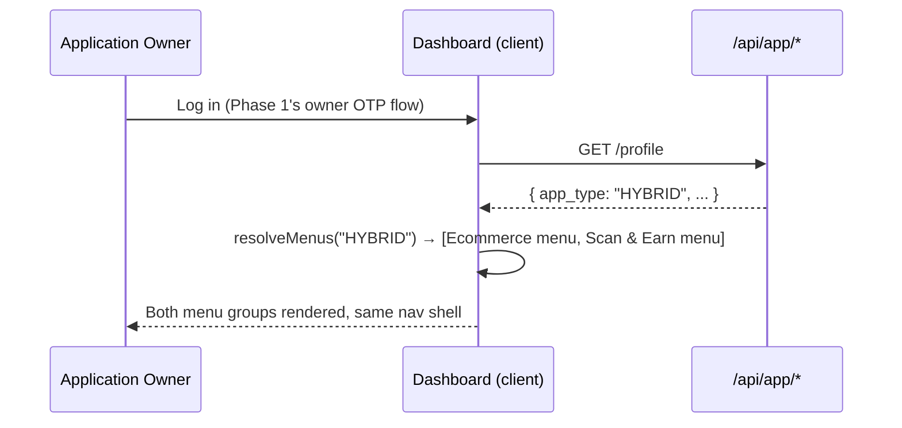
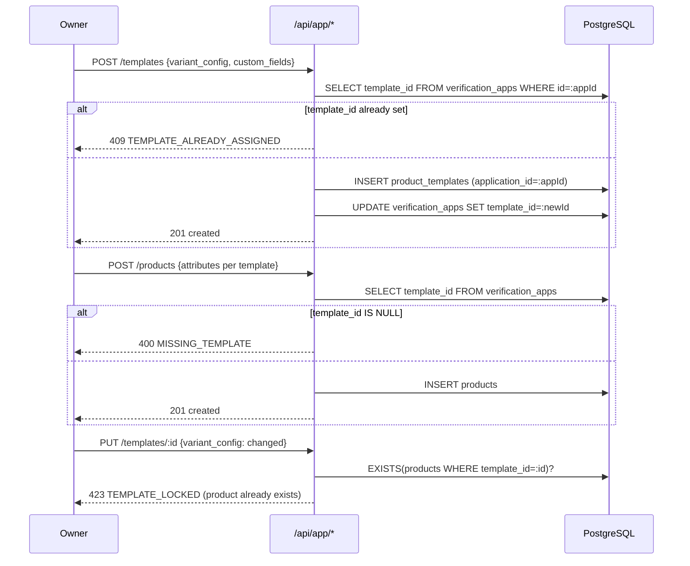
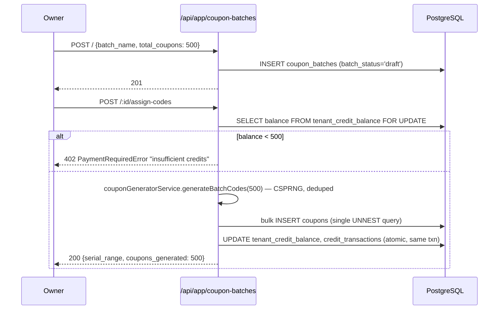

# Phase 2 — Low-Level Design

**Companion to:** `phases/phase2/prd.md` (requirements) · `../../PRD.md` (master) · `../../HLD.md` §3, §11.3 (architecture)
**Status:** Draft v1

---

## 1. Scope

This phase turns Phase 1's identity model into a working Application Owner dashboard: one shared shell whose menus switch on `app_type`, backed by the real ecommerce and scan-and-earn CRUD the codebase mostly already has. No billing, no credit gating, no real payment — those are Phases 3–5 and 8. A key finding from this LLD's codebase audit: **more of this phase is re-routing and re-scoping already-correct logic than building new logic** — flagged explicitly below wherever that's true, since it changes effort estimates.

---

## 2. Database Schema

**No new tables.** This phase's only schema changes are two additive columns and one enforcement trigger, all on existing tables (confirmed against `scan4earn-database/full_setup.sql`):

```sql
-- Migration: scan4earn-database/migrations/002_phase2_template_ownership.sql

-- product_templates currently only supports tenant-scoped templates
-- (UNIQUE(tenant_id, template_name), no application_id column at all).
-- PRD §1 requires templates to also be creatable BY an Application itself
-- (a custom template scoped to just that Application, not shared tenant-wide).
ALTER TABLE product_templates
  ADD COLUMN IF NOT EXISTS application_id UUID REFERENCES verification_apps(id) ON DELETE CASCADE;
  -- NULL = tenant-wide template (existing behavior, unchanged)
  -- set  = this Application's own custom template, invisible to sibling Applications

-- "One application will not have more than one template" (PRD §1) is already
-- enforceable via the existing verification_apps.template_id column — no
-- schema change needed there. What's missing is the ENFORCEMENT of "editable
-- only until products are added" — add a trigger, not just application code,
-- so this can never be bypassed by a direct DB write either.
CREATE OR REPLACE FUNCTION prevent_template_edit_after_product() RETURNS TRIGGER AS $$
BEGIN
  IF EXISTS (SELECT 1 FROM products WHERE template_id = OLD.id) THEN
    RAISE EXCEPTION 'template % is locked: at least one product already uses it', OLD.id
      USING ERRCODE = 'check_violation';
  END IF;
  RETURN NEW;
END;
$$ LANGUAGE plpgsql;

DROP TRIGGER IF EXISTS trg_template_lock ON product_templates;
CREATE TRIGGER trg_template_lock
  BEFORE UPDATE ON product_templates
  FOR EACH ROW
  WHEN (OLD.variant_config IS DISTINCT FROM NEW.variant_config
        OR OLD.custom_fields IS DISTINCT FROM NEW.custom_fields)
  EXECUTE FUNCTION prevent_template_edit_after_product();
```

**Verified unchanged (read from `full_setup.sql` directly, not assumed):** `products` (SERIAL id, `verification_app_id` nullable today — Phase 1's DR-1 migration makes this NOT NULL and renames the user-facing term to "Application"; this LLD's code reuses whatever the Phase-1-migrated column is actually called at the DB layer), `categories`, `tags`, `product_tags`, `product_categories`, `coupon_batches` (`batch_status` enum: `draft → code_assigned → activated → live → completed`), `coupons` (`status`: `draft/printed/active/used/inactive/expired/exhausted`), `ecommerce_orders` (`status`: `pending/confirmed/processing/shipped/delivered/returned/cancelled/refunded`), `serial_number_tracker`, `coupon_code_sequences`. None of these need a Phase 2 migration — they're already shaped correctly for CRUD.

---

## 3. API Contracts

All endpoints below live under `{application's effective domain}/api/app/*` per HLD §11.3, auth = **Owner JWT** (`user_id == applications.owner_user_id`, per Phase 1's identity check). Every contract's error shape is uniform:
```json
{ "success": false, "error": { "code": "STRING_CODE", "message": "human string" } }
```

### 3.1 Profile & `app_type`
| Endpoint | Request | Response 200 | Errors |
|---|---|---|---|
| `GET /profile` | — | `{ id, app_name, app_type, branding: {...}, currency }` | 401 `UNAUTHENTICATED` |
| `PUT /profile` | `{ app_name?, branding?, currency? }` — **`app_type` is NOT editable here**, it's fixed at provisioning by the Tenant Admin (FR-28) | updated profile | 400 `VALIDATION_ERROR` if `app_type` present in body (reject explicitly, don't silently ignore) |

### 3.2 Catalog — Templates
| Endpoint | Request | Response 200/201 | Errors |
|---|---|---|---|
| `GET /templates` | — | `{ tenant_templates: [...], own_template: {...}|null }` — the Tenant's shared library plus this Application's own custom one if it made one | — |
| `POST /templates` | `{ template_name, industry_type, variant_config, custom_fields }` | 201 created template, `application_id` = this Application | 409 `TEMPLATE_ALREADY_ASSIGNED` if `verification_apps.template_id` is already set (one template per Application, PRD §1) |
| `PUT /templates/:id` | `{ variant_config?, custom_fields? }` | updated | 423 `TEMPLATE_LOCKED` if any product already references it (DB trigger above fires; controller catches `check_violation` and maps to 423) |

### 3.3 Catalog — Products
| Endpoint | Request | Response | Errors |
|---|---|---|---|
| `GET /products?page=&limit=&search=` | query params | paginated list | — |
| `GET /products/:id` | — | product detail + `attributes` (per `product_attribute_values`) | 404 `PRODUCT_NOT_FOUND` |
| `GET /products/:id/attributes` | — | template-driven attribute values | 404 |
| `POST /products` | `{ product_name, price, attributes: {...per template.custom_fields...}, category_ids?, tag_ids? }` | 201 | 400 `MISSING_TEMPLATE` if `verification_apps.template_id IS NULL` (must assign/create a template before the first product — PRD §1's ordering constraint); 400 `VALIDATION_ERROR` per template's `is_required` attribute fields |
| `PUT /products/:id` | partial fields | 200 | 404 |
| `DELETE /products/:id` | — | 204 | 404; **no hard delete if `ecommerce_orders` reference it** — soft-delete (`is_active=false`) instead, consistent with Phase 1's DR-6 soft-delete philosophy |

### 3.4 Catalog — Categories (net-new owner CRUD; today only a read-only consumer version exists)
| Endpoint | Request | Response | Errors |
|---|---|---|---|
| `GET /categories` | — | list | — |
| `POST /categories` | `{ name, description?, icon? }` | 201 | 409 `CATEGORY_NAME_EXISTS` (per `unique_tenant_app_category`) |
| `PUT /categories/:id` | partial | 200 | 404 |
| `DELETE /categories/:id` | — | 204 | 409 `CATEGORY_IN_USE` if products still linked (leave linking decision to the owner — don't cascade-delete product associations silently) |

### 3.5 Catalog — Tags (No Change — already exists exactly as needed)
`GET/POST /tags`, `GET/PUT/DELETE /tags/:id` — reuse `tag.routes.js` verbatim, just remounted under `/api/app/*` with Owner-JWT auth instead of today's tenant-permission auth.

### 3.6 Inventory (No Change)
`POST /products/:id/stock`, `GET /products/:id/stock/movements`, `GET /inventory/low-stock`, `GET /inventory/out-of-stock` — reuse `inventory.routes.js` verbatim.

### 3.7 Orders (Needs Modification — the real fix is an auth-boundary bug, not new logic)
| Endpoint | Request | Response | Errors |
|---|---|---|---|
| `GET /orders?status=&page=` | — | full order list, **unrestricted to this Application** (unlike the consumer's "own orders only" view) | — |
| `GET /orders/:id` | — | detail + items | 404 |
| `PATCH /orders/:id/status` | `{ status }` | 200 | 400 `INVALID_TRANSITION` if not an allowed edge in §4's state machine; **410-style rejection if caller is not Owner JWT** — this is the actual bug being fixed: today's `ecommerceApi.routes.js` mounts this route behind the same `authenticate` middleware as the shopper-facing cart/checkout routes in the same file. Phase 2 splits it into its own route file mounted under `/api/app/*` with Owner-JWT-only auth, removing it entirely from the shopper-facing router. |

Placeholder fields on every order response this phase: `payment_status` always `"pending"`, `invoice_url` always `null` — both wired for real in Phase 8 (DR-19).

### 3.8 Coupon Batches (Needs Modification — mostly re-routing, not new logic)
Reuses `batchController.js`'s `createBatch`/`assignSerialNumbers`/`activateBatch`/`getBatchDetails`/`listBatches` almost as-is — **this controller already does CSPRNG code generation via `couponGeneratorService.generateBatchCodes()` and an atomic, row-locked credit debit** (see §5.2 — a real, positive finding from the codebase audit, not something this phase needs to build from scratch).

| Endpoint | Request | Response | Errors |
|---|---|---|---|
| `POST /coupon-batches` | `{ batch_name, dealer_name, zone, total_coupons }` | 201, `batch_status='draft'` | 400 if `total_coupons` not in `1..100000` |
| `POST /coupon-batches/:id/assign-codes` | `{ quantity? }` | 200, codes generated | **In this phase, credit check still targets `tenant_credit_balance`** (unchanged) — Phase 5 (DR-17) redirects this same code path's balance check/debit to `application_credit_balance` instead. Flag this row in code review as the exact line Phase 5 must touch. |
| `POST /coupon-batches/:id/activate` | — | 200, `batch_status='activated'` | 400 if not `code_assigned` |
| `POST /coupon-batches/:id/print` | — | 200, bulk-marks every coupon in the batch `status='printed'` | 400 if batch not yet `code_assigned`/`activated`. **Consolidation, not new logic:** today this lives at `POST /coupons/batch/:batch_id/print` in `rewards.routes.js` — this phase just remounts it under the `coupon-batches` namespace per HLD §11.3, same underlying controller logic. |
| `POST /coupon-batches/:id/deactivate` | — | 200, bulk-deactivates every coupon in the batch | 400 if already deactivated. Same consolidation as `/print` — today's `POST /coupons/batch/:batch_id/deactivate` in `rewards.routes.js`, remounted here. |
| `GET /coupon-batches` / `/:id` / `/:id/stats` | — | list/detail/stats | 404 |

### 3.9 Coupons (single/multi, No Change to codegen — reuses `rewards.controller.js`)
`GET /coupons`, `GET /coupons/:id`, `POST /coupons`, `POST /coupons/multi-batch`, `PATCH /coupons/:id/status`, `POST /coupons/activate-range|activate-batch|bulk-activate`, `PATCH /coupons/:id/print`, `POST /coupons/bulk-print|deactivate-range` — remount as-is under Owner JWT. Same Phase-5 flag as above for the credit-debit target.

### 3.10 Scans & Redemptions (read-only in this phase)
`GET /scans/history`, `GET /scans/analytics`, `GET /redemptions`, `GET /redemptions/summary`, `GET /redemptions/:id` — read-only reuse of existing `rewards.controller.js`/`redemptionAdmin` logic. Approve/reject stay available (existing `POST /redemptions/:id/approve|reject`) since they don't touch credits.

### 3.11 Dashboard (basic slice only)
| Endpoint | Response |
|---|---|
| `GET /dashboard/stats` | `app_type=ECOMMERCE`: `{ order_count, orders: [...(paginated)], low_stock_products: [...], unique_customers }`. `app_type=SCAN_AND_EARN`: `{ total_scans, cashback_paid, points_issued, coupon_burn_down_pct, pending_redemptions: [...] }`. `HYBRID`: both objects, both keys present, never merged into one ambiguous shape. **No charts, no CSV, no heatmap, no top-N tables here — Phase 7.** |

### 3.12 `/api-docs` (basic filtered version)
`GET /api-docs` → returns the endpoint list from §11.5 (ecommerce) and/or §11.6 (scan-and-earn) filtered by `app_type`, as plain JSON (method/path/description) — no try-it-out console, no code samples yet (Phase 7).

---

## 4. State Machines

**Coupon batch (`coupon_batches.batch_status`, existing ENUM, unchanged):**
```
draft --[assign-codes]--> code_assigned --[activate]--> activated --[???]--> live --[???]--> completed
```
`live`/`completed` transitions are not exposed by any endpoint in this phase's scope (existing gap in the real codebase — `activateBatch` only reaches `activated`). Not this phase's job to close; note as an Open Question in §11.

**Coupon (`coupons.status`, existing CHECK, unchanged):** `draft → printed → active → (used | expired | exhausted | inactive)`. Enforced entirely by existing `rewards.controller.js` logic (`PATCH /coupons/:id/status`, `/:id/print`, `/activate-*`) — this phase changes only the auth wrapper, not the transition logic.

**Ecommerce order (`ecommerce_orders.status`, existing CHECK constraint, unchanged):**
```
pending → confirmed → processing → shipped → delivered
   \--> cancelled        \--> returned --> refunded
```
This phase's `PATCH /orders/:id/status` must validate the edge against this exact set server-side (today's `updateOrderStatus` controller — verify it already does; if not, this is a Needs-Modification item alongside the auth fix).

---

## 5. Business Logic / Algorithms

### 5.1 `app_type` → menu resolution
```
function resolveMenus(app_type):
    menus = []
    if app_type in ('ECOMMERCE', 'HYBRID'): menus.append(ECOMMERCE_MENU)   # Products, Inventory, Orders, Customers
    if app_type in ('SCAN_AND_EARN', 'HYBRID'): menus.append(SCAN_MENU)   # Batches, Coupons, Scans, Redemptions, Cashback
    return menus
```
Applied identically on the client (nav rendering) and the server (`/api-docs` filtering, and as a coarse route-group check in the Authorization Layer per HLD §4 — an `ECOMMERCE`-only Application's session hitting `/coupon-batches` should 403 `APP_TYPE_MISMATCH`, not just hide the menu item client-side).

### 5.2 Non-enumerable coupon code generation — **already correct, reuse verbatim**
`services/coupon-generator.service.js`'s `generateCouponCode()` already uses `crypto.randomInt` over a 32-character confusion-free charset (`ABCDEFGHJKLMNPQRSTUVWXYZ23456789`, excludes `0/O/1/I/l`), 8 chars formatted `XXXX-XXXX`, with `generateBatchCodes()` de-duplicating via a `Set` until it reaches the target count, and the single-coupon path in `rewards.controller.js` retrying up to 10 times against a `SELECT ... WHERE coupon_code = $1` uniqueness check. **This already satisfies NFR-4.** No new algorithm needed — the PRD/HLD's claim of "today's path emits sequential codes" does not match the current codebase and should be corrected upstream (flagged in the Definition of Done below as a verification step, not a build step).

### 5.3 Template-lock-after-first-product
```
ON template UPDATE (variant_config or custom_fields changed):
    IF EXISTS (SELECT 1 FROM products WHERE template_id = this.id):
        REJECT (423 TEMPLATE_LOCKED)
```
Implemented as both a DB trigger (§2, defense in depth) and a pre-check in the `PUT /templates/:id` controller (fast, friendly error before the trigger even fires).

### 5.4 One-template-per-Application enforcement
```
ON template assignment (POST /templates, or Tenant Admin's original app-creation flow):
    IF verification_apps.template_id IS NOT NULL:
        REJECT (409 TEMPLATE_ALREADY_ASSIGNED)
    ELSE:
        SET verification_apps.template_id = new_template.id
```

---

## 6. Sequence Diagrams







---

## 7. Validation & Error Catalog

| Code | HTTP | Trigger |
|---|---|---|
| `VALIDATION_ERROR` | 400 | Generic field validation failure (missing required field, out-of-range value) |
| `MISSING_TEMPLATE` | 400 | `POST /products` before any template is assigned to this Application |
| `TEMPLATE_ALREADY_ASSIGNED` | 409 | `POST /templates` when `verification_apps.template_id` is already set |
| `TEMPLATE_LOCKED` | 423 | Editing a template that already has ≥1 product referencing it |
| `CATEGORY_NAME_EXISTS` | 409 | Duplicate category name within this Application |
| `CATEGORY_IN_USE` | 409 | Deleting a category still linked to products |
| `PRODUCT_NOT_FOUND` | 404 | Unknown/foreign product id |
| `INVALID_TRANSITION` | 400 | `PATCH /orders/:id/status` to a non-adjacent state (§4) |
| `APP_TYPE_MISMATCH` | 403 | Calling an Ecommerce-only endpoint on a `SCAN_AND_EARN` Application or vice versa |
| `PaymentRequiredError` (existing) | 402 | Coupon batch/coupon creation when credit balance insufficient (still Tenant-level in this phase) |
| `UNAUTHENTICATED` | 401 | No/invalid Owner JWT |
| `FORBIDDEN` | 403 | Valid JWT, wrong Application (`user_id != owner_user_id`) |

---

## 8. File/Module Plan

| File | Action | Purpose |
|---|---|---|
| `scan4earn-server/src/routes/products.routes.js` | Modify | Remount under `/api/app/*`, Owner-JWT auth; add `MISSING_TEMPLATE`/template-lock checks to create/update handlers |
| `scan4earn-server/src/routes/tag.routes.js` | Modify | Remount only — no logic change |
| `scan4earn-server/src/routes/inventory.routes.js` | Modify | Remount only |
| `scan4earn-server/src/routes/ecommerceApi.routes.js` | **Modify (split)** | Remove `PATCH /orders/:id/status` from this shopper-facing router entirely |
| `scan4earn-server/src/routes/appOrders.routes.js` | **New** | Owner-only order routes: `GET /orders`, `GET /orders/:id`, `PATCH /orders/:id/status` — Owner JWT only |
| `scan4earn-server/src/routes/batchRoutes.js` | Modify | Remount under `/api/app/coupon-batches`; no logic change to code generation/credit debit (Phase 5 touches the debit target later) |
| `scan4earn-server/src/routes/rewards.routes.js` | Modify | Split: coupon CRUD + templates/features/verification-apps management stays Tenant-side (already in §11.2) vs. coupon-batch/coupon operational endpoints move to Owner-JWT `/api/app/*` |
| `scan4earn-server/src/routes/dashboard.routes.js` | Modify | Add `app_type` branching in `getDashboardStats` |
| `scan4earn-server/src/routes/apiConfig.routes.js` | Modify | `/api-docs` gains `app_type` filtering |
| `scan4earn-server/src/controllers/products.controller.js` (or wherever `products.routes.js` delegates) | Modify | Add template-lock/missing-template checks |
| `scan4earn-server/src/services/coupon-generator.service.js` | **No Change** | Already correct — do not touch |
| New: `scan4earn-server/src/routes/categories.routes.js` | **New** | Owner-side category CRUD (currently only read-only exists in the consumer API) |
| `scan4earn-database/migrations/002_phase2_template_ownership.sql` | New | §2's DDL |

---

## 9. Configuration

No new environment variables required for this phase (coupon code charset/length are hardcoded in the existing, already-correct service — no need to make configurable unless a future requirement demands it).

---

## 10. Test Plan

Mapped to `phase2/prd.md`'s Definition of Done:

1. **`app_type` switch, all three values, HYBRID shows both menus simultaneously** — unit test on `resolveMenus()`; integration test hitting `/api-docs` for each `app_type` and asserting the correct endpoint groups appear/are absent.
2. **Ecommerce CRUD end-to-end** — integration test: create template → create product (fails without template, `MISSING_TEMPLATE`) → create product (succeeds) → attempt template edit (`TEMPLATE_LOCKED`) → adjust stock → verify low-stock listing → transition order through the full state machine including a rejected `INVALID_TRANSITION` attempt → attempt the same PATCH with a Consumer-session token instead of Owner JWT and assert 403 (this is the regression test for the auth-boundary bug this phase fixes).
3. **Scan-and-earn CRUD end-to-end** — create batch → assign-codes with insufficient tenant credit balance (402) → top up → assign-codes again (200, codes generated) → assert every generated code matches the CSPRNG format regex and none are sequential → activate batch → approve a redemption.
4. **NFR-4 entropy test** — generate 10,000 codes via `generateBatchCodes`, assert charset compliance, assert no two consecutive codes differ by a fixed offset (rules out an accidental sequential fallback), assert collision-retry logic never fires more than expected at this volume.
5. **Owner with 2+ Applications, no data bleed-through** — integration test: same owner, two Applications, assert `GET /products` under Application A's JWT context never returns Application B's rows even with an identical owner.
6. **`/api-docs` correct subset per `app_type`** — three assertions, one per `app_type` value.

---

## 11. Open Questions / Assumptions

- **Assumed:** `batch_status` values `live`/`completed` (present in the existing ENUM) have no controller path reaching them yet in the current codebase, and closing that gap is out of this phase's scope (not called for by `phase2/prd.md`) — flagging rather than silently leaving batches permanently stuck at `activated`.
- **Assumed:** category deletion should block (409) rather than cascade when products are still linked, since no PRD text specifies the desired behavior — chose the safer default over silent data loss.
- **Correction upstream — already applied, verified:** `PRD.md`'s NFR-3/NFR-4 and `HLD.md`'s §11.3 coupon-batch rows have since been corrected to reflect this LLD's codebase-audit finding (`batchController.js`/`coupon-generator.service.js` already implement CSPRNG codes and an atomic, row-locked tenant-level credit debit — no "charges 0"/"sequential codes" defect exists). No further action needed here; noting the correction landed so this LLD and the master docs read as consistent, not as a still-open recommendation.
