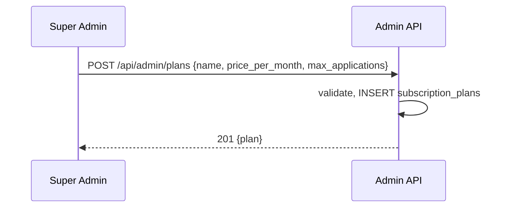
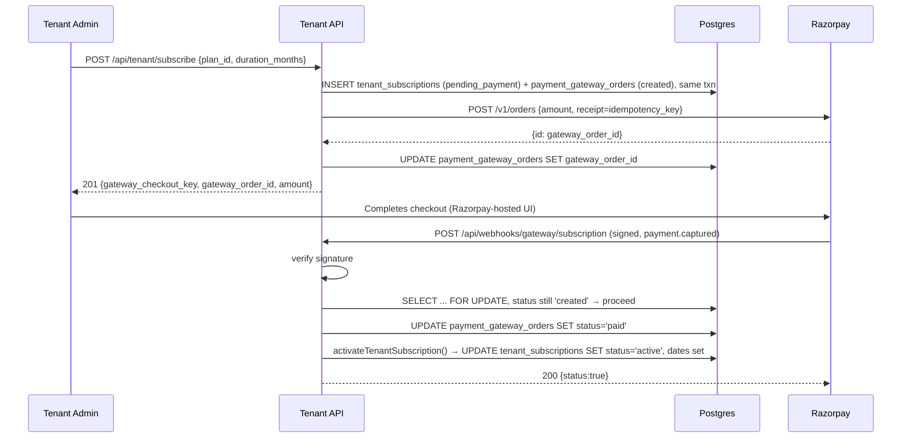
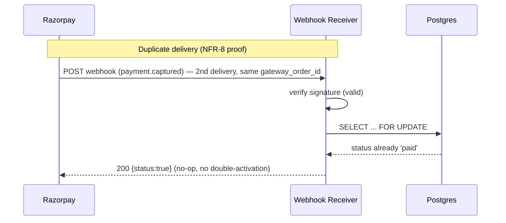
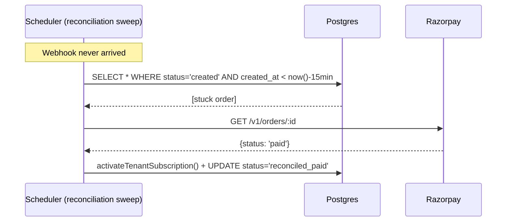
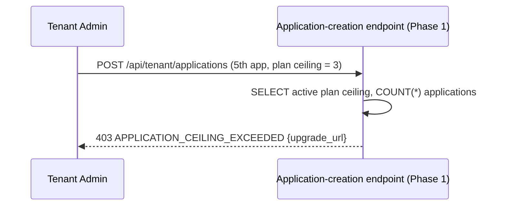

# Phase 3 — Low-Level Design
## Super Admin ⇄ Tenant Subscription Billing (Layer 1) + Payment Gateway Foundation

**Status:** Implementation-ready
**Parent docs:** `../../PRD.md` §6.8 Layer 1, `../../HLD.md` §3/§4/§6/§7/§11.1/§11.2/§11.4, `./prd.md`

---

## 1. Scope

This phase stands up the platform's first real, gateway-confirmed money flow — a Tenant subscribing to a Super-Admin-managed plan — and builds the **shared payment infrastructure** (gateway Order creation, signed-webhook verification, idempotency, stuck-payment reconciliation) that Phases 4, 5, and 8 will all reuse without reinventing. It covers FR-4a, FR-6a, the FR-9/FR-19/FR-20 dashboard enhancements, DR-8, DR-9, NFR-7–10, RD-4, RD-7. It does **not** touch Application-level billing (Phase 4) or the credit cascade (Phase 5) — those are separate consumers of the infrastructure this phase builds.

---

## 2. Database Schema

### 2.1 Current state (verified against `scan4earn-database/full_setup.sql`)

`tenant_subscriptions` today has no `plan_id`, and is populated directly and synchronously inside `tenant.controller.js#createTenant`/`#addSubscription` with `payment_status` hardcoded to whatever the caller passes (typically `'paid'` immediately) — there is **no gateway involved at all today**. This phase must not delete this legacy path (existing rows stay valid per DR-9), but the *new* subscribe flow (§4.2) replaces it going forward with a real gateway-order-then-webhook flow.

### 2.2 Migration file

The `migrations/` folder is currently empty by convention (pre-production, changes go into `full_setup.sql` directly per its README). This phase is the point at which that convention should flip — Phase 1 onward assumes real Tenants exist — so this LLD targets numbered migration files starting at `001`. **Assumption, flagged:** if the team prefers to keep folding into `full_setup.sql` a while longer, apply the same DDL there instead; the SQL itself is unaffected.

**`scan4earn-database/migrations/001_subscription_plans_and_gateway_orders.sql`**
```sql
-- =========================================================
-- DR-8: subscription_plans (Platform-grain, Super-Admin-managed catalog)
-- =========================================================
CREATE TABLE IF NOT EXISTS subscription_plans (
    id UUID PRIMARY KEY DEFAULT gen_random_uuid(),
    name VARCHAR(100) NOT NULL,
    price_per_month NUMERIC(12,2) NOT NULL CHECK (price_per_month >= 0),
    max_applications INTEGER CHECK (max_applications IS NULL OR max_applications > 0), -- NULL = unlimited
    is_active BOOLEAN NOT NULL DEFAULT true,
    sort_order INTEGER NOT NULL DEFAULT 0,
    created_by UUID REFERENCES users(id),
    created_at TIMESTAMP WITH TIME ZONE DEFAULT CURRENT_TIMESTAMP,
    updated_at TIMESTAMP WITH TIME ZONE DEFAULT CURRENT_TIMESTAMP,
    CONSTRAINT uq_subscription_plans_name UNIQUE (name)
);

CREATE INDEX IF NOT EXISTS idx_subscription_plans_active_sort
    ON subscription_plans (is_active, sort_order);

DROP TRIGGER IF EXISTS update_subscription_plans_updated_at ON subscription_plans;
CREATE TRIGGER update_subscription_plans_updated_at BEFORE UPDATE ON subscription_plans
    FOR EACH ROW EXECUTE FUNCTION update_updated_at_column();

-- Seed the three initial plans (FR-4a) — ordinary rows, editable/extensible later
INSERT INTO subscription_plans (name, price_per_month, max_applications, sort_order)
VALUES
    ('Plan 1', 2000.00, 3, 1),
    ('Plan 2', 5500.00, 10, 2),
    ('Plan 3', 50000.00, NULL, 3)
ON CONFLICT (name) DO NOTHING;

-- =========================================================
-- DR-9: tenant_subscriptions gains plan_id
-- =========================================================
ALTER TABLE tenant_subscriptions
    ADD COLUMN IF NOT EXISTS plan_id UUID REFERENCES subscription_plans(id);

-- New rows created via the Phase-3 subscribe flow always set plan_id;
-- existing/legacy rows (app_count/price_per_app_month, pre-Phase-3) keep plan_id NULL — historical, never migrated.
ALTER TABLE tenant_subscriptions
    ADD COLUMN IF NOT EXISTS gateway_order_id VARCHAR(255);

CREATE INDEX IF NOT EXISTS idx_tenant_subscriptions_plan ON tenant_subscriptions (plan_id);
CREATE INDEX IF NOT EXISTS idx_tenant_subscriptions_gateway_order ON tenant_subscriptions (gateway_order_id);

-- Broaden the status check to add the new pending_payment state (NFR-7 gateway flow)
ALTER TABLE tenant_subscriptions DROP CONSTRAINT IF EXISTS tenant_subscription_status_check;
ALTER TABLE tenant_subscriptions ADD CONSTRAINT tenant_subscription_status_check
    CHECK (status IN ('pending_payment', 'active', 'expired', 'cancelled'));

-- =========================================================
-- Shared payment infrastructure (NFR-7/8/9/10) — introduced here,
-- reused unmodified by Phase 4 (application_subscriptions), Phase 5
-- (credit purchases), and Phase 8 (ecommerce checkout).
-- =========================================================
CREATE TABLE IF NOT EXISTS payment_gateway_orders (
    id UUID PRIMARY KEY DEFAULT gen_random_uuid(),
    gateway VARCHAR(30) NOT NULL DEFAULT 'razorpay',
    gateway_order_id VARCHAR(255) NOT NULL,
    gateway_payment_id VARCHAR(255),
    purpose VARCHAR(40) NOT NULL, -- 'tenant_subscription' | 'application_subscription' | 'tenant_credit_purchase' | 'application_credit_purchase' | 'ecommerce_checkout'
    payer_type VARCHAR(20) NOT NULL, -- 'tenant' | 'application' | 'consumer'
    payer_id UUID NOT NULL,          -- tenants.id / applications.id / users.id depending on payer_type
    reference_table VARCHAR(60) NOT NULL, -- e.g. 'tenant_subscriptions' — the row this order ultimately activates
    reference_id UUID NOT NULL,           -- the PK of that row
    amount NUMERIC(12,2) NOT NULL CHECK (amount >= 0),
    currency VARCHAR(3) NOT NULL DEFAULT 'INR',
    status VARCHAR(20) NOT NULL DEFAULT 'created', -- created | paid | failed | reconciled_paid | reconciled_failed
    idempotency_key VARCHAR(255) NOT NULL, -- app-generated, sent to gateway as receipt/notes to correlate retried creation attempts
    webhook_received_at TIMESTAMP WITH TIME ZONE,
    reconciled_at TIMESTAMP WITH TIME ZONE,
    raw_webhook_payload JSONB,
    created_at TIMESTAMP WITH TIME ZONE DEFAULT CURRENT_TIMESTAMP,
    updated_at TIMESTAMP WITH TIME ZONE DEFAULT CURRENT_TIMESTAMP,
    CONSTRAINT uq_payment_gateway_orders_gateway_order_id UNIQUE (gateway, gateway_order_id),
    CONSTRAINT uq_payment_gateway_orders_idempotency_key UNIQUE (idempotency_key),
    CONSTRAINT chk_payment_gateway_orders_purpose CHECK (purpose IN
        ('tenant_subscription','application_subscription','tenant_credit_purchase','application_credit_purchase','ecommerce_checkout')),
    CONSTRAINT chk_payment_gateway_orders_payer_type CHECK (payer_type IN ('tenant','application','consumer')),
    CONSTRAINT chk_payment_gateway_orders_status CHECK (status IN ('created','paid','failed','reconciled_paid','reconciled_failed'))
);

CREATE INDEX IF NOT EXISTS idx_pgo_status_created ON payment_gateway_orders (status, created_at);
CREATE INDEX IF NOT EXISTS idx_pgo_reference ON payment_gateway_orders (reference_table, reference_id);

DROP TRIGGER IF EXISTS update_payment_gateway_orders_updated_at ON payment_gateway_orders;
CREATE TRIGGER update_payment_gateway_orders_updated_at BEFORE UPDATE ON payment_gateway_orders
    FOR EACH ROW EXECUTE FUNCTION update_updated_at_column();
```

**Why one shared `payment_gateway_orders` table, not four purpose-specific ones:** NFR-7 explicitly requires "all four payment surfaces use the same pattern." A single table with a `purpose`/`reference_table`/`reference_id` triple lets the webhook receiver (§4.4) and the reconciliation sweep (§5.3) be generic, written once, reused by Phases 4/5/8 by simply inserting a new `purpose` value — not duplicating the whole idempotency/reconciliation mechanism per phase.

---

## 3. API Contracts

Base paths per HLD §11.1/§11.2/§11.4. All authenticated responses use the codebase's real envelope: `{ "status": true, "data": {...}, "message"?: "..." }` on success (`response.util.js#sendSuccess`), thrown `AppError` subclasses on failure serialize to `{ "success": false, "error": { "message", "code", "statusCode", "details" } }` (`AppError.js#toJSON` — note the existing inconsistency between `status`/`success` keys on success vs. error responses; this LLD does not fix that pre-existing inconsistency, just documents it so implementers aren't surprised).

### 3.1 `GET /api/admin/plans` — Super Admin JWT
List the plan catalog.
- Query: `include_inactive` (boolean, optional, default `false`)
- 200: `{ status: true, data: { plans: [{ id, name, price_per_month, max_applications, is_active, sort_order }] } }`

### 3.2 `POST /api/admin/plans` — Super Admin JWT
- Body: `{ name: string (required, 1-100 chars, unique), price_per_month: number (required, >= 0), max_applications: integer | null (optional; omit/null = unlimited, else > 0), sort_order: integer (optional, default 0) }`
- 201: `{ status: true, data: { plan: {...} } }`
- 409 `PLAN_NAME_EXISTS` if `name` collides with the unique constraint.
- 400 `VALIDATION_ERROR` if `price_per_month < 0` or `max_applications <= 0`.

### 3.3 `PUT /api/admin/plans/:id` — Super Admin JWT
- Body: any subset of `{ name, price_per_month, max_applications, sort_order }`.
- 200: `{ status: true, data: { plan: {...} } }`
- 404 `PLAN_NOT_FOUND`.
- **Rule:** editing `price_per_month`/`max_applications` never touches already-active `tenant_subscriptions` rows (they froze their own `total_amount` at subscribe time) — only affects future subscribes/renewals.

### 3.4 `PATCH /api/admin/plans/:id/deactivate` — Super Admin JWT
- Sets `is_active = false`. Existing subscribers on this plan are **not** affected or force-migrated (RD-4 spirit: no silent renegotiation). New subscribes/renewals to a deactivated plan are rejected.
- 200: `{ status: true, data: { plan: {...} } }`
- 404 `PLAN_NOT_FOUND`.

### 3.5 `GET /api/tenant/plans` — Tenant Admin JWT
Same shape as 3.1 but implicitly `include_inactive=false` and no override — a Tenant only ever sees active, subscribable plans.

### 3.6 `POST /api/tenant/subscribe` — Tenant Admin JWT
The core new flow (RD-7: real gateway checkout, not a manual mark-as-paid).
- Body: `{ plan_id: uuid (required), duration_months: integer (required, one of 1,3,6,9,12) }`
- Server logic:
  1. Load plan; 404 `PLAN_NOT_FOUND` if missing, 400 `PLAN_INACTIVE` if `is_active = false`.
  2. Validate `duration_months` against `ALLOWED_SUBSCRIPTION_DURATIONS = [1,3,6,9,12]` (reuse the existing constant from `tenant.controller.js`) — 400 `INVALID_DURATION` otherwise.
  3. `total_amount = plan.price_per_month * duration_months` (exact NUMERIC arithmetic, not floating point — see §5.1).
  4. Insert a `tenant_subscriptions` row with `status='pending_payment'`, `plan_id`, `duration_months`, `total_amount`, `start_date = NULL`, `end_date = NULL` (dates are only set on confirmed activation, §5.2) inside the same DB transaction as step 5.
  5. Insert a `payment_gateway_orders` row: `purpose='tenant_subscription'`, `payer_type='tenant'`, `payer_id=<tenant_id>`, `reference_table='tenant_subscriptions'`, `reference_id=<the row from step 4>`, `amount=total_amount`, `status='created'`, `idempotency_key=uuid()`.
  6. Call Razorpay `POST /v1/orders` (see §5.2 for exact request/response) using `idempotency_key` as the Razorpay `receipt` field; store the returned `gateway_order_id` on the `payment_gateway_orders` row.
  7. Return the gateway's checkout parameters to the client.
- 201: `{ status: true, data: { tenant_subscription_id, payment_gateway_order_id, gateway_order_id, amount, currency: "INR", gateway_checkout_key: "<RAZORPAY_KEY_ID>" } }` — the frontend uses this to open Razorpay Checkout.
- 409 `SUBSCRIPTION_ALREADY_PENDING` if the Tenant already has a `pending_payment` row (must pay or let it expire before creating another — see §5.4 pending-order expiry note).
- 400 `PLAN_INACTIVE` / `INVALID_DURATION` as above.

### 3.7 `GET /api/tenant/subscription` — Tenant Admin JWT
- 200: `{ status: true, data: { subscription: { plan_name, price_per_month, duration_months, total_amount, status, start_date, end_date, max_applications, applications_used } } }` — `applications_used` is a live `COUNT(*)` from `applications WHERE tenant_id = ... AND deleted_at IS NULL`, joined in, not stored.
- 404 `NO_SUBSCRIPTION` if the Tenant has never subscribed (pre-Phase-3 legacy tenants with only `app_count`-style rows still resolve here using their legacy row, with `plan_name: null`).

### 3.8 `POST /api/webhooks/gateway/subscription` — Gateway signature (no user JWT)
Shared receiver for Layer 1 (this phase) and Layer 2 (Phase 4) subscription payments — differentiated by `payment_gateway_orders.purpose`.
- Headers: `X-Razorpay-Signature` (HMAC-SHA256 hex digest).
- Body: raw Razorpay webhook payload (`event`, `payload.payment.entity`, etc.) — **must be read as the raw byte body for signature verification, before JSON parsing** (see §5.2's exact algorithm — this is a common integration bug).
- Server logic: see §5.3.
- 200 `{ status: true }` on successful processing **or** on a recognized-duplicate (idempotent no-op) — Razorpay retries on any non-2xx, so genuine processing errors must still return 200 after logging, to avoid a retry storm, UNLESS the signature itself is invalid (401).
- 401 `INVALID_SIGNATURE` if HMAC verification fails — do not process the body at all in this case.

### 3.9 `GET /api/admin/dashboard/stats` — Super Admin JWT (enhancement to existing Phase 1 endpoint)
Adds to the existing response: `active_subscriptions_count` (live `COUNT(*) WHERE status='active'`), `total_credits_sold` (0 until Phase 5 — this phase just adds the field, populated value comes later per FR-19's note).

### 3.10 `GET /api/tenant/dashboard/stats` — Tenant Admin JWT (enhancement to existing Phase 1 endpoint)
Adds: `plan_name`, `subscription_status`, `subscription_renewal_date` (per FR-20).

---

## 4. State Machines

### 4.1 `tenant_subscriptions.status`
```
pending_payment --[webhook: payment.captured]--> active
pending_payment --[webhook: payment.failed]-----> (row stays pending_payment; Tenant Admin may retry subscribe, which creates a NEW pending_payment row + new payment_gateway_orders row — the failed one is left as historical audit trail, not reused)
active           --[Scheduler: end_date passed, no renewal]--> expired   (NOTE: master PRD's RD-8/FR-33, implemented in Phase 4, says this does NOT cascade-suspend Applications — Phase 3 only owns flipping this Tenant-grain status itself)
active           --[Tenant Admin: re-subscribes early]--------> (existing row untouched; a fresh subscribe cycle runs, and on confirmation the OLD active row is superseded — see §5.4 renewal rule)
expired          --[webhook: new subscribe payment.captured]--> active (renewal)
cancelled        : terminal (manual Super Admin action only, out of this phase's API surface — exists in the CHECK constraint for completeness/future use)
```

### 4.2 `payment_gateway_orders.status`
```
created --[webhook arrives, signature valid, gateway status = captured]--> paid
created --[webhook arrives, signature valid, gateway status = failed]----> failed
created --[Scheduler reconciliation: gateway reports captured]-----------> reconciled_paid
created --[Scheduler reconciliation: gateway reports failed/expired]-----> reconciled_failed
paid / reconciled_paid / failed / reconciled_failed : terminal
```
`paid` and `reconciled_paid` are treated identically by every downstream consumer (both mean "activate the referenced row") — the distinction exists only so operators can see in a query whether the webhook worked or reconciliation had to catch it (an NFR-9 health signal, not a behavioral difference).

---

## 5. Business Logic / Algorithms

### 5.1 `total_amount` calculation
```js
// NUMERIC(12,2) arithmetic must not go through JS floating point for the stored value.
// Compute in integer paise to avoid rounding drift, then format back to 2dp string for storage/display.
function calculateTotalAmount(pricePerMonth, durationMonths) {
  const priceInPaise = Math.round(Number(pricePerMonth) * 100);
  const totalPaise = priceInPaise * durationMonths;
  return (totalPaise / 100).toFixed(2); // string, passed as a NUMERIC-bindable param
}
```

### 5.2 Razorpay Order creation (extends `paymentGateway.service.js`)
The existing service only implements `initiateUpiPayout` (Payouts API, outbound). This phase adds a new sibling function, same module, same env-var-gated mock/razorpay switch pattern:
```js
// New: createOrder({ amountInRupees, currency='INR', receipt, notes }) -> { gatewayOrderId, keyId, amount, currency }
async function razorpayCreateOrder({ amount, currency, receipt, notes }) {
  const body = {
    amount: Math.round(amount * 100), // paise
    currency,
    receipt,          // = payment_gateway_orders.idempotency_key — lets Razorpay itself de-dupe retried creation calls
    notes,            // e.g. { purpose: 'tenant_subscription', tenant_subscription_id }
    payment_capture: 1
  };
  const result = await razorpayRequest('POST', '/v1/orders', body); // reuses the existing razorpayRequest() helper unchanged
  return { gatewayOrderId: result.id, keyId: process.env.RAZORPAY_KEY_ID, amount: body.amount, currency };
}

function mockCreateOrder({ amount, currency, receipt }) {
  return Promise.resolve({ gatewayOrderId: `MOCK_ORDER_${receipt}`, keyId: 'mock_key', amount: Math.round(amount*100), currency });
}

async function createGatewayOrder(request) {
  const gateway = (process.env.PAYMENT_GATEWAY || 'mock').toLowerCase();
  if (gateway === 'mock') return mockCreateOrder(request);
  if (gateway === 'razorpay') return razorpayCreateOrder(request);
  throw new Error(`Unknown PAYMENT_GATEWAY: "${gateway}"`);
}
module.exports = { initiateUpiPayout, createGatewayOrder }; // extend the existing exports, don't replace
```

**Webhook signature verification** (Razorpay's documented scheme — HMAC-SHA256 over the raw request body, keyed with the webhook secret configured in the Razorpay dashboard, compared to the `X-Razorpay-Signature` header):
```js
const crypto = require('crypto');
function verifyWebhookSignature(rawBody, signatureHeader) {
  const expected = crypto
    .createHmac('sha256', process.env.RAZORPAY_WEBHOOK_SECRET)
    .update(rawBody) // MUST be the raw, unparsed request body buffer/string
    .digest('hex');
  // Constant-time compare to avoid timing side-channels
  return crypto.timingSafeEqual(Buffer.from(expected), Buffer.from(signatureHeader || ''));
}
```
**Route-level requirement:** the Express route for `/api/webhooks/gateway/*` must use `express.raw({ type: 'application/json' })` (or an equivalent raw-body capture), NOT the global `express.json()` body parser, specifically for this route — signature verification fails silently otherwise. Flag this explicitly in the file/module plan (§8) since it's an easy integration mistake.

### 5.3 Webhook handler algorithm (generic — reused by Phases 4/5/8 unmodified)
```
1. Read raw body + X-Razorpay-Signature header.
2. verifyWebhookSignature(rawBody, signature) → if false: respond 401 INVALID_SIGNATURE, log, stop. Do not touch the DB.
3. Parse JSON body. Extract event type ('payment.captured' | 'payment.failed') and gateway_order_id (payload.payment.entity.order_id).
4. BEGIN TRANSACTION.
5. SELECT * FROM payment_gateway_orders WHERE gateway_order_id = $1 FOR UPDATE.
     - Not found → 200 OK anyway (log a warning; could be an order from a different environment/gateway account — never error back to the gateway for this).
     - Found, status already IN ('paid','reconciled_paid','failed','reconciled_failed') → this is a retried webhook (NFR-8). COMMIT with no further writes, respond 200. This single check is the entire idempotency guarantee — the UNIQUE(gateway, gateway_order_id) constraint backstops it against a race between two concurrent webhook deliveries.
     - Found, status = 'created' → proceed.
6. UPDATE payment_gateway_orders SET status = (event==='payment.captured' ? 'paid' : 'failed'), gateway_payment_id = ..., webhook_received_at = now(), raw_webhook_payload = <body> WHERE id = ...
7. IF status now 'paid': dispatch to the purpose-specific activation function using reference_table/reference_id:
     - purpose='tenant_subscription' → activateTenantSubscription(reference_id) [this phase, §5.4]
     - purpose='application_subscription' → Phase 4's activation function
     - purpose='tenant_credit_purchase' / 'application_credit_purchase' → Phase 5's activation function
     - purpose='ecommerce_checkout' → Phase 8's activation function
   (Phase 3 only implements the 'tenant_subscription' branch; the dispatch table itself is written generically so later phases add a case, not a new handler.)
8. COMMIT.
9. Respond 200 { status: true }.
```

### 5.4 `activateTenantSubscription(tenantSubscriptionId)`
```
1. Load the tenant_subscriptions row + its plan.
2. start_date = today (UTC date), end_date = start_date + duration_months (reuse the existing calculateSubscriptionEndDate() helper from tenant.controller.js verbatim — same UTC-month-add logic, don't reimplement).
3. IF this is a renewal (a prior 'active' or 'expired' row exists for this tenant with an earlier end_date):
     new_start_date = MAX(today, previous_row.end_date)  -- i.e. if renewing early, extend from the current end_date rather than from today (mirrors Phase 4's FR-11f renewal rule, kept consistent across Layer 1 and Layer 2)
     Mark the previous row's status = 'expired' (idempotent — Application ceiling checks always read the single most-recent 'active' row per tenant).
4. UPDATE tenant_subscriptions SET status='active', start_date=..., end_date=... WHERE id = tenantSubscriptionId.
```

### 5.5 Application-ceiling enforcement (consumed by Phase 1's Application-creation endpoint, specified here since this phase owns the ceiling data)
```sql
-- Run inside the same transaction as Application creation (Phase 1's POST /api/tenant/applications)
SELECT sp.max_applications
FROM tenant_subscriptions ts JOIN subscription_plans sp ON sp.id = ts.plan_id
WHERE ts.tenant_id = $1 AND ts.status = 'active'
ORDER BY ts.created_at DESC LIMIT 1;
-- max_applications IS NULL => unlimited, allow.
-- else: SELECT COUNT(*) FROM applications WHERE tenant_id = $1 AND deleted_at IS NULL;
--       if count >= max_applications → 403 APPLICATION_CEILING_EXCEEDED
```

### 5.6 Reconciliation sweep (HLD §3 Scheduler — this phase's job)
```
Every RECONCILIATION_SWEEP_INTERVAL_SECONDS (config, default 300):
  SELECT * FROM payment_gateway_orders
  WHERE status = 'created'
    AND created_at < now() - (RECONCILIATION_STUCK_THRESHOLD_MINUTES || 15) * interval '1 minute'
  LIMIT 100;  -- batch, avoid unbounded sweep on a backlog
  FOR EACH row:
    result = razorpay.orders.fetch(row.gateway_order_id)  -- GET /v1/orders/:id, existing razorpayRequest() helper, new GET verb usage
    IF result.status === 'paid': run the same activation dispatch as §5.3 step 7, then UPDATE status='reconciled_paid', reconciled_at=now()
    IF result.status in ('created') and still within a longer max-age (e.g. 24h): leave alone, will retry next sweep
    IF result.status === 'created' and OLDER than RECONCILIATION_ABANDON_HOURS (config, default 24): UPDATE status='reconciled_failed', reconciled_at=now() (treated as abandoned checkout)
```

---

## 6. Sequence Diagrams











---

## 7. Validation & Error Catalog

| Code | HTTP | Trigger |
|---|---|---|
| `VALIDATION_ERROR` | 400 | Missing/malformed field on any endpoint in §3 |
| `PLAN_NAME_EXISTS` | 409 | Duplicate `subscription_plans.name` |
| `PLAN_NOT_FOUND` | 404 | `plan_id` doesn't exist |
| `PLAN_INACTIVE` | 400 | Subscribing/renewing against a deactivated plan |
| `INVALID_DURATION` | 400 | `duration_months` not in `{1,3,6,9,12}` |
| `SUBSCRIPTION_ALREADY_PENDING` | 409 | A `pending_payment` row already exists for this tenant |
| `NO_SUBSCRIPTION` | 404 | `GET /subscription` with no subscription history at all |
| `APPLICATION_CEILING_EXCEEDED` | 403 | Provisioning beyond the active plan's `max_applications` (Phase 1 endpoint, logic owned here) |
| `INVALID_SIGNATURE` | 401 | Webhook HMAC verification failed |
| `GATEWAY_ERROR` | 502 | Razorpay API call itself failed (network/5xx) — surfaced to the Tenant Admin's subscribe call, not swallowed |

---

## 8. File/Module Plan

| File | Action | Purpose |
|---|---|---|
| `scan4earn-database/migrations/001_subscription_plans_and_gateway_orders.sql` | **New** | DDL from §2.2 |
| `scan4earn-server/src/services/paymentGateway.service.js` | **Modify** | Add `createGatewayOrder()` (§5.2), export alongside existing `initiateUpiPayout` — do not touch the existing payout code path |
| `scan4earn-server/src/services/paymentWebhook.service.js` | **New** | Generic webhook verification + dispatch logic (§5.3) — the shared piece Phases 4/5/8 extend by registering a new `purpose` handler |
| `scan4earn-server/src/services/reconciliation.service.js` | **New** | Sweep job body (§5.6) |
| `scan4earn-server/src/jobs/reconciliationScheduler.js` | **New** | Cron/interval wrapper invoking `reconciliation.service.js` every `RECONCILIATION_SWEEP_INTERVAL_SECONDS` — this is HLD §3's Scheduler component's first concrete job |
| `scan4earn-server/src/modules/super-admin/controllers/plan.controller.js` | **New** | §3.1–3.4 |
| `scan4earn-server/src/modules/super-admin/routes/plan.routes.js` | **New** | Mount at `/api/admin/plans` |
| `scan4earn-server/src/modules/tenant/controllers/subscription.controller.js` | **New** | §3.5–3.7 |
| `scan4earn-server/src/modules/tenant/routes/subscription.routes.js` | **New** | Mount at `/api/tenant/plans`, `/api/tenant/subscribe`, `/api/tenant/subscription` |
| `scan4earn-server/src/routes/webhooks.gateway.routes.js` | **New** | Mounts `/api/webhooks/gateway/subscription` with `express.raw()` body parsing — **must be registered before the global JSON body-parser middleware in `server.js`**, flag this in code review |
| `scan4earn-server/src/modules/super-admin/controllers/tenant.controller.js` | **Modify** | No functional change required to `createTenant`/`addSubscription` (legacy path stays, per DR-9) — add a code comment pointing future readers to the new `subscription.controller.js` flow as the going-forward path |
| `scan4earn-server/src/modules/tenant/controllers/application.controller.js` (Phase 1's file) | **Modify** | Add the §5.5 ceiling check to Application creation |
| `scan4earn-server/src/modules/super-admin/controllers/dashboard.controller.js` | **Modify** | Add `active_subscriptions_count`, `total_credits_sold` fields (§3.9) |
| `scan4earn-server/src/modules/tenant/controllers/dashboard.controller.js` | **Modify** | Add `plan_name`, `subscription_status`, `subscription_renewal_date` fields (§3.10) |
| `scan4earn-server/src/server.js` | **Modify** | Register the two new route modules + the raw-body webhook route + start the reconciliation scheduler on boot |

---

## 9. Configuration

| Env var | Default | Purpose |
|---|---|---|
| `RAZORPAY_KEY_ID` / `RAZORPAY_KEY_SECRET` | — | Already exist (used by payouts); reused for Orders |
| `RAZORPAY_WEBHOOK_SECRET` | — | **New.** Configured to match the webhook secret set in the Razorpay dashboard for this endpoint |
| `PAYMENT_GATEWAY` | `mock` | Already exists; `createGatewayOrder` respects the same switch |
| `RECONCILIATION_SWEEP_INTERVAL_SECONDS` | `300` | **New.** Scheduler cadence |
| `RECONCILIATION_STUCK_THRESHOLD_MINUTES` | `15` | **New.** How old a `created` order must be before the sweep investigates it |
| `RECONCILIATION_ABANDON_HOURS` | `24` | **New.** How old before a still-`created` order is given up on as abandoned checkout |

---

## 10. Test Plan (mapped to Phase 3 `prd.md` Definition of Done)

| DoD item | Test(s) |
|---|---|
| Plan catalog seeded with 3 plans; Super Admin can add a 4th without deploy | Integration: `GET /api/admin/plans` returns 3 seeded rows; `POST /api/admin/plans` creates a 4th, visible in the same list |
| Tenant Admin subscribes, sandbox checkout, auto-activates on webhook | Integration: full flow §6 diagram 2, against Razorpay test-mode credentials; assert `status='active'`, `start_date`/`end_date` set correctly |
| Ceiling enforcement blocks over-provisioning | Integration: subscribe to Plan 1 (max 3), create 3 Applications (succeed), 4th → 403 `APPLICATION_CEILING_EXCEEDED` |
| Duplicate webhook doesn't double-activate/charge | Unit + integration: fire the same webhook payload twice; assert single `activateTenantSubscription` call (mock/spy), row transitions exactly once |
| Missed webhook caught by reconciliation within threshold | Integration: create an order, never fire its webhook, fast-forward/mock the sweep's time window, assert it reconciles to `active` |
| **Additional (not explicit in DoD but required by this LLD's own correctness):** invalid signature is rejected without DB writes | Unit: tamper the signature header, assert 401 and zero rows touched |
| Renewal extends from previous `end_date`, not from today, when renewing early | Unit: `activateTenantSubscription` with an existing future-dated active row |
| Plan deactivation doesn't affect existing subscribers | Integration: deactivate a plan mid-subscription, assert the existing `active` row is untouched, new subscribes to it are rejected |
| Two concurrent subscribe calls for the same Tenant don't create two `active` rows | Integration/race test: fire two `POST /subscribe` calls back-to-back, assert the second gets `409 SUBSCRIPTION_ALREADY_PENDING` |

---

## 11. Open Questions / Assumptions

1. **Migration-file vs. `full_setup.sql`:** assumed migration files are the right vehicle from this phase onward since real Tenant data will exist by the time this ships; flagged in §2.2 if the team wants to keep folding into `full_setup.sql` a while longer instead.
2. **Renewal timing rule** (§5.4 step 3) is not explicitly specified for Layer 1 in the master PRD (only Phase 4/FR-11f specifies it for Layer 2) — this LLD applies the same "extend from later of today/previous end_date" rule for consistency, as a clearly-labeled decision, not a copied requirement.
3. **`RECONCILIATION_ABANDON_HOURS` (24h default)** and the specific sweep/threshold minute values are not specified anywhere upstream — reasonable defaults chosen here, tune freely without any other design impact.
4. **Webhook event-type mapping** (`payment.captured`/`payment.failed`) assumes Razorpay's standard webhook event vocabulary; if `PAYMENT_GATEWAY=mock` is used in non-prod, the mock webhook sender (test harness) must emit matching event-type strings.
