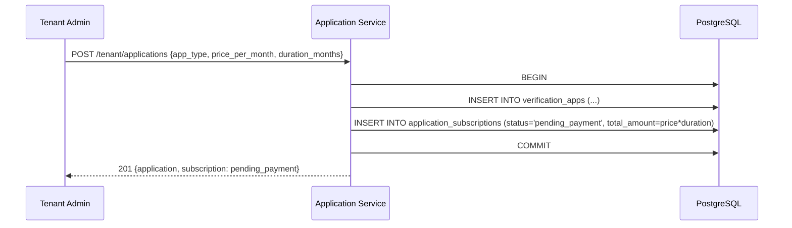
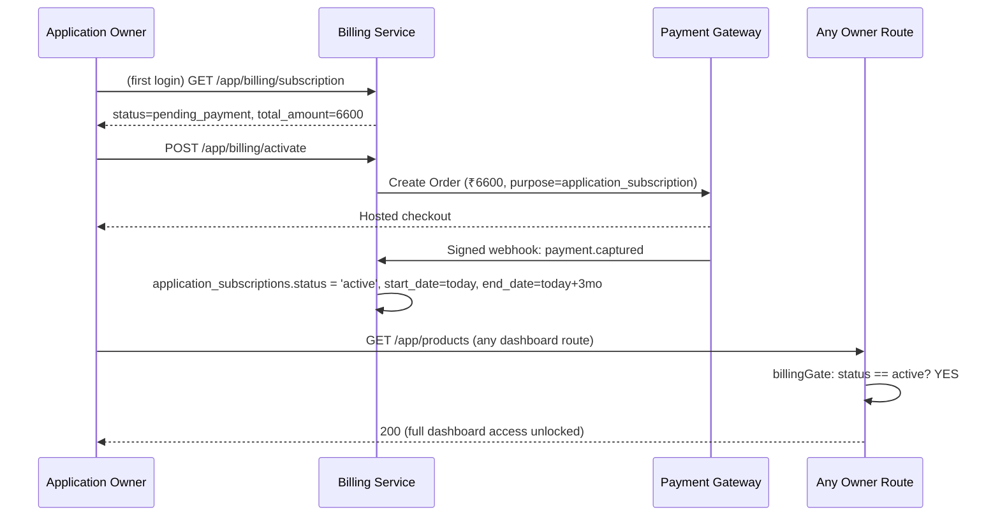
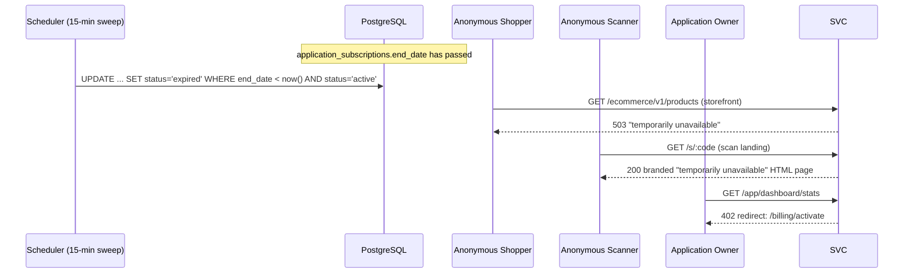
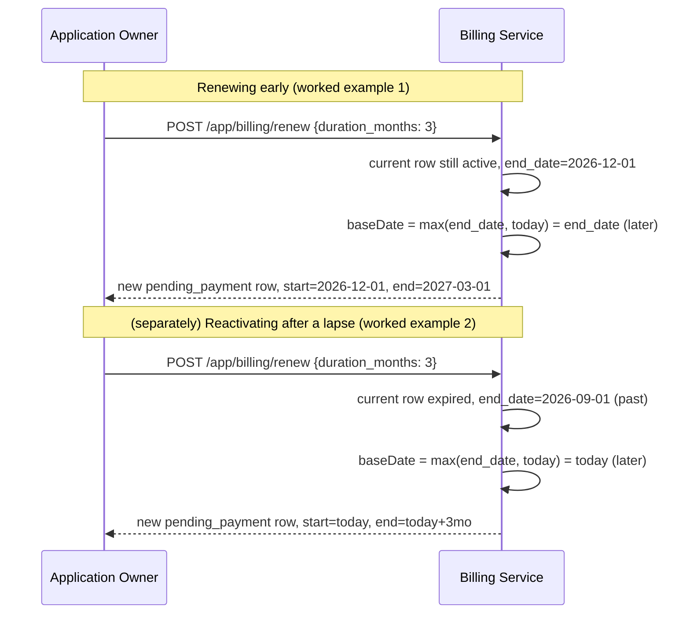
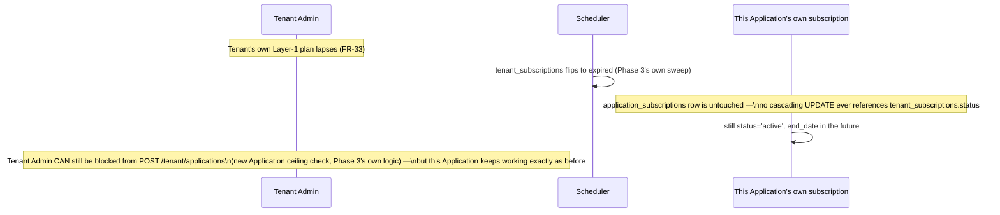

# Phase 4 — Low-Level Design: Tenant ⇄ Application Subscription & Paywall (Layer 2)

**Depends on LLDs:** Phase 1 (`applications`, `owner_user_id`, auth middleware skeleton), Phase 3 (`payment_gateway_orders` shared table + webhook/idempotency pattern — this phase adds `purpose = 'application_subscription'` as a new value on that table, it does not create a parallel payment mechanism)
**Master reference:** `../../PRD.md` FR-6b, FR-11a, FR-11b/11c (gating clause), FR-11f, FR-16a, FR-20, FR-22a, FR-31, FR-32, FR-33, DR-10, RD-6, RD-8; `../../HLD.md` §4 (auth/billing gate), §6/§7 (money flow, Layer 2)

## 1. Scope

This phase makes an individual Application's continued operation contingent on its own flat monthly subscription — priced per-Application by its Tenant at creation time, paid by the Application Owner via a single unavoidable "Activate & Pay" page, and enforced identically across three surfaces (owner dashboard, public ecommerce storefront/API, public scan-and-earn landing) the moment the paid period lapses. It introduces one new table (`application_subscriptions`), reuses Phase 3's shared payment-gateway infrastructure under a new `purpose` value, and adds the billing-status branch to the authorization middleware chain that Phase 1 established.

---

## 2. Database Schema

### 2.1 New table: `application_subscriptions` (DR-10)

Verified against the real `tenant_subscriptions` table (`scan4earn-database/full_setup.sql:81`) for column/type/constraint conventions — this table follows the same shape at Application grain instead of Tenant grain, with `price_per_month` (not `price_per_app_month`, since there is no `app_count` here — one row always governs exactly one Application) and no separate `payment_method`/`payment_reference`/`payment_notes` columns, since those are now generically owned by the shared `payment_gateway_orders` table from Phase 3 (`gateway_order_id` here is the FK into it).

```sql
-- Migration: scan4earn-database/migrations/001_add_application_subscriptions.sql
-- (First migration file in this project — full_setup.sql predates production data;
--  from this phase onward, schema changes that touch an existing production DB
--  go here per migrations/README.md.)

CREATE TABLE IF NOT EXISTS application_subscriptions (
    id UUID PRIMARY KEY DEFAULT gen_random_uuid(),
    application_id UUID NOT NULL REFERENCES verification_apps (id) ON DELETE CASCADE,
    tenant_id UUID NOT NULL REFERENCES tenants (id) ON DELETE CASCADE,
    price_per_month NUMERIC(12, 2) NOT NULL CHECK (price_per_month >= 0),
    duration_months INTEGER NOT NULL CHECK (duration_months IN (1, 3, 6, 9, 12)),
    total_amount NUMERIC(12, 2) NOT NULL CHECK (total_amount >= 0),
    currency VARCHAR(3) NOT NULL DEFAULT 'INR',
    start_date DATE,
    end_date DATE,
    status VARCHAR(20) NOT NULL DEFAULT 'pending_payment',
    payment_status VARCHAR(20) NOT NULL DEFAULT 'pending',
    gateway_order_id UUID REFERENCES payment_gateway_orders (id),
    paid_at TIMESTAMP WITH TIME ZONE,
    created_by UUID REFERENCES users (id),
    created_at TIMESTAMP WITH TIME ZONE DEFAULT CURRENT_TIMESTAMP,
    updated_at TIMESTAMP WITH TIME ZONE DEFAULT CURRENT_TIMESTAMP,
    CONSTRAINT application_subscription_status_check
        CHECK (status IN ('pending_payment', 'active', 'expired', 'cancelled')),
    CONSTRAINT application_subscription_payment_status_check
        CHECK (payment_status IN ('pending', 'paid', 'failed')),
    CONSTRAINT application_subscription_dates_check
        CHECK (end_date IS NULL OR start_date IS NULL OR end_date > start_date)
);

-- One "current" row per Application is looked up constantly (every request, via
-- the auth middleware) — these partial indexes keep that lookup O(1) regardless
-- of how many historical (expired/cancelled) rows accumulate. Two separate
-- partial unique indexes, NOT one combined index over both statuses: renewing
-- early (§5.3, worked example 1) legitimately produces one 'active' row and one
-- 'pending_payment' row coexisting for the same Application, so uniqueness must
-- be enforced per status value, not "at most one non-terminal row total" (see
-- §4.1 for the invariant this protects).
CREATE UNIQUE INDEX IF NOT EXISTS idx_app_subscriptions_one_active
    ON application_subscriptions (application_id) WHERE status = 'active';
CREATE UNIQUE INDEX IF NOT EXISTS idx_app_subscriptions_one_pending
    ON application_subscriptions (application_id) WHERE status = 'pending_payment';

CREATE INDEX IF NOT EXISTS idx_app_subscriptions_application
    ON application_subscriptions (application_id, created_at DESC);

CREATE INDEX IF NOT EXISTS idx_app_subscriptions_expiry_sweep
    ON application_subscriptions (end_date)
    WHERE status = 'active';

DROP TRIGGER IF EXISTS update_application_subscriptions_updated_at ON application_subscriptions;
CREATE TRIGGER update_application_subscriptions_updated_at
    BEFORE UPDATE ON application_subscriptions
    FOR EACH ROW EXECUTE FUNCTION update_updated_at_column();
```

**Why two separate partial unique indexes, not one:** each independently prevents two `active` rows (or two `pending_payment` rows) existing simultaneously for the same Application — the exact invariant the state machine in §4 depends on — while still permitting exactly one of each to coexist during an early renewal. An attempt to insert a second row into either status fails at the DB layer, not just the application layer.

### 2.2 Dependency on Phase 3's `payment_gateway_orders`

This phase assumes Phase 3 introduces (paraphrased from that phase's LLD):
```sql
-- payment_gateway_orders(id, purpose, payer_type, payer_id, amount, currency,
--                          gateway_order_id, status, idempotency_key,
--                          webhook_received_at, created_at, updated_at)
```
Phase 3's `payment_gateway_orders.purpose` CHECK constraint already includes `'application_subscription'` as an accepted value (designed generically upfront for reuse by Phases 4/5/8 — verified directly against Phase 3's LLD, `chk_payment_gateway_orders_purpose`) — this phase does **not** need to alter that constraint, only to use it: insert rows with `purpose='application_subscription'`, `payer_type='application'`, `payer_id=application_subscriptions.application_id`. No new payment table, and no migration against Phase 3's table, is created here — see Phase 4's Rollout Note in `prd.md`, which explicitly warns against duplicating Phase 3's mechanism.

---

## 3. API Contracts

Base paths per HLD §11.2/§11.3. Auth per HLD §4's split (Owner-operational branch for everything below except the webhook, which is gateway-signature-authenticated).

### 3.1 `POST /api/tenant/applications` (extends Phase 1's endpoint — Modify)
Adds billing terms to Application creation (FR-6b).

**Request body (new fields added to Phase 1's payload):**
```json
{
  "app_name": "Pals Paint Store",
  "app_type": "ECOMMERCE",
  "price_per_month": 2200.00,
  "duration_months": 3
}
```
| Field | Type | Required | Validation |
|---|---|---|---|
| `price_per_month` | numeric | yes | `>= 0`, max 2 decimal places, max value 10,000,000 (sanity ceiling) |
| `duration_months` | integer | yes | must be one of `[1,3,6,9,12]` |

**Response `201`:**
```json
{
  "success": true,
  "data": {
    "application": { "id": "...", "app_name": "...", "app_type": "ECOMMERCE", "owner_user_id": null },
    "subscription": {
      "id": "...", "status": "pending_payment", "price_per_month": 2200.00,
      "duration_months": 3, "total_amount": 6600.00, "currency": "INR"
    }
  }
}
```
Creating the Application **and** its first `application_subscriptions` row (`status='pending_payment'`, `start_date`/`end_date` both `NULL` until paid) happens in one DB transaction — an Application must never exist without a corresponding subscription row.

**Errors:**
| Code | HTTP | Condition |
|---|---|---|
| `INVALID_DURATION_MONTHS` | 400 | not in `[1,3,6,9,12]` |
| `INVALID_PRICE` | 400 | negative, non-numeric, or exceeds sanity ceiling |
| `TENANT_APPLICATION_CEILING_EXCEEDED` | 403 | Phase 3's plan ceiling check (reused as-is, unaffected by this phase) |

### 3.2 `GET /api/app/billing/subscription` (Owner JWT) — New
Returns the Application's current subscription row.

**Response `200`:**
```json
{
  "success": true,
  "data": {
    "status": "active",
    "price_per_month": 2200.00,
    "duration_months": 3,
    "total_amount": 6600.00,
    "currency": "INR",
    "start_date": "2026-09-01",
    "end_date": "2026-12-01",
    "days_remaining": 12,
    "payment_history": [
      { "paid_at": "2026-09-01T10:03:00Z", "amount": 6600.00, "duration_months": 3 }
    ]
  }
}
```
`payment_history` is every historical row for this `application_id` ordered by `created_at DESC` (satisfies FR-22a's "payment history").

### 3.3 `POST /api/app/billing/activate` (Owner JWT) — New
Pays for the **current** `pending_payment` row (FR-11a).

**Request:** empty body — the amount is derived server-side from the existing `pending_payment` row, never trusted from the client.

**Response `200`:**
```json
{
  "success": true,
  "data": {
    "gateway_order_id": "order_Nk8P...",
    "gateway_key": "rzp_live_...",
    "amount_paise": 660000,
    "currency": "INR"
  }
}
```
This is a thin wrapper: create a `payment_gateway_orders` row (`purpose='application_subscription'`, `payer_id=application_id`, `amount=total_amount`), call Phase 3's shared "create gateway order" service function, return its handoff payload for the client's checkout SDK.

**Errors:**
| Code | HTTP | Condition |
|---|---|---|
| `NO_PENDING_SUBSCRIPTION` | 409 | no row in `pending_payment` state exists (e.g. already active — nothing to activate) |
| `GATEWAY_ORDER_CREATION_FAILED` | 502 | Phase 3's gateway service call failed |

### 3.4 `POST /api/app/billing/renew` (Owner JWT) — New
Identical shape/response to `/activate`, but creates a **new** `application_subscriptions` row (`status='pending_payment'`) rather than reusing the current one — because renewal terms (price, duration) may differ from the original if the Tenant has since changed the Application's pricing (out of this phase's scope to build a pricing-change UI, but the schema must not assume price is immutable).

**Request body:**
```json
{ "duration_months": 6 }
```
If omitted, defaults to the most recent row's `duration_months`. `price_per_month` is **never** client-supplied here — always copied from the Tenant's currently configured price for this Application (read from the latest row, or a separate `applications.current_price_per_month` — **decision below**).

> **Decision (upstream silent on this):** add `applications.current_price_per_month` and `applications.current_duration_months` as the Tenant-editable "current terms" (Tenant Admin can update these via an endpoint out of this phase's scope but the columns are needed now so renewal has a source of truth independent of subscription history). Migration:
> ```sql
> ALTER TABLE verification_apps ADD COLUMN IF NOT EXISTS current_price_per_month NUMERIC(12,2);
> ALTER TABLE verification_apps ADD COLUMN IF NOT EXISTS current_duration_months INTEGER
>     CHECK (current_duration_months IS NULL OR current_duration_months IN (1,3,6,9,12));
> ```
> Populated at creation time from §3.1's request body; renewal reads from here, not from the subscription history table.

### 3.5 `POST /api/webhooks/gateway/subscription` (gateway signature) — extends Phase 3's webhook handler
Adds a branch for `purpose = 'application_subscription'`: on verified signed payment-success, look up the `application_subscriptions` row by `gateway_order_id`, set `payment_status='paid'`, `status='active'`, compute `start_date`/`end_date` per §5's date-math algorithm, `paid_at = now()`.

### 3.6 `GET /api/tenant/applications/:id` (extends Phase 1/3 — Modify)
Adds to the response: `price_per_month`, `duration_months`, `subscription_status`, `next_renewal_date` (= `end_date`) — the per-Application billing list fields FR-20 requires on the Tenant Admin's Application list. These are read directly off `application_subscriptions` under the DR-3 carve-out (billing columns only — this endpoint must never join in order/scan/cashback data).

---

## 4. State Machines

### 4.1 `application_subscriptions.status`

| From | Event | To | Guard |
|---|---|---|---|
| *(none — row created)* | Application created (§3.1) | `pending_payment` | always |
| `pending_payment` | Webhook: payment confirmed | `active` | signature valid, `gateway_order_id` matches |
| `pending_payment` | Webhook: payment failed | *(stays `pending_payment`)* | owner can retry `/activate` again — no `failed` terminal state, since retry is always allowed |
| `active` | Sweep job: `end_date < now()` | `expired` | see §5.2 |
| `active`/`expired` | New renewal row created (§3.4) | *(new row starts its own `pending_payment`→`active` cycle; old row stays `active`/`expired` as history, never mutated)* | — |
| any | Manual suspension (out of this phase's scope, but the value exists for future use) | `cancelled` | Super Admin/Tenant Admin action, not built here |

**Invariant enforced by §2.1's two partial unique indexes:** at most one `active` row and at most one `pending_payment` row may exist per `application_id` — never two of the same status, but one of each concurrently is valid and expected. This is exactly what makes renewing early safe: the old row stays `active` while a new row is inserted as `pending_payment`, and only when that new row's payment is confirmed does it flip to `active` — at which point the old row must already have been moved out of `active` (see the webhook handler in §3.5, which transitions the *new* row only; the old row separately expires via §5.2's sweep once its own `end_date` passes, never both `active` simultaneously in practice since the new row's `start_date` is set to the old row's `end_date`).

### 4.2 Authorization gate state (per-request, not persisted)
`active` → route proceeds. `pending_payment` / `expired` / `cancelled` / *(no row exists at all — should be impossible post-creation, but treat defensively as equivalent to `pending_payment`)* → paywall response (branch depends on route type, §5.1).

---

## 5. Business Logic / Algorithms

### 5.1 Three-branch authorization middleware (extends HLD §4's diagram into concrete code)

```js
// scan4earn-server/src/middleware/billingGate.middleware.js  (NEW)

async function billingGate(req, res, next) {
  const routeType = req.scan4earnRouteType; // set upstream: 'owner_dashboard' | 'public_storefront' | 'public_scan'
  const applicationId = req.context.applicationId; // set by Host Resolver / API-key middleware, already resolved

  if (!applicationId) return next(); // route isn't Application-scoped at all (e.g. Tenant/Super Admin routes) — nothing to gate

  const sub = await db.query(
    `SELECT status FROM application_subscriptions
     WHERE application_id = $1 AND status = 'active' LIMIT 1`,
    [applicationId]
  );
  const isActive = sub.rows.length > 0;
  if (isActive) return next();

  // Not active — branch by route type, per HLD §4's two-response-shape rule:
  switch (routeType) {
    case 'owner_dashboard':
      return res.status(402).json({
        success: false,
        code: 'APPLICATION_SUBSCRIPTION_INACTIVE',
        message: 'Activate your plan to continue.',
        redirect: '/billing/activate'
      });
    case 'public_storefront':
      return res.status(503).json({
        success: false,
        code: 'APPLICATION_TEMPORARILY_UNAVAILABLE',
        message: 'This store is temporarily unavailable.'
      });
    case 'public_scan':
      return res.status(200).send(renderBrandedUnavailablePage(applicationId)); // HTML, not JSON — a human is looking at this in a browser
  }
}

module.exports = { billingGate };
```

**Middleware chain order per route type** (this is the part HLD only diagrams at a conceptual level — here is the literal Express chain):

```js
// Owner-operational routes (mounted under /api/app/*):
router.use(appAuthMiddleware.authenticate);      // existing (Phase 1) — issues req.user
router.use(authMiddleware.requireAppOwnership);  // existing (Phase 1) — FR-26, sets req.context.applicationId
router.use((req, res, next) => { req.scan4earnRouteType = 'owner_dashboard'; next(); });
router.use(billingGate.billingGate);             // NEW — this phase
// ...then the actual route handlers (products, orders, coupon-batches, etc.)

// Public ecommerce storefront (mounted under /api/ecommerce/v1/*):
router.use(apiKeyMiddleware.validateApplicationKey); // existing — resolves req.context.applicationId from API key, no owner concept
router.use((req, res, next) => { req.scan4earnRouteType = 'public_storefront'; next(); });
router.use(billingGate.billingGate);                 // NEW
// ...

// Public scan landing (mounted under /s/:code, and /api/mobile/v1/* for the app channel):
router.use(scanResolverMiddleware.resolveCodeToApplication); // existing — resolves req.context.applicationId from the coupon code
router.use((req, res, next) => { req.scan4earnRouteType = 'public_scan'; next(); });
router.use(billingGate.billingGate);                          // NEW
```

Note the deliberate ordering: **identity/API-key resolution always runs before the billing gate**, per HLD §4's "sequential, never conflated" guarantee — the billing gate never runs on a request that hasn't already been resolved to a specific `applicationId`.

### 5.2 Subscription-expiry sweep job (Scheduler component, HLD §3)

```sql
-- Run every 15 minutes (recommended interval — see Configuration §9 for rationale)
UPDATE application_subscriptions
SET status = 'expired', updated_at = now()
WHERE status = 'active' AND end_date < CURRENT_DATE;
```
Pseudocode wrapper (idempotent — safe to re-run, `WHERE status = 'active'` means already-expired rows are simply not matched again):
```js
async function sweepExpiredApplicationSubscriptions() {
  const { rowCount } = await db.query(SWEEP_SQL);
  metrics.increment('scheduler.application_subscription_expiry.flipped', rowCount);
}
```
**Recommended interval: every 15 minutes.** Rationale: bounds the enforcement-lag window (HLD §4's documented tradeoff) to a maximum of 15 minutes past the exact `end_date` — short enough that no real customer would notice/exploit it, long enough that it's a trivially cheap recurring query even at large scale (`idx_app_subscriptions_expiry_sweep` makes this an index-only scan).

### 5.3 Renewal date-math (FR-11f) — exact pseudocode with worked examples

```js
function computeRenewalDates(currentSubscription, newDurationMonths, paymentConfirmedAt) {
  const today = paymentConfirmedAt; // the moment the webhook confirms payment
  const currentEndDate = currentSubscription?.end_date ?? null;

  // "whichever is later": the current end_date (renewing early) or the payment date (reactivating after a lapse)
  const baseDate = (currentEndDate && currentEndDate > today) ? currentEndDate : today;

  const newStartDate = baseDate;
  const newEndDate = addMonths(baseDate, newDurationMonths);
  return { start_date: newStartDate, end_date: newEndDate };
}
```

**Worked example 1 — renewing early (before expiry):**
Current row: `end_date = 2026-12-01`, still `active`. Owner renews on `2026-11-20` for 3 more months.
`baseDate = max(2026-12-01, 2026-11-20) = 2026-12-01` (current `end_date` wins, since it's later than today).
→ `new start_date = 2026-12-01`, `new end_date = 2027-03-01`. **No days are lost** — the new period starts exactly when the old one would have ended.

**Worked example 2 — reactivating after a lapse:**
Current row: `end_date = 2026-09-01`, flipped to `expired` by the sweep on `2026-09-01 00:15`. Owner doesn't pay until `2026-09-20`.
`baseDate = max(2026-09-01, 2026-09-20) = 2026-09-20` (today wins, since the old `end_date` is in the past).
→ `new start_date = 2026-09-20`, `new end_date` (3-month renewal) `= 2026-12-20`. **The 19 lapsed days are not refunded or backdated** — the new period starts from the actual payment moment, matching FR-11f's literal wording ("the payment date if renewing after a lapse").

---

## 6. Sequence Diagrams











---

## 7. Validation & Error Catalog

| Code | HTTP | Trigger |
|---|---|---|
| `INVALID_DURATION_MONTHS` | 400 | `duration_months` not in `[1,3,6,9,12]` at creation or renewal |
| `INVALID_PRICE` | 400 | `price_per_month` negative or exceeds sanity ceiling |
| `NO_PENDING_SUBSCRIPTION` | 409 | `/activate` called with no `pending_payment` row present |
| `SUBSCRIPTION_ALREADY_ACTIVE` | 409 | `/renew` called with no basis to renew (edge case: race between two renew clicks — second one hits the unique partial index and must be caught and translated to this error, not a raw DB constraint violation) |
| `GATEWAY_ORDER_CREATION_FAILED` | 502 | Phase 3's shared gateway-order creation call fails |
| `WEBHOOK_SIGNATURE_INVALID` | 400 | (Phase 3's error, reused verbatim — this phase's webhook branch shares the same signature-verification entry point) |
| `APPLICATION_SUBSCRIPTION_INACTIVE` | 402 | Owner-dashboard route hit while not `active` |
| `APPLICATION_TEMPORARILY_UNAVAILABLE` | 503 | Public storefront/API route hit while not `active` |

---

## 8. File/Module Plan

| File | Action | Purpose |
|---|---|---|
| `scan4earn-database/migrations/001_add_application_subscriptions.sql` | **New** | §2.1's DDL |
| `scan4earn-database/migrations/002_add_application_current_terms.sql` | **New** | §3.4's `current_price_per_month`/`current_duration_months` columns |
| `scan4earn-server/src/middleware/billingGate.middleware.js` | **New** | §5.1's gate |
| `scan4earn-server/src/services/applicationBilling.service.js` | **New** | subscription CRUD, renewal date-math (§5.3), gateway-order creation delegating to Phase 3's shared service |
| `scan4earn-server/src/controllers/applicationBilling.controller.js` | **New** | `/app/billing/*` handlers |
| `scan4earn-server/src/routes/applicationBilling.routes.js` | **New** | mounts `/app/billing/*`, wires the middleware chain from §5.1 |
| `scan4earn-server/src/jobs/applicationSubscriptionSweep.job.js` | **New** | §5.2's scheduled sweep, registered with the Scheduler infra Phase 1/3 establish |
| `scan4earn-server/src/modules/.../applications.controller.js` (Application creation, exact file TBD — same one Phase 1 touches) | **Modify** | add billing-terms fields to the create-Application transaction, §3.1 |
| `scan4earn-server/src/middleware/auth.middleware.js` | **No change** | `requireAppOwnership` (line 244, already found this session) is reused as-is — this phase only adds a *new* middleware after it, never modifies the existing owner-identity check |
| `scan4earn-server/src/routes/ecommerceApi.routes.js`, `publicScan.routes.js`, `publicCashback.routes.js` | **Modify** | insert `billingGate` into each router's middleware chain per §5.1 |
| Webhook handler introduced in Phase 3 (exact file per that phase's LLD) | **Modify** | add the `purpose='application_subscription'` branch, §3.5 |

---

## 9. Configuration

| Variable | Default | Purpose |
|---|---|---|
| `APPLICATION_SUBSCRIPTION_SWEEP_INTERVAL_MINUTES` | `15` | §5.2's cadence |
| `APPLICATION_SUBSCRIPTION_PRICE_CEILING` | `10000000` | sanity bound for `INVALID_PRICE` |

---

## 10. Test Plan

Mapped to `phases/phase4/prd.md`'s Definition of Done:

- [ ] Creating an Application produces a `pending_payment` row → GET billing/subscription reflects it; every owner-dashboard route returns `402 APPLICATION_SUBSCRIPTION_INACTIVE`.
- [ ] `/activate` → webhook confirms → status flips to `active`, `start_date`/`end_date` computed correctly (duration=1,3,6,9,12 each tested), full dashboard unlocked.
- [ ] Sweep job: seed a row with `end_date = yesterday, status='active'`; run the sweep query; assert `status='expired'`; assert all three surfaces (owner dashboard, storefront, scan landing) now reject with the correct response shape per route type (three separate assertions, not one).
- [ ] Sweep interval bound: assert the sweep query is index-only (via `EXPLAIN`) against `idx_app_subscriptions_expiry_sweep`.
- [ ] Renewal early: worked example 1's exact dates, asserted numerically.
- [ ] Renewal after lapse: worked example 2's exact dates, asserted numerically.
- [ ] Concurrency: two simultaneous `/renew` calls — assert the unique partial index rejects the second and it surfaces as `SUBSCRIPTION_ALREADY_ACTIVE`, not a raw 500.
- [ ] FR-33 proof: flip a Tenant's `tenant_subscriptions.status` to `expired` directly in the DB; assert this Application's own `application_subscriptions.status` is untouched and every route still returns 200; assert `POST /tenant/applications` (a *new* Application) is blocked by Phase 3's ceiling logic.
- [ ] DR-3 carve-out: `GET /tenant/applications/:id` returns `price_per_month`/`duration_months`/`subscription_status`/`next_renewal_date` and nothing else Application-grain (no orders/scans/cashback keys present in the response at all).

---

## 11. Open Questions / Assumptions

1. **`applications.current_price_per_month`/`current_duration_months` (§3.4) is a net-new design decision** not explicitly specified in the PRD/HLD — needed so renewal has a source of truth for "what should this cost now" independent of subscription history. Flagging for review; alternative would be "renewal always repeats the immediately-prior row's price," which is simpler but doesn't allow a Tenant to ever reprice an Application for its next renewal. Went with the more flexible option since nothing in the PRD forbids re-pricing.
2. **§2.1's two separate partial unique indexes** (one per status value, not one combined index across both) reflect a design correction made while working through the renewal-while-still-active case during drafting — a single combined index would have made early renewal impossible. Noting this since it reverses what looks like the more obvious first design.
3. **15-minute sweep interval** is my recommendation, not specified upstream — HLD only says "the Scheduler exists to keep this accurate," not how often. Chose 15 minutes as a reasonable balance; trivially configurable via `APPLICATION_SUBSCRIPTION_SWEEP_INTERVAL_MINUTES` if a different SLA is desired later.
