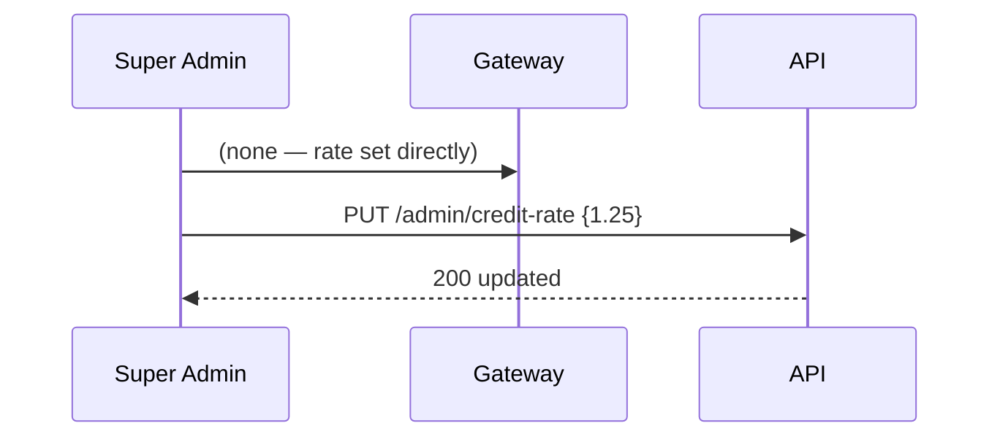
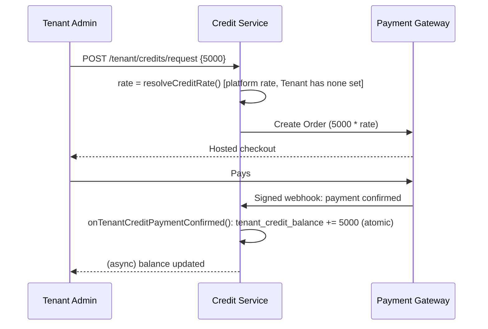
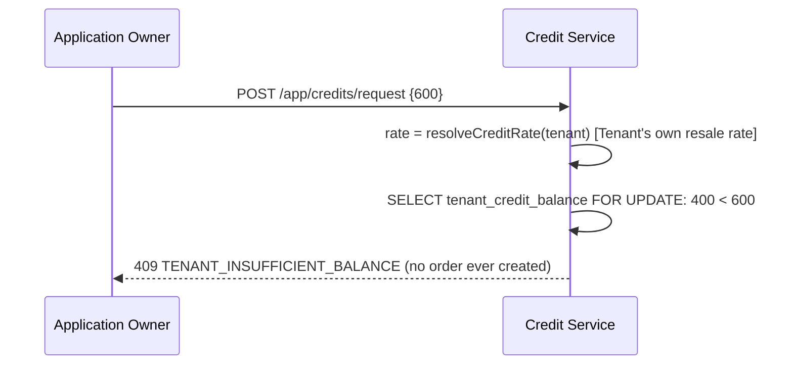
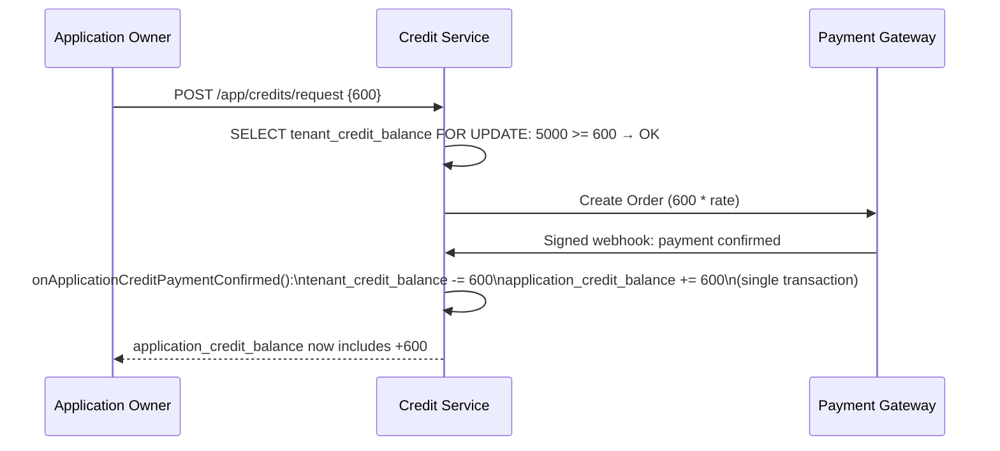
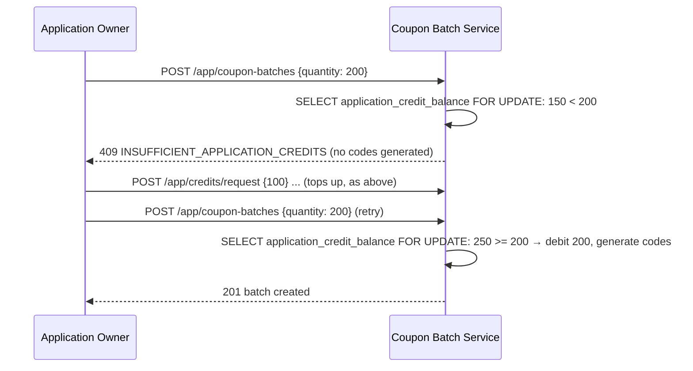
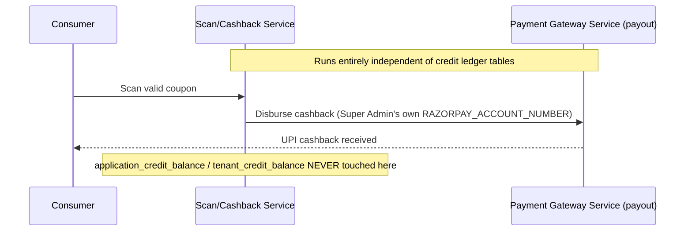

# Phase 5 — Scan-and-Earn Credit Hierarchy (Layer 3) — Low-Level Design

**Status:** Implementation-ready
**Master reference:** `../../PRD.md` §6.8 Layer 3, §7 Data Model Requirements | `../../HLD.md` §6/§7 (money-flow + credit-cascade sequences), §5 (DR-3 carve-out)
**Phase reference:** `./prd.md`

---

## 1. Scope

This phase closes the scan-and-earn credit loop: Super Admin sets one platform-wide credit rate; a Tenant buys credits from Super Admin at that rate; a Tenant may set its own resale rate for its Applications (defaulting to the platform rate); an Application buys credits from its own Tenant, capped at whatever the Tenant currently holds; and coupon-batch creation — today gated only at the **Tenant** level via `tenant_credit_balance` (confirmed still live and correctly enforced in `batchController.js`/`rewards.controller.js`) — is re-pointed to gate against the **Application's own** `application_credit_balance` instead. Real cashback settlement to consumers remains entirely separate from this ledger (§5.4). No UI work is in this phase's scope; only schema, services, and API contracts.

---

## 2. Database Schema

All statements use `IF NOT EXISTS`/`ADD COLUMN IF NOT EXISTS` per this repo's current pre-production convention (schema changes go straight into `scan4earn-database/full_setup.sql` today; the identical SQL becomes `scan4earn-database/migrations/00X_scan_earn_credit_hierarchy.sql` once the migrations folder is in active use — see `migrations/README.md`).

```sql
-- ============================================================
-- DR-11: Platform-wide credit rate (singleton config row)
-- ============================================================
CREATE TABLE IF NOT EXISTS platform_credit_rate (
    id UUID PRIMARY KEY DEFAULT gen_random_uuid(),
    inr_per_credit NUMERIC(10,4) NOT NULL CHECK (inr_per_credit > 0),
    updated_by UUID REFERENCES users(id),
    created_at TIMESTAMP WITH TIME ZONE DEFAULT CURRENT_TIMESTAMP,
    updated_at TIMESTAMP WITH TIME ZONE DEFAULT CURRENT_TIMESTAMP,
    -- Enforce singleton: only one row may ever exist.
    singleton_guard BOOLEAN NOT NULL DEFAULT true UNIQUE
);

-- Seed the one row (idempotent — safe to re-run).
INSERT INTO platform_credit_rate (inr_per_credit, singleton_guard)
VALUES (1.00, true)
ON CONFLICT (singleton_guard) DO NOTHING;

-- ============================================================
-- DR-12: Per-Tenant resale rate (nullable = inherit platform rate)
-- ============================================================
CREATE TABLE IF NOT EXISTS tenant_credit_rate (
    tenant_id UUID PRIMARY KEY REFERENCES tenants(id) ON DELETE CASCADE,
    inr_per_credit NUMERIC(10,4) CHECK (inr_per_credit IS NULL OR inr_per_credit > 0),
    updated_by UUID REFERENCES users(id),
    created_at TIMESTAMP WITH TIME ZONE DEFAULT CURRENT_TIMESTAMP,
    updated_at TIMESTAMP WITH TIME ZONE DEFAULT CURRENT_TIMESTAMP
);

-- ============================================================
-- DR-13: Application's own credit balance (mirrors tenant_credit_balance)
-- ============================================================
CREATE TABLE IF NOT EXISTS application_credit_balance (
    id UUID PRIMARY KEY DEFAULT gen_random_uuid(),
    application_id UUID NOT NULL UNIQUE REFERENCES verification_apps(id) ON DELETE CASCADE,
    balance INTEGER NOT NULL DEFAULT 0 CHECK (balance >= 0),
    total_received INTEGER NOT NULL DEFAULT 0 CHECK (total_received >= 0),
    total_spent INTEGER NOT NULL DEFAULT 0 CHECK (total_spent >= 0),
    created_at TIMESTAMP WITH TIME ZONE DEFAULT CURRENT_TIMESTAMP,
    updated_at TIMESTAMP WITH TIME ZONE DEFAULT CURRENT_TIMESTAMP
);
CREATE INDEX IF NOT EXISTS idx_application_credit_balance_app ON application_credit_balance (application_id);

-- ============================================================
-- DR-14: Application → Tenant credit requests (mirrors credit_requests + payment cols)
-- ============================================================
CREATE TABLE IF NOT EXISTS application_credit_requests (
    id UUID PRIMARY KEY DEFAULT gen_random_uuid(),
    application_id UUID NOT NULL REFERENCES verification_apps(id) ON DELETE CASCADE,
    tenant_id UUID NOT NULL REFERENCES tenants(id) ON DELETE CASCADE,
    requested_by UUID NOT NULL REFERENCES users(id),
    requested_amount INTEGER NOT NULL CHECK (requested_amount > 0),
    rate_applied NUMERIC(10,4) NOT NULL CHECK (rate_applied > 0),
    total_payable NUMERIC(12,2) NOT NULL CHECK (total_payable >= 0),
    status VARCHAR(20) NOT NULL DEFAULT 'pending_payment'
        CHECK (status IN ('pending_payment', 'approved', 'rejected')),
    gateway_order_id VARCHAR(255),
    paid_at TIMESTAMP WITH TIME ZONE,
    processed_by UUID REFERENCES users(id),
    processed_at TIMESTAMP WITH TIME ZONE,
    rejection_reason TEXT,
    requested_at TIMESTAMP WITH TIME ZONE NOT NULL DEFAULT CURRENT_TIMESTAMP,
    created_at TIMESTAMP WITH TIME ZONE DEFAULT CURRENT_TIMESTAMP,
    updated_at TIMESTAMP WITH TIME ZONE DEFAULT CURRENT_TIMESTAMP
);
CREATE INDEX IF NOT EXISTS idx_app_credit_requests_app ON application_credit_requests (application_id);
CREATE INDEX IF NOT EXISTS idx_app_credit_requests_tenant ON application_credit_requests (tenant_id);
CREATE INDEX IF NOT EXISTS idx_app_credit_requests_status ON application_credit_requests (status);

-- ============================================================
-- DR-15: Application credit ledger (mirrors credit_transactions)
-- ============================================================
CREATE TABLE IF NOT EXISTS application_credit_transactions (
    id UUID PRIMARY KEY DEFAULT gen_random_uuid(),
    application_id UUID NOT NULL REFERENCES verification_apps(id) ON DELETE CASCADE,
    transaction_type VARCHAR(20) NOT NULL CHECK (transaction_type IN ('CREDIT', 'DEBIT', 'REFUND')),
    amount INTEGER NOT NULL CHECK (amount > 0),
    balance_before INTEGER NOT NULL,
    balance_after INTEGER NOT NULL,
    description TEXT,
    reference_id UUID,
    reference_type VARCHAR(50), -- e.g. 'CREDIT_REQUEST', 'COUPON_BATCH'
    created_by UUID REFERENCES users(id),
    created_at TIMESTAMP WITH TIME ZONE DEFAULT CURRENT_TIMESTAMP
);
CREATE INDEX IF NOT EXISTS idx_app_credit_txn_app ON application_credit_transactions (application_id);
CREATE INDEX IF NOT EXISTS idx_app_credit_txn_type ON application_credit_transactions (transaction_type);
CREATE INDEX IF NOT EXISTS idx_app_credit_txn_created_at ON application_credit_transactions (created_at);

-- ============================================================
-- DR-16: Payment-gate the existing Tenant ⇄ Super Admin credit_requests table
-- ============================================================
ALTER TABLE credit_requests ADD COLUMN IF NOT EXISTS rate_applied NUMERIC(10,4);
ALTER TABLE credit_requests ADD COLUMN IF NOT EXISTS total_payable NUMERIC(12,2);
ALTER TABLE credit_requests ADD COLUMN IF NOT EXISTS gateway_order_id VARCHAR(255);
ALTER TABLE credit_requests ADD COLUMN IF NOT EXISTS paid_at TIMESTAMP WITH TIME ZONE;
-- status already supports 'pending'/'approved'/'rejected' — reinterpret 'pending' as
-- 'pending_payment' at the application layer; no CHECK constraint rename needed.

-- ============================================================
-- DR-17: No new DDL — this is a code-path redirect (see §5, §8).
-- Existing debit call sites (batchController.js, rewards.controller.js) currently
-- write to tenant_credit_balance/credit_transactions; Phase 5 redirects them to
-- application_credit_balance/application_credit_transactions instead.
-- ============================================================
```

**Naming note:** the real schema still uses `verification_apps` as the physical table name (Phase 1's DR-1/DR-2 only formalize `application_id` as the join-key convention and rename the concept in user-facing surfaces — it does not mandate a physical table rename). All new FKs above correctly reference `verification_apps(id)`, matching Phase 1's LLD assumption; if Phase 1's LLD does perform a physical rename to `applications`, update these FKs to match in lockstep.

---

## 3. API Contracts

Base paths and auth conventions per HLD §11. All request/response bodies use the existing envelope shape already visible in the codebase: `{ status: boolean, data?: {...}, error?: { message, code } }`.

### 3.1 `GET /api/admin/credit-rate` (Super Admin JWT)
**Response 200:**
```json
{ "status": true, "data": { "inr_per_credit": 1.00, "updated_by": "<uuid>", "updated_at": "2026-09-30T00:00:00Z" } }
```

### 3.2 `PUT /api/admin/credit-rate` (Super Admin JWT)
**Request:** `{ "inr_per_credit": 1.25 }`
**Validation:** `inr_per_credit` required, numeric, `> 0`.
**Response 200:** updated row. **Note:** updates the one singleton row; never retroactively touches `rate_applied` already stored on past requests (DR-16/DR-14 freeze the rate at request time).
**Errors:** `400 INVALID_RATE` (≤ 0 or non-numeric).

### 3.3 `GET /api/tenant/credits/balance` (Tenant Admin JWT) — existing, unchanged
### 3.4 `POST /api/tenant/credits/request` (Tenant Admin JWT) — existing `credits.routes.js` `/request`, extended
**Request:** `{ "requested_amount": 5000, "justification": "Q1 campaign" }`
**Server logic:** `rate_applied = tenant_credit_rate.inr_per_credit ?? platform_credit_rate.inr_per_credit` (frozen at request time); `total_payable = requested_amount * rate_applied`; creates `credit_requests` row `status='pending'` (interpreted as `pending_payment`), creates a Gateway Order (Phase 3's shared `payment_gateway_orders` row, `purpose='tenant_credit_purchase'`), returns the checkout handle.
**Response 201:** `{ "data": { "request_id": "<uuid>", "total_payable": 5000.00, "currency": "INR", "gateway_order_id": "order_xxx" } }`
**Errors:** `400 INVALID_AMOUNT` (≤ 0).

### 3.5 `GET /api/tenant/credit-rate` / `PUT /api/tenant/credit-rate` (Tenant Admin JWT)
**PUT Request:** `{ "inr_per_credit": 1.50 }` or `{ "inr_per_credit": null }` (null = revert to inheriting platform rate).
**Response 200:** current effective rate + whether it's inherited or explicit.

### 3.6 `GET /api/tenant/applications/:id/credit-requests` (Tenant Admin JWT) — HLD §11.2
**Response 200:** list of `application_credit_requests` rows for that Application — **DR-3 carve-out columns only, strictly as master PRD's DR-3 note names them: `requested_amount` and `status`.** Never a balance figure, and — per the current literal wording of master PRD's DR-3 carve-out — not `rate_applied`/`total_payable`/`requested_at`/`processed_at` either, since those aren't named in that carve-out list. **Flag for product owner:** this makes the Tenant Admin's pending-requests view show only "N credits, pending" with no payable amount or request date, which may be too thin to actually act on — recommend widening master PRD.md's DR-3 carve-out wording to explicitly include `total_payable` and `requested_at` if a usable admin view is intended; this LLD complies with the narrower literal text since it isn't authorized to edit the master PRD.

### 3.7 `POST /api/tenant/applications/:id/credit-requests/:reqId/approve` (Tenant Admin JWT)
Manual override only (§5's normal path is automatic on confirmed payment — see §5.1). Used only if a request is stuck (e.g. gateway webhook lost and reconciliation hasn't yet caught it) and the Tenant Admin wants to force-approve after independently confirming payment out-of-band. **Must still re-run the balance-sufficiency check (§5.1 step 2) before approving** — never bypass it even in the manual path.
**Errors:** `409 INSUFFICIENT_TENANT_BALANCE`, `409 REQUEST_NOT_PENDING`.

### 3.8 `GET /api/app/credits/balance` (Owner JWT) — HLD §11.3
**Response 200:** `{ "data": { "balance": 1200, "total_received": 5000, "total_spent": 3800 } }`

### 3.9 `POST /api/app/credits/request` (Owner JWT) — HLD §11.3
**Request:** `{ "requested_amount": 500 }`
**Server logic:** see §5.1's full pre-check + order-creation algorithm.
**Response 201 (order created):** `{ "data": { "request_id": "<uuid>", "total_payable": 750.00, "currency": "INR", "gateway_order_id": "order_yyy" } }`
**Response 409 (Tenant balance insufficient — rejected BEFORE any order is created):**
```json
{ "status": false, "error": { "message": "Tenant does not have enough credits to sell", "code": "TENANT_INSUFFICIENT_BALANCE" } }
```
**Errors:** `400 INVALID_AMOUNT`.

### 3.10 `GET /api/app/credits/transactions` (Owner JWT)
Paginated `application_credit_transactions` for this Application only.

---

## 4. State Machines

**`application_credit_requests.status`**
```
pending_payment ──(gateway webhook confirms payment AND tenant balance still sufficient)──▶ approved
pending_payment ──(Tenant Admin manually rejects, OR reconciliation finds tenant balance now insufficient)──▶ rejected
```
No transition ever moves backward. A `rejected` or `approved` request is terminal; a new request must be created for further attempts.

**`credit_requests.status`** (existing table, Tenant ⇄ Super Admin) — same shape, `pending → approved | rejected`, now payment-gated identically (§5.1 applies one level up too, with Super Admin's own balance being unlimited/authoritative — no sufficiency check needed at the top of the hierarchy).

---

## 5. Business Logic / Algorithms

### 5.1 Application buys M credits from its Tenant (the critical path)

```
FUNCTION requestApplicationCredits(applicationId, requestedAmount, requestingUserId):
    tenant_id = lookup tenant owning applicationId

    # Step 1 — resolve rate (own resale rate, else platform default)
    rate = SELECT inr_per_credit FROM tenant_credit_rate WHERE tenant_id = tenant_id
    IF rate IS NULL:
        rate = SELECT inr_per_credit FROM platform_credit_rate LIMIT 1
    total_payable = requestedAmount * rate

    # Step 2 — pre-check BEFORE generating any payable order (hard PRD requirement)
    BEGIN TRANSACTION (read committed is sufficient here; write happens later)
        tenant_balance = SELECT balance FROM tenant_credit_balance
                         WHERE tenant_id = tenant_id FOR UPDATE  -- lock, mirrors batchController.js pattern
        IF tenant_balance < requestedAmount:
            ROLLBACK
            RETURN 409 "Tenant does not have enough credits to sell" (TENANT_INSUFFICIENT_BALANCE)
        # Do NOT commit yet — release the lock immediately after the check passes;
        # the actual debit happens later, atomically, only on confirmed payment (step 4).
        # Re-acquiring the lock at step 4 re-validates in case balance changed between
        # request-creation and payment-confirmation (a race Step 4 closes definitively).
    COMMIT (read-only, no mutation yet)

    # Step 3 — create the request row + gateway order
    INSERT INTO application_credit_requests
        (application_id, tenant_id, requested_by, requested_amount, rate_applied,
         total_payable, status) VALUES (..., 'pending_payment')
    CREATE gateway Order (Phase 3's payment_gateway_orders, purpose='application_credit_purchase',
                           amount=total_payable, reference_id=request.id)
    RETURN 201 { request_id, total_payable, gateway_order_id }

# --- Invoked by the Phase 3 shared webhook handler on confirmed payment ---
FUNCTION onApplicationCreditPaymentConfirmed(requestId):
    BEGIN TRANSACTION
        request = SELECT * FROM application_credit_requests WHERE id = requestId FOR UPDATE
        IF request.status != 'pending_payment':
            ROLLBACK  -- idempotency: webhook retried, already processed
            RETURN

        tenant_balance = SELECT balance FROM tenant_credit_balance
                         WHERE tenant_id = request.tenant_id FOR UPDATE
        IF tenant_balance < request.requested_amount:
            # Balance shrank between request and payment (e.g. Tenant spent it elsewhere
            # or another Application's request was approved first) — refund path.
            UPDATE application_credit_requests SET status='rejected',
                rejection_reason='Tenant balance became insufficient after payment' WHERE id=requestId
            TRIGGER refund of the shopper's/Tenant's payment via the gateway (out of band;
                    see PRD Non-goals — full refund tooling is out of scope, but a request that
                    fails this final check MUST NOT silently keep the money; flag for manual ops
                    action if automated refund is not yet built)
            COMMIT
            RETURN

        # Atomic transfer — both writes in the SAME transaction, or neither happens.
        new_tenant_balance = tenant_balance - request.requested_amount
        new_app_balance = (SELECT balance FROM application_credit_balance
                            WHERE application_id = request.application_id FOR UPDATE) + request.requested_amount

        UPDATE tenant_credit_balance SET balance = new_tenant_balance,
            total_spent = total_spent + request.requested_amount WHERE tenant_id = request.tenant_id
        INSERT INTO credit_transactions (tenant_id, transaction_type='DEBIT', amount=request.requested_amount,
            balance_before=tenant_balance, balance_after=new_tenant_balance,
            reference_id=request.id, reference_type='APPLICATION_CREDIT_SALE')

        UPDATE application_credit_balance SET balance = new_app_balance,
            total_received = total_received + request.requested_amount WHERE application_id = request.application_id
        INSERT INTO application_credit_transactions (application_id, transaction_type='CREDIT',
            amount=request.requested_amount, balance_before=(new_app_balance - request.requested_amount),
            balance_after=new_app_balance, reference_id=request.id, reference_type='CREDIT_REQUEST')

        UPDATE application_credit_requests SET status='approved', processed_at=NOW(),
            paid_at=NOW(), gateway_order_id=<webhook's order id> WHERE id = requestId
    COMMIT
```

**Why the pre-check (Step 2) is separate from the atomic transfer (payment-confirmed handler):** PRD FR-6d requires rejecting the request *before* the Application Owner is even asked to pay, but the payment itself is asynchronous (webhook-driven, per RD-7) — so a second, authoritative balance check must run again at confirmation time, because the Tenant's balance can legitimately change in the gap between "request created" and "payment confirmed." Both checks use `SELECT ... FOR UPDATE` row locking, matching the pattern already used in `batchController.js:99`.

### 5.1b Tenant buys N credits from Super Admin (FR-4c) — the missing companion algorithm
Referenced by §3.4's request handler and §6's second sequence diagram, but not previously spelled out. Simpler than §5.1 because Super Admin's supply is authoritative/unlimited — no debit counterpart, no insufficient-balance pre-check.

```
FUNCTION requestTenantCredits(tenantId, requestedAmount, requestingUserId):
    rate = SELECT inr_per_credit FROM platform_credit_rate LIMIT 1
    total_payable = requestedAmount * rate
    INSERT INTO credit_requests (tenant_id, requested_by, requested_amount, rate_applied,
        total_payable, status='pending') VALUES (...)
    CREATE gateway Order (payment_gateway_orders, purpose='tenant_credit_purchase',
        amount=total_payable, reference_id=request.id)
    RETURN 201 { request_id, total_payable, gateway_order_id }

# --- Invoked by the Phase 3 shared webhook handler on confirmed payment ---
FUNCTION onTenantCreditPaymentConfirmed(requestId):
    BEGIN TRANSACTION
        request = SELECT * FROM credit_requests WHERE id = requestId FOR UPDATE
        IF request.status != 'pending':
            ROLLBACK  -- idempotency: webhook retried, already processed
            RETURN
        tenant_balance = SELECT balance FROM tenant_credit_balance
                         WHERE tenant_id = request.tenant_id FOR UPDATE
        new_balance = tenant_balance + request.requested_amount
        UPDATE tenant_credit_balance SET balance = new_balance,
            total_received = total_received + request.requested_amount WHERE tenant_id = request.tenant_id
        INSERT INTO credit_transactions (tenant_id, transaction_type='CREDIT', amount=request.requested_amount,
            balance_before=tenant_balance, balance_after=new_balance,
            reference_id=request.id, reference_type='CREDIT_PURCHASE')
        UPDATE credit_requests SET status='approved', processed_at=NOW(), paid_at=NOW() WHERE id = requestId
    COMMIT
```
No sufficiency pre-check exists at this top level of the hierarchy — Super Admin's supply is treated as unlimited, matching PRD FR-4c's "payment confirmation *is* the approval" with no rejection path other than payment failure itself.

### 5.2 Rate resolution (used by 5.1 and by the Super-Admin-facing `credit_requests` path)
```
FUNCTION resolveCreditRate(tenantId):
    tenantRate = SELECT inr_per_credit FROM tenant_credit_rate WHERE tenant_id = tenantId
    RETURN tenantRate IF tenantRate IS NOT NULL ELSE (SELECT inr_per_credit FROM platform_credit_rate LIMIT 1)
```

### 5.3 Coupon-batch credit gate (redirect DR-17)
Current code (`batchController.js:98-121`) implements this pattern correctly — `SELECT balance ... FOR UPDATE`, insufficient-balance rejection, atomic debit + ledger insert. **Correction after re-checking the real file:** `rewards.controller.js`'s two call sites (`:388-400`, `:558-570`) run the identical check/debit sequence but *without* `FOR UPDATE` — a real, pre-existing race condition (two concurrent requests can both read the same `currentBalance` and both pass the insufficient-balance check). Phase 5 must fix this gap as part of the redirect, not just relocate it: **add `FOR UPDATE` to both `rewards.controller.js` call sites while moving them to `application_credit_balance`.** This is a small, in-scope correctness fix riding along with DR-17's redirect, not a separate defect to defer.

```
# batchController.js line ~98-121 (already has FOR UPDATE — keep it):
# BEFORE (tenant-grain):
#   SELECT balance FROM tenant_credit_balance WHERE tenant_id = $1 FOR UPDATE
#   UPDATE tenant_credit_balance SET balance = ... WHERE tenant_id = $1
#   INSERT INTO credit_transactions (tenant_id, ...)
#
# rewards.controller.js lines ~388-400, ~558-570 (currently MISSING FOR UPDATE — add it):
#   SELECT balance FROM tenant_credit_balance WHERE tenant_id = $1   -- ⚠ no lock today
#   UPDATE tenant_credit_balance SET balance = ... WHERE tenant_id = $1
#   INSERT INTO credit_transactions (tenant_id, ...)
#
# AFTER (application-grain):
    SELECT balance FROM application_credit_balance WHERE application_id = $1 FOR UPDATE
    IF balance < couponQuantity (or costCalculation.total):
        ROLLBACK, return 409 INSUFFICIENT_APPLICATION_CREDITS  -- before any QR code generation
    UPDATE application_credit_balance SET balance = balance - cost, total_spent = total_spent + cost
        WHERE application_id = $1
    INSERT INTO application_credit_transactions (application_id, transaction_type='DEBIT',
        amount=cost, balance_before=..., balance_after=..., reference_id=batch_id,
        reference_type='COUPON_BATCH')
```
All three call sites must resolve `application_id` from the batch/coupon's own `verification_app_id` column (already present on `coupon_batches` and `coupons` per the existing schema) rather than `tenant_id`.

### 5.4 Settlement isolation (hard rule, not a suggestion)
The function/module that calls Razorpay's payout API for consumer cashback (`paymentGateway.service.js`'s payout path, funded from `RAZORPAY_ACCOUNT_NUMBER`) **must never**, under any code path, read or write `application_credit_balance`, `tenant_credit_balance`, or either transactions table. Enforce this at review time with a concrete rule: the cashback-payout module may only import from the scan/redemption domain, never from a `creditService`/`creditRepository` module — if a future PR imports both in the same file, that is a P0 review-blocking finding, not a style nitpick. Conversely, the credit-ledger code (§5.1, §5.3) must never call the Razorpay payout API — it only ever mutates balances and rows in Postgres.

---

## 6. Sequence Diagrams













---

## 7. Validation & Error Catalog

| Code | HTTP | Trigger |
|---|---|---|
| `INVALID_RATE` | 400 | `inr_per_credit` ≤ 0 or non-numeric on rate set/update |
| `INVALID_AMOUNT` | 400 | `requested_amount` ≤ 0 on any credit request |
| `TENANT_INSUFFICIENT_BALANCE` | 409 | Application requests more credits than its Tenant currently holds (checked pre-order and re-checked at payment confirmation) |
| `REQUEST_NOT_PENDING` | 409 | Manual approve/reject attempted on an already-approved/rejected request |
| `INSUFFICIENT_APPLICATION_CREDITS` | 409 | Coupon batch/coupon creation requested against a balance lower than its cost — rejected before any QR code generation |
| `RATE_NOT_CONFIGURED` | 500 | `platform_credit_rate` singleton row missing (should never happen post-seed; treat as a P0 alert, not a user-facing 400) |

---

## 8. File/Module Plan

| File | Action | Purpose |
|---|---|---|
| `scan4earn-database/full_setup.sql` | Modify | Add DR-11 through DR-16 DDL (§2) |
| `scan4earn-server/src/modules/super-admin/controllers/credit.controller.js` | Modify | Add `getCreditRate`/`updateCreditRate` handlers |
| `scan4earn-server/src/modules/tenant-admin/controllers/credit.controller.js` | Modify | Add rate-resolution use in existing request handler; add `getTenantCreditRate`/`updateTenantCreditRate`; add `listApplicationCreditRequests`/`approveApplicationCreditRequest` |
| `scan4earn-server/src/routes/credits.routes.js` | Modify | Wire the new Super Admin and Tenant Admin endpoints above |
| **New:** `scan4earn-server/src/modules/application-owner/controllers/credit.controller.js` | New | `getBalance`, `requestCredits`, `getTransactions` (§3.8–3.10) |
| **New:** `scan4earn-server/src/routes/applicationCredits.routes.js` | New | Mounts at `/api/app/credits/*` per HLD §11.3 |
| **New:** `scan4earn-server/src/services/creditRateResolver.service.js` | New | Implements §5.2, shared by both Tenant and Application request handlers |
| `scan4earn-server/src/controllers/batchController.js` | Modify | Lines ~98-121: redirect debit from `tenant_credit_balance`/`credit_transactions` to `application_credit_balance`/`application_credit_transactions`, resolve `application_id` from the batch's `verification_app_id` |
| `scan4earn-server/src/controllers/rewards.controller.js` | Modify | Lines ~388-400 and ~558-570: same redirect for single-coupon and multi-batch coupon creation, **plus add the missing `FOR UPDATE` row lock at both call sites** (confirmed absent in the real file — see §5.3 correction) |
| `scan4earn-server/src/services/paymentGateway.service.js` | Modify | Register the two new webhook `purpose` values (`tenant_credit_purchase`, `application_credit_purchase`) in the shared handler introduced by Phase 3's LLD; call `onTenantCreditPaymentConfirmed`/`onApplicationCreditPaymentConfirmed` (§5.1) on confirmation |

---

## 9. Configuration

| Variable | Default | Purpose |
|---|---|---|
| `DEFAULT_PLATFORM_CREDIT_RATE` | `1.00` | Seed value for `platform_credit_rate.inr_per_credit` on first migration |
| `CREDIT_CURRENCY` | `INR` | Currency label used in credit-purchase order creation (matches existing `tenant_credit_balance` amounts, which are unit-less integers priced in this currency) |

---

## 10. Test Plan

Mapped to Phase 5's `prd.md` Definition of Done:

- [ ] Super Admin rate change does not alter `rate_applied` on an already-`approved` request (freeze-at-request-time test).
- [ ] Tenant credit-rate unset → resolves to platform rate; set → resolves to Tenant's own rate.
- [ ] Application credit request for more than `tenant_credit_balance` holds → `409 TENANT_INSUFFICIENT_BALANCE`, **zero** rows written to `application_credit_requests` or any gateway order table.
- [ ] Application credit request within Tenant's balance → order created, `pending_payment`.
- [ ] Confirmed webhook on that request → atomic transfer: `tenant_credit_balance` decreases by exactly M, `application_credit_balance` increases by exactly M, both transaction tables gain exactly one row each, all four writes verified to occur in one DB transaction (kill the process mid-transaction in a test harness and confirm no partial state persists).
- [ ] Duplicate webhook delivery for the same request → second call is a no-op (idempotency — request already `approved`).
- [ ] Coupon batch creation against insufficient `application_credit_balance` → `409 INSUFFICIENT_APPLICATION_CREDITS`, zero QR codes generated, zero ledger rows written.
- [ ] Coupon batch creation against sufficient balance → exact debit amount matches batch cost, single ledger row.
- [ ] **Concurrency:** two simultaneous batch-creation requests against a balance that can only satisfy one of them — verify `FOR UPDATE` locking serializes them correctly (one succeeds, one gets `409`, no negative balance ever possible even transiently). Run this specifically against **both** `batchController.js`'s path and `rewards.controller.js`'s two paths (single-coupon and multi-batch) — the latter two currently have no row lock at all and must be proven fixed, not just redirected.
- [ ] Settlement isolation: a scan/cashback payout test run with `application_credit_balance`/`tenant_credit_balance` tables dropped/inaccessible still succeeds (proves the payout code path has zero dependency on credit tables).

---

## 11. Open Questions / Assumptions

1. **Table naming:** assumed FKs continue to reference the physical `verification_apps` table (per current schema) rather than a renamed `applications` table — reconcile with Phase 1's LLD if it performs a physical rename.
2. **Failed-payment-after-approval refund path:** §5.1's `onApplicationCreditPaymentConfirmed` includes a case where the Tenant's balance shrinks between request and payment confirmation. The master PRD's Non-goals explicitly exclude refund tooling — this LLD assumes that edge case is rare enough to flag for manual ops intervention rather than building automated refund reversal in this phase. Confirm this is acceptable before build.
3. **`platform_credit_rate` singleton enforcement** via a `UNIQUE` boolean column is a common Postgres pattern but slightly unusual — flagging in case the team prefers a simpler "just never insert a second row, enforced by application code only" approach instead.
4. The PRD/HLD's inherited narrative that "today's batch path charges 0, bypassing the meter" does **not** match the current code (`batchController.js`/`rewards.controller.js` both correctly check and debit `tenant_credit_balance` today, with row locking). This LLD proceeds on the basis that Phase 5's real task is the tenant→application redirect (§5.3), not fixing a live bypass bug — flagging the discrepancy for awareness, not re-litigating it.
