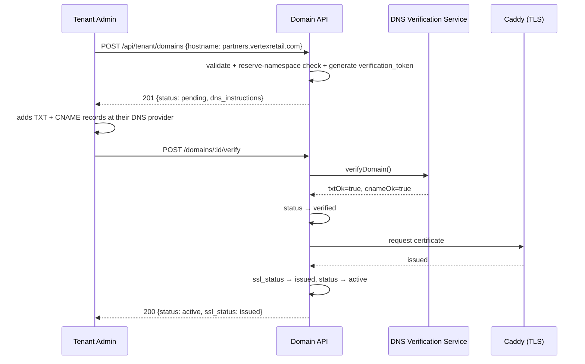
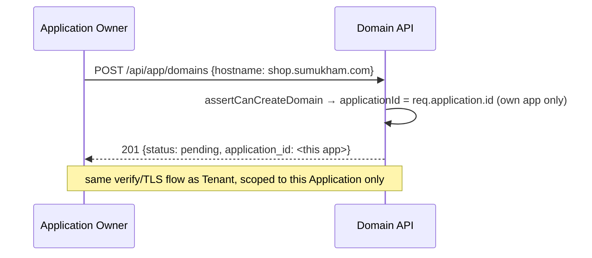
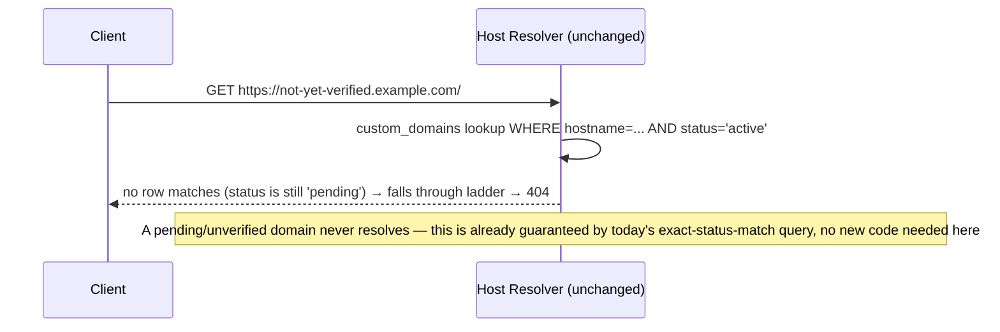
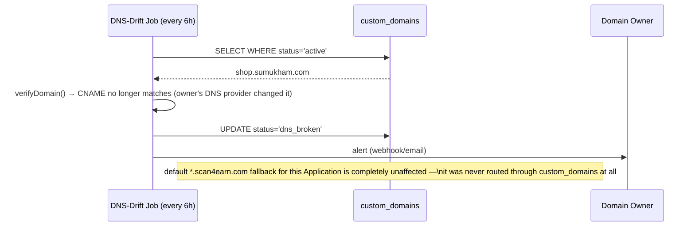
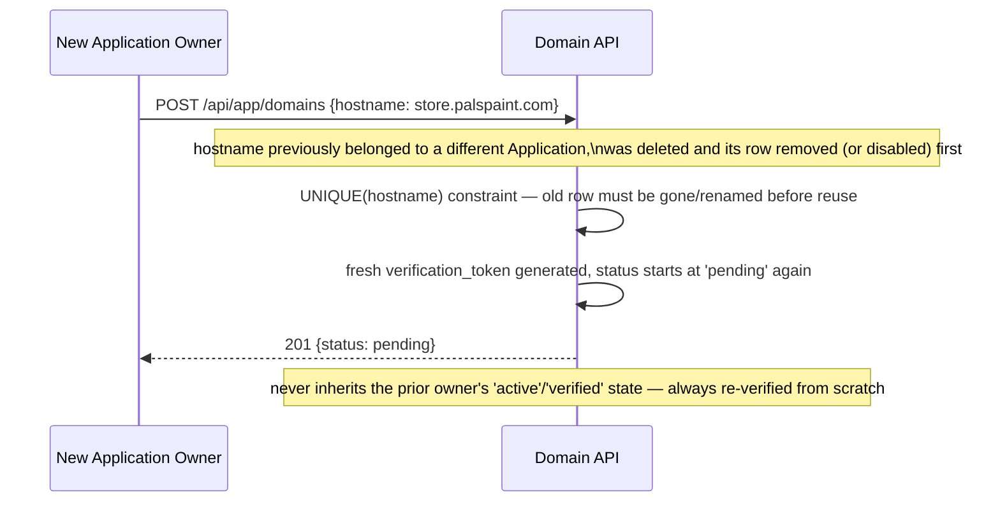

# Phase 6 — Custom Domains & Routing — Low-Level Design

**Companion to:** `phases/phase6/prd.md`, master `PRD.md` §6.6, `HLD.md` §4/§11.2/§11.3
**Status:** Implementation-ready

## 1. Scope

This phase lets a Tenant map a custom domain to its reseller portal (B1) and an Application Owner map a custom domain directly to their Application (B2), with TXT/CNAME ownership verification, auto-issued/renewed TLS, DNS-drift detection, and a reserved-namespace blocklist — covering FR-23 through FR-27, DR-7, and NFR-5. **Major finding from grounding this LLD in the real codebase: the `custom_domains` table and the full host-resolution middleware (`hostContext.middleware.js`) already exist and are already wired into `server.js` (line 136).** This phase is therefore much smaller than its own PRD implied — it is the **domain-management API + verification/TLS/drift background jobs** on top of resolution logic that is already production code, not new resolution logic itself.

## 2. Database Schema

### 2.1 Current real schema (verified in `scan4earn-database/full_setup.sql:2685-2713`) — **No Change needed**
```sql
CREATE TABLE IF NOT EXISTS custom_domains (
  id UUID PRIMARY KEY DEFAULT gen_random_uuid(),
  hostname VARCHAR(255) NOT NULL UNIQUE,
  tenant_id UUID NOT NULL REFERENCES tenants(id) ON DELETE CASCADE,
  verification_app_id UUID REFERENCES verification_apps(id) ON DELETE CASCADE,
  is_primary BOOLEAN NOT NULL DEFAULT false,
  verification_token VARCHAR(64),
  status VARCHAR(20) NOT NULL DEFAULT 'pending',
  ssl_status VARCHAR(20) NOT NULL DEFAULT 'pending',
  verified_at TIMESTAMP WITH TIME ZONE,
  created_at TIMESTAMP WITH TIME ZONE DEFAULT CURRENT_TIMESTAMP,
  updated_at TIMESTAMP WITH TIME ZONE DEFAULT CURRENT_TIMESTAMP,
  CONSTRAINT check_custom_domain_status
    CHECK (status IN ('pending', 'verified', 'active', 'dns_broken', 'suspended', 'disabled')),
  CONSTRAINT check_custom_domain_ssl_status
    CHECK (ssl_status IN ('pending', 'issued', 'ssl_expiring', 'failed')),
  CONSTRAINT check_custom_domain_hostname
    CHECK (hostname ~* '^[a-z0-9]([a-z0-9-]*[a-z0-9])?(\.[a-z0-9]([a-z0-9-]*[a-z0-9])?)+$'),
  FOREIGN KEY (verification_app_id, tenant_id) REFERENCES verification_apps (id, tenant_id)
);
CREATE INDEX IF NOT EXISTS idx_custom_domains_tenant ON custom_domains (tenant_id);
CREATE UNIQUE INDEX IF NOT EXISTS uq_custom_domains_primary_tenant
  ON custom_domains (tenant_id) WHERE is_primary AND verification_app_id IS NULL;
CREATE UNIQUE INDEX IF NOT EXISTS uq_custom_domains_primary_app
  ON custom_domains (verification_app_id) WHERE is_primary AND verification_app_id IS NOT NULL;
```
`verification_app_id` retains its pre-rename name internally per DR-1's allowance ("DB columns may keep the existing name internally if a rename is too invasive; user-facing terminology must say Application") — API responses must present this field as `application_id` in JSON, never the raw column name.

### 2.2 New migration — `scan4earn-database/migrations/001_domain_dns_check_log.sql`
No new column is required on `custom_domains` itself, but the DNS-drift job (§5.3) needs somewhere to record check history for alerting/debugging:
```sql
-- 001_domain_dns_check_log.sql
CREATE TABLE IF NOT EXISTS custom_domain_checks (
  id UUID PRIMARY KEY DEFAULT gen_random_uuid(),
  custom_domain_id UUID NOT NULL REFERENCES custom_domains(id) ON DELETE CASCADE,
  check_type VARCHAR(20) NOT NULL CHECK (check_type IN ('dns_verify', 'dns_drift', 'tls_issue', 'tls_renew')),
  result VARCHAR(20) NOT NULL CHECK (result IN ('ok', 'failed')),
  detail TEXT,
  checked_at TIMESTAMP WITH TIME ZONE DEFAULT CURRENT_TIMESTAMP
);
CREATE INDEX IF NOT EXISTS idx_custom_domain_checks_domain ON custom_domain_checks (custom_domain_id, checked_at DESC);
```
This is the only genuinely new table this phase introduces.

## 3. API Contracts

Both groups below write to the *same* `custom_domains` table; the only difference is whether `application_id` is `NULL` (Tenant portal, B1) or set (Application, B2). Middleware enforces which value a given JWT is allowed to write — this is new authorization logic this phase adds (see §5.4).

### 3.1 Tenant-level (HLD §11.2) — new controller `domains.controller.js`, mounted under `/api/tenant/domains`
| Method | Path | Auth | Request | Response | Status |
|---|---|---|---|---|---|
| POST | `/domains` | Tenant Admin JWT | `{ hostname: string }` | `201 { id, hostname, status: 'pending', verification_token, dns_instructions: { txt: {name, value}, cname: {name, value} } }` | New |
| GET | `/domains` | Tenant Admin JWT | — | `200 { domains: [{ id, hostname, application_id: null, is_primary, status, ssl_status, verified_at }] }` — filtered `WHERE tenant_id = :tenant AND application_id IS NULL` | New |
| POST | `/domains/:id/verify` | Tenant Admin JWT | — | `200 { status, ssl_status }` — triggers an immediate DNS check (§5.2) instead of waiting for the next sweep | New |
| DELETE | `/domains/:id` | Tenant Admin JWT | — | `204` | New |

### 3.2 Application-level (HLD §11.3) — same controller, mounted under `/api/app/domains`
| Method | Path | Auth | Request | Response | Status |
|---|---|---|---|---|---|
| POST | `/domains` | Owner JWT | `{ hostname: string }` | Same shape as 3.1; server forces `application_id = req.application.id`, `tenant_id` inherited from the Application | New |
| GET | `/domains` | Owner JWT | — | `200 { domains: [...] }` — filtered `WHERE application_id = :application_id` | New |
| POST | `/domains/:id/verify` | Owner JWT | — | Same as 3.1 | New |
| DELETE | `/domains/:id` | Owner JWT | — | `204` | New |

Both groups share one service function `createDomain({ tenantId, applicationId, hostname, requestedBy })` — `applicationId` is `null` for the Tenant route, always non-null for the Application route; the route layer, not the service, decides which value is legal to pass, so an Application Owner's JWT can never reach the Tenant-portal code path.

### 3.3 Validation on `POST /domains` (both groups)
1. Hostname format matches the existing DB CHECK regex — validate client-side too, but the DB constraint is the real gate.
2. Reject if hostname is `scan4earn.com`, any suffix of `.scan4earn.com`, or matches `RESERVED_SLUGS` (`www, api, admin, mail, ingress, status, staging`) as a bare subdomain-style name of the platform's own root — **this exact check does not exist yet in any creation path** (today `RESERVED_SLUGS` only guards Tenant subdomain slugs at signup, not arbitrary `custom_domains.hostname` values) → new validation to add.
3. Reject if `hostname` already exists in `custom_domains` (the UNIQUE constraint already guarantees this at the DB level; return a friendly `409 HOSTNAME_ALREADY_CLAIMED` instead of a raw constraint-violation 500).
4. Generate `verification_token` as `crypto.randomBytes(24).toString('hex')` (48 hex chars, fits `VARCHAR(64)`).
5. First domain for a target (Tenant with no domains yet, or Application with no domains yet) is auto-marked `is_primary = true`; subsequent ones default `is_primary = false` and can be promoted via a `PATCH /domains/:id/primary` — **not required for this phase's Definition of Done, flagged as a fast-follow, not blocking.**

## 4. State Machines

### 4.1 `custom_domains.status`
```
pending --(TXT+CNAME both verify)--> verified --(TLS cert issued)--> active
pending --(verify fails, retried by sweep or manual trigger)--> pending (no change, retry)
active --(DNS drift detected: CNAME/TXT no longer resolves as expected)--> dns_broken
dns_broken --(DNS re-verified correct again)--> active
active/verified/pending --(Tenant/Application deletes the domain)--> [row deleted]
active --(the owning Application is soft-deleted)--> disabled
```
`suspended` (already in the DB CHECK) is reserved for a future admin action (e.g. abuse) — not triggered by any flow in this phase; included for schema completeness only.

### 4.2 `custom_domains.ssl_status`
```
pending --(status reaches 'verified', TLS issuance job runs)--> issued
issued --(cert has < 30 days remaining, per §5.3)--> ssl_expiring
ssl_expiring --(renewal succeeds)--> issued
pending/issued/ssl_expiring --(issuance or renewal call fails)--> failed
failed --(next sweep retries automatically)--> pending or issued
```

## 5. Business Logic / Algorithms

### 5.1 Host Resolver ladder — **already implemented, No Change** (`hostContext.middleware.js`, verified against HLD §4 — matches exactly: custom-domain lookup by exact hostname + `status='active'` → subdomain parse with reserved-slug guard → root domain → legacy `X-Tenant-Slug` header fallback → root-ish default). This phase's job is everything that keeps `custom_domains` rows *accurate*, not the resolution logic itself.

### 5.2 TXT/CNAME verification (new — `services/domainVerification.service.js`)
```
function verifyDomain(customDomain):
    expectedTxtName  = "_scan4earn-verify." + customDomain.hostname
    expectedTxtValue = customDomain.verification_token
    expectedCnameTarget = "ingress.scan4earn.com"   # or A/ALIAS IP for apex domains, see §9

    txtRecords   = dns.resolveTxt(expectedTxtName)       # may throw NXDOMAIN
    cnameRecord  = dns.resolveCname(customDomain.hostname) # may throw NXDOMAIN/ENODATA

    txtOk   = txtRecords.some(r => r.join('') === expectedTxtValue)
    cnameOk = cnameRecord === expectedCnameTarget

    log(custom_domain_checks, type='dns_verify', result = txtOk && cnameOk ? 'ok' : 'failed')

    if txtOk && cnameOk:
        UPDATE custom_domains SET status='verified', verified_at=now() WHERE id = customDomain.id
        enqueue(tlsIssuanceJob, customDomain.id)
        return { status: 'verified' }
    else:
        return { status: 'pending', reason: !txtOk ? 'TXT_NOT_FOUND' : 'CNAME_MISMATCH' }
```
Called both synchronously (on `POST /domains/:id/verify`, for immediate user feedback) and by the periodic sweep (§5.5) for domains still `pending`.

### 5.3 TLS auto-issue / renewal job (new — Scheduler job, HLD §3)
- **Provider decision (concrete, not left open): Caddy's on-demand TLS via its admin API**, since the platform already needs a reverse-proxy layer in front of Node and Caddy's on-demand issuance needs only an HTTP callback confirming the hostname is one of ours — no third-party account/billing dependency like Cloudflare for SaaS, and simpler than hand-rolling ACME against GCP Certificate Manager. (Flagged in Open Questions §11 as the one upstream-unspecified choice this LLD had to make.)
- Issuance trigger: whenever a domain reaches `status='verified'`, call Caddy's `/config/apps/tls/automation/policies` (or the on-demand-ask callback endpoint) to request a cert for `hostname`; on success set `ssl_status='issued'`; on failure `ssl_status='failed'` and log to `custom_domain_checks`.
- Renewal check (runs daily): `SELECT * FROM custom_domains WHERE ssl_status IN ('issued','ssl_expiring') AND status='active'` → for each, query Caddy's cert-info endpoint for days-to-expiry → if `< 30` set `ssl_status='ssl_expiring'` and fire an alert (email/webhook to the Tenant Admin or Application Owner, via the existing `NOTIFSVC`/webhook mechanism) → Caddy's own on-demand renewal handles the actual re-issuance automatically once `ssl_expiring` is flagged, this job is detection+alerting only, not manual re-issuance.

### 5.4 Domain-ownership authorization for creation (new)
```
function assertCanCreateDomain(req):
    if req.route is Tenant-level ("/api/tenant/domains"):
        assert req.user.role == 'TENANT_ADMIN'
        applicationId = null
        tenantId = req.user.tenant_id
    else:  # "/api/app/domains"
        assert req.user.role == 'APPLICATION_OWNER'
        assert req.user.id == req.application.owner_user_id   # FR-26, reuses existing owner-identity middleware
        applicationId = req.application.id
        tenantId = req.application.tenant_id
    return { tenantId, applicationId }
```
This is new code, but it composes existing, already-built pieces: the existing `requireAppOwnership`-style middleware (found in `apiConfig.routes.js`) is reused verbatim for the Application-level route, not reimplemented.

### 5.5 DNS-drift detection job (new — Scheduler, runs every 6 hours)
```
SELECT * FROM custom_domains WHERE status = 'active'
for each row:
    result = verifyDomain(row)   # reuses §5.2's check, without flipping status back to 'verified' on success
    if result failed:
        UPDATE custom_domains SET status='dns_broken' WHERE id = row.id
        log(custom_domain_checks, type='dns_drift', result='failed')
        alert(owning Tenant Admin or Application Owner)
    else:
        log(custom_domain_checks, type='dns_drift', result='ok')
        # status stays 'active' — no-op, this job only ever downgrades, never silently re-upgrades;
        # recovery from dns_broken back to active requires a fresh POST /domains/:id/verify call
```
Recovering from `dns_broken` requires the owner to explicitly re-trigger verification (§3's `/verify` endpoint) — the drift job never auto-heals a broken record, to avoid silently flapping a domain that's genuinely misconfigured.

### 5.6 Application soft-delete → domain deactivation (new middleware addition)
On `applications.deleted_at` being set (Phase 1's DR-6 soft-delete), a `AFTER UPDATE` trigger or an explicit service-layer call sets every `custom_domains` row with that `application_id` to `status='disabled'`. `hostContext.middleware.js` must gain one new branch: if the matched `custom_domains` row has `status='disabled'`, respond `410 Gone` with a branded "this Application is no longer available" page instead of falling through to step 2 of the ladder — **this is a genuine code change to the otherwise-unchanged middleware.**

## 6. Sequence Diagrams











## 7. Validation & Error Catalog

| Code | HTTP | Condition | Message |
|---|---|---|---|
| `HOSTNAME_ALREADY_CLAIMED` | 409 | hostname already exists in `custom_domains` | "This domain is already mapped to a target on this platform." |
| `HOSTNAME_RESERVED` | 400 | hostname is `scan4earn.com`, `*.scan4earn.com`, or a reserved slug | "This hostname is reserved and cannot be used as a custom domain." |
| `HOSTNAME_INVALID_FORMAT` | 400 | fails the DB's hostname CHECK regex | "Enter a valid domain name." |
| `DOMAIN_NOT_FOUND` | 404 | `:id` doesn't exist or doesn't belong to the caller's Tenant/Application | "Domain not found." |
| `DOMAIN_NOT_VERIFIABLE_YET` | 409 | `/verify` called but DNS records not yet propagated | "DNS records not detected yet — this can take up to a few hours after adding them." |
| `APEX_DOMAIN_UNSUPPORTED_CNAME` | 400 (informational, not a hard block) | hostname has no subdomain (e.g. `sumukham.com`) | "Apex domains can't use CNAME — use the A/ALIAS record shown below instead, or map a subdomain like `shop.sumukham.com`." |
| `DOMAIN_DISABLED` | 410 | request arrives on a domain whose Application was soft-deleted | Branded "this store is no longer available" page |

## 8. File/Module Plan

| File | Action | Purpose |
|---|---|---|
| `scan4earn-server/src/middleware/hostContext.middleware.js` | **Modify** | Add the `status='disabled'` → 410 branch (§5.6); everything else stays exactly as-is |
| `scan4earn-server/src/controllers/domains.controller.js` | **New** | `createDomain`, `listDomains`, `verifyDomain`, `deleteDomain` — shared by both route groups |
| `scan4earn-server/src/services/domainVerification.service.js` | **New** | DNS TXT/CNAME check logic (§5.2), reused by both the manual `/verify` endpoint and the drift sweep |
| `scan4earn-server/src/services/tlsProvisioning.service.js` | **New** | Caddy API integration for issuance/renewal-status checks (§5.3) |
| `scan4earn-server/src/routes/tenantDomains.routes.js` | **New** | Mounts `/api/tenant/domains/*`, Tenant Admin JWT only |
| `scan4earn-server/src/routes/appDomains.routes.js` | **New** | Mounts `/api/app/domains/*`, Owner JWT only, reuses existing `requireAppOwnership`-style middleware |
| `scan4earn-server/src/jobs/domainDriftSweep.job.js` | **New** | §5.5, registered with the Scheduler (HLD §3) at a 6-hour interval |
| `scan4earn-server/src/jobs/tlsRenewalSweep.job.js` | **New** | §5.3's daily renewal-status check |
| `scan4earn-database/migrations/001_domain_dns_check_log.sql` | **New** | `custom_domain_checks` table (§2.2) |
| `scan4earn-server/src/server.js` | **Modify** | Register the two new route files and the two new scheduled jobs |

## 9. Configuration

| Env var | Purpose | Default |
|---|---|---|
| `ROOT_DOMAIN` | Already exists (`hostContext.middleware.js` reads it) | `scan4earn.com` |
| `DOMAIN_INGRESS_TARGET` | CNAME target shown to Tenants/Owners in `dns_instructions` | `ingress.scan4earn.com` |
| `DOMAIN_INGRESS_IP` | A/ALIAS target for apex-domain instructions | *(set per environment)* |
| `CADDY_ADMIN_API_URL` | Base URL for the Caddy admin API used by §5.3 | `http://localhost:2019` |
| `DNS_DRIFT_SWEEP_INTERVAL_HOURS` | §5.5's cadence | `6` |
| `TLS_RENEWAL_SWEEP_INTERVAL_HOURS` | §5.3's cadence | `24` |
| `TLS_RENEWAL_ALERT_THRESHOLD_DAYS` | §5.3's `ssl_expiring` trigger | `30` |

## 10. Test Plan

Mapped to Phase 6 `prd.md`'s Definition of Done:
- [ ] Tenant maps a portal domain → TXT+CNAME added → `/verify` → `status=active`, `ssl_status=issued` (integration test hitting a mocked DNS resolver and a mocked/local Caddy instance).
- [ ] Application Owner maps a domain directly → row created with `application_id` set, never `null`; a second Application Owner's JWT attempting to create a domain with someone else's `application_id` is rejected (test `assertCanCreateDomain`).
- [ ] A request to an Application-scoped operational route via a correctly-resolved custom domain, but with the wrong logged-in owner, still 403s (FR-26 — proves host resolution and identity check remain independent, per HLD §4).
- [ ] A domain sitting at `ssl_status='issued'` with a cert expiring in 25 days flips to `ssl_expiring` on the next renewal sweep and fires an alert.
- [ ] A domain's CNAME is changed externally; the drift sweep detects it and flips `active → dns_broken`, while the Application's default `*.scan4earn.com` path continues resolving normally throughout.
- [ ] Printed-QR generation code path is verified (by code inspection / existing test) to only ever emit `scan4earn.com/s/:code`, never read from `custom_domains` at all.

Additional edge cases:
- [ ] Two simultaneous `POST /domains` requests for the same hostname — the DB's `UNIQUE(hostname)` constraint must produce a clean `409 HOSTNAME_ALREADY_CLAIMED`, not a raw 500, under a race (test with a unique-violation catch in the controller).
- [ ] Attempting to register `scan4earn.com`, `api.scan4earn.com`, or a bare reserved slug as a custom domain is rejected with `HOSTNAME_RESERVED`.
- [ ] Non-primary domain on the same target 301-redirects to the primary hostname — **already covered by existing `hostContext.middleware.js` logic**, add a regression test only, no new code.
- [ ] Re-pointing a previously-deleted domain to a new Application always starts at `status='pending'` with a freshly generated token — never reuses the old row's verified state.

## 11. Open Questions / Assumptions

- **TLS/DNS provider choice (Caddy on-demand TLS) is this LLD's own decision**, made because the PRD/HLD deliberately left the provider open ("Cloudflare for SaaS / GCP Certificate Manager / Caddy" were all listed as options in the blueprint). Caddy was chosen for lowest operational dependency (no third-party SaaS account required). If the team already has a preferred provider, only §5.3 and the `tlsProvisioning.service.js` file need to change — nothing else in this LLD depends on which provider is used.
- Domain-promotion-to-primary (`PATCH /domains/:id/primary`) is designed for in the schema (the two partial unique indexes already support it) but not required by this phase's Definition of Done — flagged as a natural fast-follow, not built here.
- `custom_domain_checks` retention/pruning policy is not specified upstream — assumed unbounded for now (small volume: one row per domain per sweep), revisit if it becomes a storage concern.
