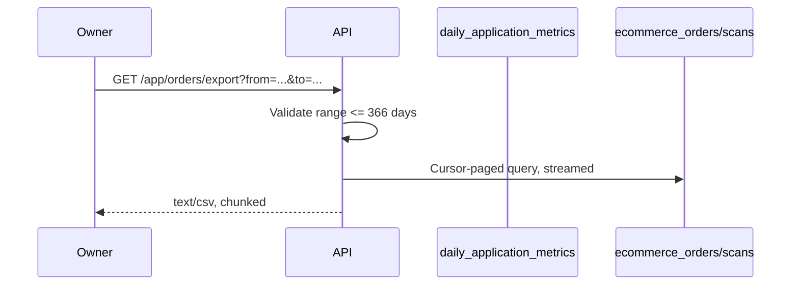
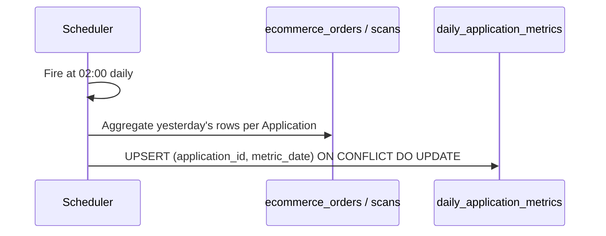
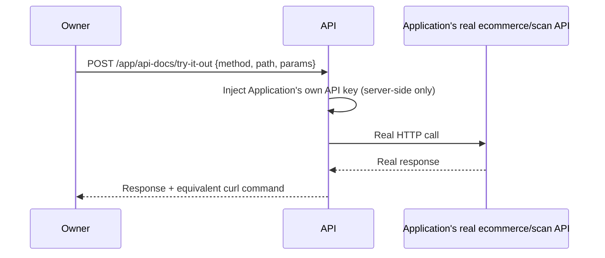

# Phase 7 — Dashboards, Analytics & Reporting Polish — Low-Level Design

**Depends on:** Phase 1 (identity/`application_id` grain), Phase 2 (basic dashboards, catalog/coupon CRUD), Phase 3 (Tenant subscriptions), Phase 4 (Application subscriptions/paywall), Phase 5 (credit ledger), Phase 6 (custom domains — Tenant health list shows domain status). Realistically also needs Phase 8/9 live to have real order/scan volume worth visualizing, though nothing in this LLD hard-requires their APIs.
**Master reference:** `../../PRD.md` §6.5; `../../HLD.md` §11.1, §11.3
**Companion:** `./prd.md` (requirements), `./lld.md` (this file — implementation detail)

## 1. Scope

This phase upgrades the plain numbers/tables Phase 2 shipped into the full decision-useful dashboards from PRD §6.5: charts, CSV export, a geo heatmap, a failed-payout queue, a sortable/filterable Tenant health list for Super Admin, and the full self-service `/api-docs` reference (Swagger-style explorer, try-it-out console, code samples, webhook event catalog with test-send). It introduces **no new write-paths and no new tables of primary record** — every number displayed here is derived from data Phases 1–6/8/9 already write. The only schema addition is an optional performance rollup layer (§2). This phase depends on Phases 1–6 per `phase7/prd.md`'s own dependency line; it also assumes Phase 1's `DR-1` migration has already added `application_id` (NOT NULL) to `scans`, `cashback_transactions`, `stock_movements`, and `webhook_logs`-adjacent tables — those columns are referenced throughout this LLD as already present, not introduced here.

## 2. Database Schema

**Decision: introduce two rollup tables, populated by a nightly batch job, rather than live-aggregating on every dashboard load.** Reasoning: `GET /dashboard/stats` and the CSV export are read on every dashboard page view; live-aggregating `SUM(total_amount)` across potentially hundreds of thousands of `ecommerce_orders`/`scans` rows per Application on every request is the kind of query that degrades first and silently, long before anyone notices in testing. A nightly rollup keeps today's numbers (which are always shown as "as of last night" — acceptable per the Rollout Note, this is a polish phase, not a real-time trading dashboard) fast and cheap; the raw tables remain the source of truth and are still queried directly for anything the rollup doesn't cover (order list, scan list, CSV export itself pulls raw rows for the exact date range requested, not the rollup).

```sql
-- migrations/0XX_phase7_dashboard_rollups.sql
-- (replace 0XX with the next unused number in scan4earn-database/migrations/ at implementation time)

CREATE TABLE IF NOT EXISTS daily_application_metrics (
    id UUID PRIMARY KEY DEFAULT gen_random_uuid(),
    application_id UUID NOT NULL REFERENCES applications(id) ON DELETE CASCADE,
    metric_date DATE NOT NULL,
    -- Ecommerce metrics (NULL for SCAN_AND_EARN-only Applications)
    orders_count INTEGER,
    gmv NUMERIC(14,2),
    avg_order_value NUMERIC(12,2),
    cart_to_order_conversion NUMERIC(5,4),
    -- Scan-and-earn metrics (NULL for ECOMMERCE-only Applications)
    scans_count INTEGER,
    scan_success_rate NUMERIC(5,4),
    cashback_paid NUMERIC(14,2),
    points_issued INTEGER,
    scans_guest_web_count INTEGER,
    scans_mobile_app_count INTEGER,
    created_at TIMESTAMP WITH TIME ZONE DEFAULT CURRENT_TIMESTAMP,
    CONSTRAINT uq_daily_app_metrics UNIQUE (application_id, metric_date)
);

CREATE INDEX IF NOT EXISTS idx_daily_app_metrics_app_date
    ON daily_application_metrics (application_id, metric_date DESC);

CREATE TABLE IF NOT EXISTS daily_tenant_health (
    id UUID PRIMARY KEY DEFAULT gen_random_uuid(),
    tenant_id UUID NOT NULL REFERENCES tenants(id) ON DELETE CASCADE,
    metric_date DATE NOT NULL,
    application_count INTEGER NOT NULL,
    active_application_count INTEGER NOT NULL,
    plan_status VARCHAR(20) NOT NULL,
    last_payment_at TIMESTAMP WITH TIME ZONE,
    last_payment_amount NUMERIC(12,2),
    created_at TIMESTAMP WITH TIME ZONE DEFAULT CURRENT_TIMESTAMP,
    CONSTRAINT uq_daily_tenant_health UNIQUE (tenant_id, metric_date)
);

CREATE INDEX IF NOT EXISTS idx_daily_tenant_health_tenant_date
    ON daily_tenant_health (tenant_id, metric_date DESC);
```

`top_products`, `top_batches`, and the geo heatmap are **not** rolled up — they're computed live but bounded (top-10, `LIMIT`-ed, indexed on `application_id` + `created_at`), since these are inherently small-result-set queries even over raw tables (see §5 for exact query shapes). `webhook-delivery health` reads `webhook_logs` directly (already indexed on `webhook_id, created_at` and `delivery_status, created_at` per the existing schema — no new index needed). The `failed-payout queue` reads `cashback_transactions WHERE status = 'FAILED'` directly (small result set by definition).

## 3. API Contracts

### `GET /app/dashboard/stats?period=30d` (Owner JWT) — supersedes Phase 2's basic version
Query params: `period` (enum `7d`|`30d`|`90d`|`custom`, default `30d`), `from`/`to` (ISO dates, required if `period=custom`, max range 366 days — see Validation §7).

**Response — ECOMMERCE/HYBRID Applications include:**
```json
{
  "data": {
    "kpis": { "orders_count": 1142, "gmv": 680000.00, "avg_order_value": 595.00,
              "cart_to_order_conversion": 0.031, "awaiting_fulfillment": 38,
              "low_stock_products": 12, "api_success_rate": 0.961, "unique_customers": 689 },
    "revenue_over_time": [ { "date": "2026-09-01", "gmv": 21400.00, "orders_count": 34 }, "..." ],
    "order_funnel": { "pending": 12, "confirmed": 40, "processing": 55, "shipped": 210, "delivered": 800, "cancelled": 15, "returned": 6, "refunded": 4 },
    "top_products": [ { "product_id": "...", "product_name": "...", "units_sold": 240, "revenue": 45000.00 } ],
    "stock_movement_log": [ { "product_id": "...", "movement_type": "SALE", "quantity": -2, "created_at": "..." } ],
    "webhook_health": { "delivered_pct": 0.98, "failed_last_24h": 3, "recent_failures": [ { "event_type": "order.created", "response_status": 500, "last_attempt_at": "..." } ] }
  }
}
```
**Response — SCAN_AND_EARN/HYBRID Applications additionally/instead include:**
```json
{
  "data": {
    "kpis": { "total_scans": 12480, "scan_success_rate": 0.924, "cashback_paid": 48200.00,
              "points_issued": 8912, "coupon_burn_down": 0.64, "pending_redemptions": 41, "new_customers": 2204 },
    "scans_over_time": [ { "date": "2026-09-01", "guest_web": 210, "mobile_app": 340 } ],
    "geo_heatmap": [ { "lat": 19.076, "lng": 72.8777, "weight": 34 } ],
    "top_batches": [ { "batch_id": "...", "batch_name": "...", "scans_count": 1200, "burn_down_pct": 0.71 } ],
    "failed_payout_queue": [ { "cashback_transaction_id": "...", "amount": 50.00, "failure_reason": "...", "created_at": "..." } ]
  }
}
```
`HYBRID` Applications receive both blocks in one response.

### `GET /app/orders/export?from=2026-08-01&to=2026-08-31&format=csv` (Owner JWT, ecommerce/hybrid only)
Streams `text/csv` (chunked transfer, not buffered — see §5 for why). Columns, in order: `order_number, placed_at, customer_name, customer_phone, status, payment_status, subtotal, tax_amount, total_amount, currency, item_count`. Response header `Content-Disposition: attachment; filename="orders_{application_id}_{from}_{to}.csv"`.

### `GET /app/api-docs` (Owner JWT) — extended from Phase 2's filtered list
```json
{ "data": { "app_type": "HYBRID", "base_url": "https://store.palspaint.com",
    "endpoint_groups": [ { "group": "Catalog", "endpoints": [ { "method":"GET","path":"/products","request_schema":{...},"response_schema":{...},"status_codes":[200,401] } ] } ],
    "code_samples": { "curl": "...", "javascript": "..." },
    "webhook_catalog": [ { "event_type":"order.created", "payload_schema":{...}, "signature_header":"X-Scan4Earn-Signature" } ] } }
```

### `POST /app/api-docs/try-it-out` (Owner JWT)
Body: `{ "method": "GET", "path": "/products", "params": {...} }`. **Decision: this literally proxies to the Application's own real, live API using the Application's own real credentials** — not a sandboxed/mocked variant. Rationale: the whole point (per PRD §6.5) is "a developer opens the dashboard and walks away with a working integration" — a mocked response would prove nothing about the real integration. Server-side, this endpoint constructs the exact HTTP call to `{base_url}/api/ecommerce/v1{path}` (or the scan-and-earn equivalent) with the Application's own API key injected, executes it server-side (never exposes the raw key to the browser), and returns the real response verbatim plus the exact curl-equivalent request that was sent.

### `GET /admin/tenants/health` (Super Admin JWT) — the sortable/filterable per-Tenant health list FR-19(rich)/DoD requires but neither `PRD.md`/`HLD.md`/this LLD's §3 had actually specified as a distinct contract until now
Query params: `sort` (enum `application_count`|`plan_status`|`last_payment_at`, default `last_payment_at`), `order` (`asc`|`desc`, default `desc`), `filter[plan_status]` (optional), `page`/`limit` (pagination, default `limit=50`).
```json
{ "data": { "tenants": [ { "tenant_id": "...", "tenant_name": "Vertex Retail Partners",
    "application_count": 4, "active_application_count": 4, "plan_status": "active",
    "last_payment_at": "2026-09-01T10:00:00Z", "last_payment_amount": 5500.00 } ],
  "pagination": { "page": 1, "limit": 50, "total": 7 } } }
```
Reads from `daily_tenant_health` joined to `tenants` for the display name — this is the row-source this LLD's §2 rollup table was already designed to serve; it just hadn't been wired to an explicit endpoint contract until this pass. **Recommend adding this endpoint's row to `HLD.md` §11.1** alongside the existing `/dashboard/stats` row, since it's a distinct, sortable/filterable list endpoint, not a sub-field of the platform-wide counts payload.

### `POST /app/webhooks/:id/test` (Owner JWT) — already exists per HLD (`webhooks.routes.js`, No Change), confirmed here
Sends a correctly-signed sample payload for a chosen `event_type` to the configured webhook URL; records the attempt in `webhook_logs` like any real delivery.

## 4. State Machines
No new stateful entities. The rollup job (`daily_application_metrics`/`daily_tenant_health` rows) has a trivial two-state lifecycle: absent → present-for-that-date (upserted nightly, never transitions further; a re-run for the same date overwrites via `ON CONFLICT (application_id, metric_date) DO UPDATE`).

## 5. Business Logic / Algorithms

**Time-series bucketing (`revenue_over_time`, `scans_over_time`):** default granularity is **daily buckets**, default window **30 days** (matches `period=30d` default), max **366 days** for `period=custom`. Query shape (ecommerce example, reading the rollup table):
```sql
SELECT metric_date, gmv, orders_count
FROM daily_application_metrics
WHERE application_id = $1 AND metric_date BETWEEN $2 AND $3
ORDER BY metric_date ASC;
```
If `to` is today or yesterday (rollup not yet computed for those dates since the nightly job runs once, after midnight), the API layer supplements the tail with a live aggregate over `ecommerce_orders`/`scans` for just the missing 1-2 days, unioned with the rollup rows — so "today" is never silently blank.

**Nightly rollup job** (Scheduler component, HLD §3): runs once daily at a low-traffic hour (default `02:00` server time, configurable — §9). For each `application_id` with `app_type` including ECOMMERCE: `INSERT ... SELECT application_id, CURRENT_DATE - 1, COUNT(*), SUM(total_amount), AVG(total_amount), (confirmed_orders::float / NULLIF(cart_sessions,0)) FROM ecommerce_orders WHERE application_id = $1 AND placed_at::date = CURRENT_DATE - 1 ... ON CONFLICT (application_id, metric_date) DO UPDATE SET ...`. Same pattern for SCAN_AND_EARN Applications against `scans`/`cashback_transactions`/`points_transactions`, additionally grouping by `scan_channel` for the `scans_guest_web_count`/`scans_mobile_app_count` split. Idempotent by construction (`ON CONFLICT DO UPDATE`) — safe to re-run for a given date without double-counting.

**`top_products` / `top_batches` (live, not rolled up):**

**Correction (verified against the real schema in `full_setup.sql` — the original query here referenced columns that don't exist):** `ecommerce_order_items` has no `application_id` and no `created_at` column — it only has `order_id`, `product_id`, `product_sku`, `product_name`, `quantity`, `unit_price`, `total_price`. Application scoping and date filtering must go through `ecommerce_orders` (which carries `application_id` and `placed_at`):
```sql
SELECT p.id, p.product_name, SUM(oi.quantity) AS units_sold, SUM(oi.total_price) AS revenue
FROM ecommerce_order_items oi
JOIN ecommerce_orders eo ON eo.id = oi.order_id
JOIN products p ON p.id = oi.product_id
WHERE eo.application_id = $1 AND eo.placed_at BETWEEN $2 AND $3
GROUP BY p.id, p.product_name ORDER BY revenue DESC LIMIT 10;
```
(`SUM(oi.total_price)` is used directly rather than recomputing `quantity * unit_price`, since `total_price` is the stored, authoritative line-item amount — avoids drift if a line-level discount is ever applied.)

`top_batches` similarly requires joining through `coupons` to reach `coupon_batches`, since `scans` has no direct batch reference (`scans.coupon_id` → `coupons.batch_id` → `coupon_batches`) and `scans` itself has no `application_id` column pre-Phase-1 (assumed present per §1's stated dependency) — the real event timestamp column is `scans.scanned_at`, not `created_at`:
```sql
SELECT cb.id AS batch_id, cb.batch_name,
       COUNT(s.id) AS scans_count,
       COUNT(s.id) FILTER (WHERE s.scan_status = 'SUCCESS')::float / NULLIF(cb.total_coupons, 0) AS burn_down_pct
FROM coupon_batches cb
JOIN coupons c ON c.batch_id = cb.id
JOIN scans s ON s.coupon_id = c.id
WHERE cb.application_id = $1 AND s.scanned_at BETWEEN $2 AND $3
GROUP BY cb.id, cb.batch_name, cb.total_coupons
ORDER BY scans_count DESC LIMIT 10;
```
The geo heatmap query (below) also filters on `scans.scanned_at`, not `created_at`, for the same reason.

**Geo heatmap:** groups `scans.latitude`/`scans.longitude` into a coarse grid (round to 2 decimal places, ≈1.1km precision, to keep point counts renderable and avoid single-scan pinpoint privacy exposure) and returns `{lat, lng, weight}` where `weight` = scan count in that grid cell, for the selected date range, `LIMIT 500` cells.

**CSV export streaming:** uses Node's `stream.Readable` piped directly into the HTTP response with `Content-Type: text/csv` — the query itself uses a server-side cursor (`pg` cursor or chunked `LIMIT`/`OFFSET` paging in batches of 1000 rows) rather than loading the full result set into memory, so an export over a large date range doesn't spike server memory. Enforce the 366-day max range (§7) specifically to bound worst-case export size.

**Webhook test-event signing:** reuses the exact HMAC-SHA256 signing scheme already used for payment webhooks (per HLD NFR-7/§7's Phase 3 LLD) — computed as `HMAC-SHA256(webhook_secret, JSON.stringify(payload))`, delivered in the `X-Scan4Earn-Signature` header, so a webhook consumer verifies test events with the identical code path as real ones.

## 6. Sequence Diagrams







## 7. Validation & Error Catalog

| Condition | Status | Error code | Message |
|---|---|---|---|
| `period=custom` without `from`/`to` | 400 | `MISSING_DATE_RANGE` | "from and to are required when period=custom" |
| Date range exceeds 366 days | 400 | `RANGE_TOO_LARGE` | "Date range cannot exceed 366 days" |
| `from` after `to` | 400 | `INVALID_RANGE` | "from must be before to" |
| Export requested for an Application with zero orders in range | 200 | — | Empty CSV with header row only, not an error |
| `try-it-out` called with a `path` not in this Application's own filtered endpoint catalog | 400 | `ENDPOINT_NOT_AVAILABLE` | "This endpoint is not enabled for this Application's app_type" |
| Webhook test-send to an unreachable URL | 200 (request accepted) | — | Logged to `webhook_logs` with `delivery_status='failed'`, surfaced in the webhook-health panel, not a 4xx/5xx on the trigger call itself |

## 8. File/Module Plan

| File | Action | Purpose |
|---|---|---|
| `scan4earn-server/src/controllers/analytics.controller.js` | Modify | Extend `ecommerceAnalytics`/`scanAndEarnAnalytics` (found at lines ~30/121) to read from `daily_application_metrics` for historical buckets + live query for today/yesterday, per §5 |
| `scan4earn-server/src/controllers/dashboard.controller.js` | Modify | Wire the richer response shape into existing `getDashboardStats` |
| `scan4earn-server/src/routes/apiConfig.routes.js` | Modify | Extend existing `GET /:id/analytics` and `GET /:id/api-docs`; add `POST /:id/api-docs/try-it-out` |
| `scan4earn-server/src/routes/products.routes.js` or a new `export.routes.js` | New | `GET /orders/export` streaming CSV endpoint |
| `scan4earn-server/src/services/csvExport.service.js` | New | Cursor-paged CSV streaming utility (§5) |
| `scan4earn-server/src/jobs/dashboardRollup.job.js` | New | Nightly rollup job (Scheduler-triggered per HLD §3) |
| `scan4earn-database/migrations/0XX_phase7_dashboard_rollups.sql` | New | DDL from §2 |
| `scan4earn-server/src/routes/webhooks.routes.js` | No Change | `POST /:id/webhooks/:id/test` already exists |

## 9. Configuration
- `DASHBOARD_ROLLUP_CRON` (default `0 2 * * *`) — nightly rollup schedule.
- `EXPORT_MAX_RANGE_DAYS` (default `366`).
- `EXPORT_CSV_BATCH_SIZE` (default `1000`) — cursor page size for streaming.
- `HEATMAP_GRID_PRECISION` (default `2` decimal places).

## 10. Test Plan
- [ ] Revenue-over-time returns correct values for a 30-day window spanning a rollup gap (today/yesterday not yet rolled up) — verifies the live-supplement logic.
- [ ] Rollup job re-run for an already-rolled-up date does not double-count (idempotency).
- [ ] CSV export for a zero-order date range returns a valid, empty (header-only) file, not an error.
- [ ] CSV export request exceeding 366 days is rejected with `RANGE_TOO_LARGE`.
- [ ] `top_products`/`top_batches` correctly scoped to one `application_id`, never bleeding into a sibling Application.
- [ ] Geo heatmap with zero scans in range returns an empty array, not an error.
- [ ] Try-it-out console's real HTTP call never leaks the raw API key value back to the browser response.
- [ ] Webhook test-send produces a signature the consumer's own verification code (using the same HMAC scheme) accepts.
- [ ] Super Admin's per-Tenant health list sort/filter works across `plan_status`, `application_count`, `last_payment_at`.

## 11. Open Questions / Assumptions
- Assumed a **nightly** rollup cadence (not hourly/real-time) is acceptable for this "polish" phase — flagged in §2's reasoning; revisit if near-real-time dashboards become a requirement later.
- ~~Assumed `ecommerce_order_items` columns~~ — **resolved:** verified directly against `full_setup.sql`; the query in §5 was corrected to join through `ecommerce_orders` for `application_id`/`placed_at` and use the real `total_price` column, since `ecommerce_order_items` itself has neither `application_id` nor `created_at`. Same verification applied to `top_batches` (joins `scans`→`coupons`→`coupon_batches`, uses `scans.scanned_at`).
- Geo heatmap grid precision (2 decimal places ≈ 1.1km) is a judgment call balancing renderability against per-scan privacy exposure; adjust if product wants finer/coarser granularity.
