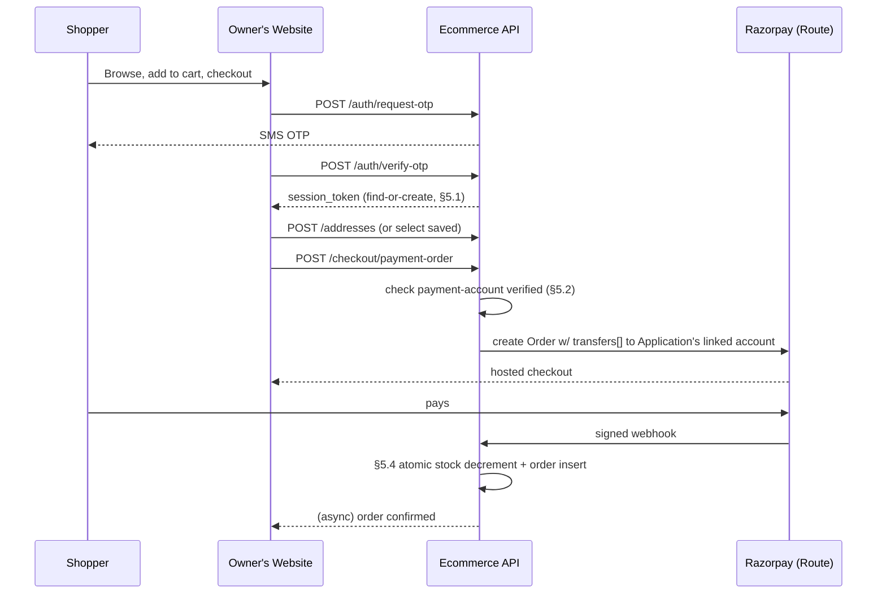
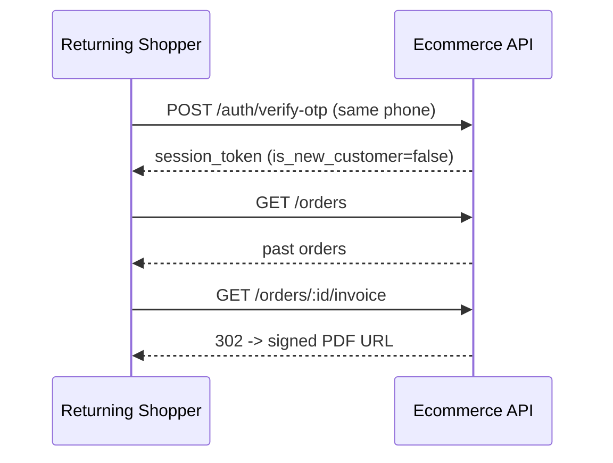
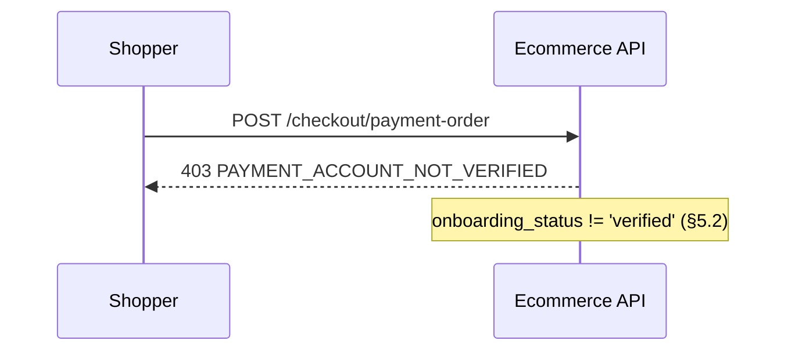
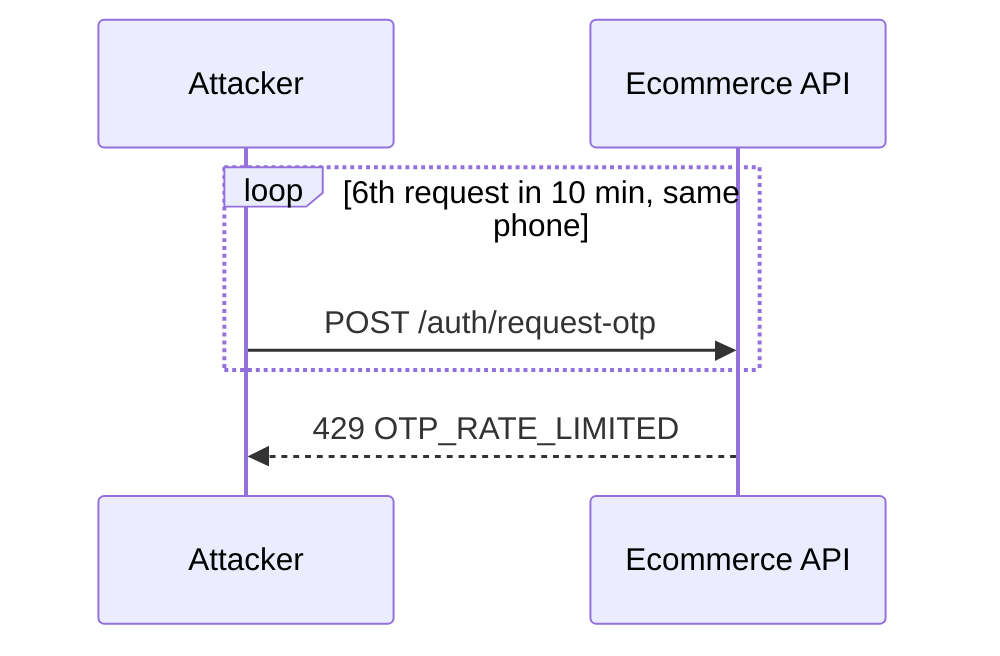

# Phase 8 — Consumer Identity & Ecommerce Checkout Payments — LLD

**Status:** Implementation-ready
**Parent:** `phases/phase8/prd.md` · **Master refs:** `PRD.md` §6.10/§6.11, `HLD.md` §8, §11.3, §11.5

## 1. Scope

This LLD covers the unified phone+OTP Consumer identity model and real, payable ecommerce checkout for Applications with `app_type IN ('ECOMMERCE','HYBRID')`. **This is explicitly not a drop-in reuse of Phase 3's payment infrastructure.** Phase 3's `payment_gateway_orders` tracking table and signed-webhook pattern are reused for the *shape* of the flow, but checkout requires genuinely new gateway capability — a marketplace/sub-account mechanism (Razorpay **Route** linked accounts) so a shopper's payment settles directly into the Application Owner's own bank account, never the platform's. Phase 3's simple Orders API integration does not provide this; Route's linked-account onboarding (KYC) and split-settlement order creation are additive work, not configuration.

Grounding findings from the current codebase that this LLD must reconcile — **two of the four originally reported here were false positives**, caught on re-audit by reading `full_setup.sql` past its first pass (the file layers an original schema with later `ALTER`/patch blocks further down; checking only the first definition of a table/index misses that it's superseded later in the same file):
- ~~`application_otps` is email-keyed, unusable for phone OTP~~ — **false.** A later block (around the `check_application_otp_identity` constraint) already adds `phone_e164`, makes `email` nullable, and adds `idx_application_otps_phone`. `application_otps` is phone-OTP-capable today. No new OTP table needed — reuse it directly.
- ~~`idx_users_phone_tenant_unique` uniques CUSTOMER phone per-tenant, contradicting FR-18~~ — **false.** That index is dropped later in the same file and replaced with role-split indexes: `uq_users_staff_phone_tenant` (staff, tenant-scoped) and `uq_users_app_phone` / `uq_users_app_email` (CUSTOMER/DEALER/APP_MANAGER/APP_VIEWER, scoped by `verification_app_id`). FR-18 is already satisfied today. No new index needed.
- `user_upi_details` is `tenant_id`-scoped (DR-21 requires `application_id`-scoping) — **confirmed real**, needs an actual backfill, not just a schema swap.
- `ecommerce_orders` has no payment or invoice columns at all today — **confirmed real**.

## 2. Database Schema

Migrations folder is currently empty (schema lives in `full_setup.sql` per its own README, pre-production). Since this phase introduces a real backfill (item 4 below) that a fresh-install file cannot express, start the numbered-migration convention here:

### `scan4earn-database/migrations/001_phase8_consumer_checkout.sql`

```sql
-- 1. Address book (DR-18)
CREATE TABLE IF NOT EXISTS customer_addresses (
    id UUID PRIMARY KEY DEFAULT gen_random_uuid(),
    application_id UUID NOT NULL REFERENCES verification_apps(id) ON DELETE CASCADE,
    customer_user_id UUID NOT NULL REFERENCES users(id) ON DELETE CASCADE,
    label VARCHAR(50) DEFAULT 'Home',
    recipient_name VARCHAR(255) NOT NULL,
    phone VARCHAR(20) NOT NULL,
    line1 VARCHAR(255) NOT NULL,
    line2 VARCHAR(255),
    city VARCHAR(100) NOT NULL,
    state VARCHAR(100) NOT NULL,
    pincode VARCHAR(12) NOT NULL,
    country VARCHAR(2) NOT NULL DEFAULT 'IN',
    is_default BOOLEAN DEFAULT false,
    created_at TIMESTAMP WITH TIME ZONE DEFAULT CURRENT_TIMESTAMP,
    updated_at TIMESTAMP WITH TIME ZONE DEFAULT CURRENT_TIMESTAMP
);
CREATE INDEX IF NOT EXISTS idx_customer_addresses_customer ON customer_addresses (application_id, customer_user_id);
-- Only one default address per customer per application
CREATE UNIQUE INDEX IF NOT EXISTS uq_customer_addresses_default
    ON customer_addresses (application_id, customer_user_id) WHERE is_default = true;

-- 2. Consumer OTP storage: NO new table. `application_otps` already supports phone-based OTP
-- (phone_e164 column, nullable email, check_application_otp_identity constraint, idx_application_otps_phone
-- index all already exist in full_setup.sql) — reuse it as-is. See §4/§6 below: every reference to a
-- "consumer_otps" table in an earlier draft of this LLD is corrected to `application_otps`.

-- 3. Consumer scoping for FR-18/FR-37: NO new index needed. `uq_users_app_phone` / `uq_users_app_email`
-- (scoped by verification_app_id, covering CUSTOMER/DEALER/APP_MANAGER/APP_VIEWER rows) already exist in
-- full_setup.sql and already satisfy "one Consumer identity per Application" today.

-- 4. user_upi_details rescope: tenant_id -> application_id (DR-21), with backfill
ALTER TABLE user_upi_details ADD COLUMN IF NOT EXISTS application_id UUID REFERENCES verification_apps(id) ON DELETE CASCADE;

-- Backfill: for each existing UPI row, resolve the owning user's application via their CUSTOMER
-- users.verification_app_id. Rows whose user has no verification_app_id (i.e. legacy non-Customer
-- rows, which should not exist for this table but are handled defensively) are logged, not deleted.
UPDATE user_upi_details uud
SET application_id = u.verification_app_id
FROM users u
WHERE uud.user_id = u.id
  AND uud.application_id IS NULL
  AND u.verification_app_id IS NOT NULL;

-- Rows that failed to backfill (orphaned): surfaced via this diagnostic view, not silently dropped.
CREATE OR REPLACE VIEW v_user_upi_details_backfill_orphans AS
SELECT * FROM user_upi_details WHERE application_id IS NULL;
-- Manual step for release runbook: resolve orphans (delete or manually assign), THEN run:
--   ALTER TABLE user_upi_details ALTER COLUMN application_id SET NOT NULL;
--   ALTER TABLE user_upi_details DROP COLUMN tenant_id;
--   ALTER TABLE user_upi_details DROP CONSTRAINT unique_user_tenant_upi;
--   ALTER TABLE user_upi_details ADD CONSTRAINT unique_user_app_upi UNIQUE (user_id, application_id, upi_id);
-- Left as a follow-up migration (002_phase8_upi_rescope_finalize.sql) gated on the orphan view being empty,
-- so this file stays safely re-runnable and never silently NOT NULLs a column with orphaned rows.

-- 5. Ecommerce order payment + invoice columns (DR-19)
ALTER TABLE ecommerce_orders ADD COLUMN IF NOT EXISTS payment_status VARCHAR(20) NOT NULL DEFAULT 'pending';
ALTER TABLE ecommerce_orders ADD COLUMN IF NOT EXISTS payment_method VARCHAR(30);
ALTER TABLE ecommerce_orders ADD COLUMN IF NOT EXISTS gateway_order_id VARCHAR(100);
ALTER TABLE ecommerce_orders ADD COLUMN IF NOT EXISTS gateway_payment_id VARCHAR(100);
ALTER TABLE ecommerce_orders ADD COLUMN IF NOT EXISTS paid_at TIMESTAMP WITH TIME ZONE;
ALTER TABLE ecommerce_orders ADD COLUMN IF NOT EXISTS invoice_url TEXT;
ALTER TABLE ecommerce_orders ADD CONSTRAINT check_ecommerce_order_payment_status
    CHECK (payment_status IN ('pending', 'paid', 'failed', 'cod'));
CREATE UNIQUE INDEX IF NOT EXISTS uq_ecommerce_orders_gateway_order ON ecommerce_orders (gateway_order_id) WHERE gateway_order_id IS NOT NULL;

-- 6. Per-Application payment gateway sub-account (DR-20)
CREATE TABLE IF NOT EXISTS application_payment_accounts (
    id UUID PRIMARY KEY DEFAULT gen_random_uuid(),
    application_id UUID NOT NULL UNIQUE REFERENCES verification_apps(id) ON DELETE CASCADE,
    gateway VARCHAR(30) NOT NULL DEFAULT 'razorpay_route',
    linked_account_id VARCHAR(100),
    onboarding_status VARCHAR(20) NOT NULL DEFAULT 'pending',
    payouts_enabled BOOLEAN NOT NULL DEFAULT false,
    kyc_details JSONB,
    created_at TIMESTAMP WITH TIME ZONE DEFAULT CURRENT_TIMESTAMP,
    updated_at TIMESTAMP WITH TIME ZONE DEFAULT CURRENT_TIMESTAMP,
    CONSTRAINT check_app_payment_account_status CHECK (onboarding_status IN ('pending', 'verified', 'rejected'))
);
```

This reuses Phase 3's generic `payment_gateway_orders` table. **Correction (cross-checked against `phases/phase3/lld.md` directly):** an earlier draft of this section assumed the `purpose` CHECK constraint needed extending here, under the wrong name (`check_payment_gateway_orders_purpose` vs. Phase 3's actual `chk_payment_gateway_orders_purpose`) and with a stale value list (`'credit_purchase'` singular). Neither is needed or correct:
- Phase 3's original constraint is named `chk_payment_gateway_orders_purpose` and its value list **already includes** `'ecommerce_checkout'`, `'tenant_credit_purchase'`, and `'application_credit_purchase'` (Phase 5 depends on the latter two). This phase's `purpose='ecommerce_checkout'` value is already valid — no ALTER needed.
- Running the old version of this block against a real database would have silently no-op'd the `DROP CONSTRAINT` (wrong name, doesn't exist) and then added a *second*, redundant, incorrectly-scoped constraint alongside Phase 3's original one. Deleted entirely.

The only real schema addition this phase makes to `payment_gateway_orders` is the sub-account routing column:
```sql
ALTER TABLE payment_gateway_orders ADD COLUMN IF NOT EXISTS linked_account_id VARCHAR(100);
-- payer_type for this purpose is 'consumer' (already a valid value in Phase 3's chk_payment_gateway_orders_payer_type);
-- payer_id references users.id (role CUSTOMER); linked_account_id (sourced from this phase's
-- application_payment_accounts.linked_account_id) tells the webhook handler which Route
-- sub-account to reconcile against.
```

## 3. API Contracts

Base: `{application's effective domain}/api/ecommerce/v1/*`. All request/response bodies are JSON. All error responses share the shape `{ "success": false, "error_code": "...", "message": "..." }`.

### 3.1 Consumer Authentication
**`POST /auth/request-otp`** — Auth: Application API key (header `X-Verification-App-Id` or Bearer key, per existing convention).
Request: `{ "phone": "+919876543210" }`
Validates: E.164 format; rate limit (§5.6).
Response `200`: `{ "success": true, "data": { "expires_in_seconds": 300 } }`
Errors: `400 INVALID_PHONE`, `429 OTP_RATE_LIMITED`.

**`POST /auth/verify-otp`** — Auth: API key.
Request: `{ "phone": "+919876543210", "otp": "482913" }`
Response `200`: `{ "success": true, "data": { "session_token": "...", "customer_id": "uuid", "is_new_customer": true } }`
Errors: `400 INVALID_OTP`, `410 OTP_EXPIRED`, `429 OTP_MAX_ATTEMPTS`.
Logic: see §5.1.

### 3.2 Address Book — Auth: Consumer session (Bearer `session_token`)
| Method | Path | Request | Response | Errors |
|---|---|---|---|---|
| GET | `/addresses` | — | `{ data: { addresses: [...] } }` | — |
| POST | `/addresses` | `{label, recipient_name, phone, line1, line2?, city, state, pincode, country?, is_default?}` | `201 { data: { address } }` | `400 VALIDATION_ERROR` (missing required field, invalid pincode format) |
| PUT | `/addresses/:id` | same fields, partial | `200 { data: { address } }` | `404 ADDRESS_NOT_FOUND` (incl. belongs to another customer) |
| DELETE | `/addresses/:id` | — | `200 { data: {} }` | `404 ADDRESS_NOT_FOUND` |
| POST | `/addresses/:id/set-default` | — | `200 { data: { address } }` | `404 ADDRESS_NOT_FOUND` |

### 3.3 Checkout — Auth: Consumer session
**`POST /checkout/payment-order`**
Request: `{ "address_id": "uuid" } | { "address": {inline address object} }`
Preconditions checked in order: (a) cart non-empty → else `400 EMPTY_CART`; (b) `application_payment_accounts.onboarding_status == 'verified'` → else `403 PAYMENT_ACCOUNT_NOT_VERIFIED`; (c) stock availability for every line item → else `409 INSUFFICIENT_STOCK` with the offending `product_id`s.
Response `200`: `{ data: { gateway_order_id, amount, currency, razorpay_key_id, linked_account_id } }` (client uses this to open Razorpay Checkout).

**`POST /webhooks/gateway/checkout`** — Auth: gateway signature (shared infra §5.3/§5.4). Not directly callable by any client.

### 3.4 Orders & Invoices — Auth: Consumer session
| Method | Path | Response | Errors |
|---|---|---|---|
| POST | `/orders` | `201 { data: { order } }` — used only for COD path; paid orders are created inside the webhook handler (§5.4), not this endpoint, to avoid a race where an order exists before payment is confirmed | `400 EMPTY_CART`, `409 INSUFFICIENT_STOCK` |
| GET | `/orders` | `{ data: { orders: [...], pagination } }` — filtered to `customer_user_id = session.user_id`, never another customer's | — |
| GET | `/orders/:id` | `{ data: { order, items } }` | `404 ORDER_NOT_FOUND` |
| POST | `/orders/:id/cancel` | `{ data: { order } }` | `404`, `409 ORDER_NOT_CANCELLABLE` (status past owner-configured boundary) |
| GET | `/orders/:id/invoice` | `302` redirect to a signed, time-limited object-storage URL for the PDF | `404 ORDER_NOT_FOUND`, `409 INVOICE_NOT_READY` (order not yet `paid`) |

### 3.5 Owner-facing payment-account onboarding — Auth: Owner JWT, base `/api/app/*`
| Method | Path | Response |
|---|---|---|
| GET | `/payment-account` | `{ data: { onboarding_status, payouts_enabled, linked_account_id } }` |
| POST | `/payment-account/onboard` | Creates/updates the Razorpay Route linked account via the KYC payload; `202 { data: { onboarding_status: 'pending' } }` — verification is async (gateway-side review), status flips via a gateway callback, not this call directly. |

## 4. State Machines

**`application_payment_accounts.onboarding_status`**: `pending` → `verified` (gateway KYC approval callback) | `pending` → `rejected` (gateway KYC rejection callback, resubmit re-enters `pending`).

**`ecommerce_orders.payment_status`**: `pending` → `paid` (webhook confirmed) | `pending` → `failed` (webhook reports failure, stock is NOT decremented, cart is preserved for retry) | (Tenant/Owner-configured) `pending`/`cod` accepted directly for COD orders with no gateway step.

## 5. Business Logic / Algorithms

### 5.1 OTP verify → find-or-create Consumer (unifies register/login)
```
function verifyOtp(application_id, phone, otp_code):
    row = SELECT * FROM application_otps
          WHERE verification_app_id = $1 AND phone_e164 = $2 AND is_used = false
          ORDER BY created_at DESC LIMIT 1
    if row is None: raise INVALID_OTP
    if row.expires_at < now(): raise OTP_EXPIRED
    if row.attempts >= 5: raise OTP_MAX_ATTEMPTS
    if row.otp_code != otp_code:
        UPDATE application_otps SET attempts = attempts + 1 WHERE id = row.id
        raise INVALID_OTP
    UPDATE application_otps SET is_used = true WHERE id = row.id

    # Atomic find-or-create on the existing per-application unique index (uq_users_app_phone,
    # already present in full_setup.sql — no new index needed, see §2 correction)
    BEGIN TRANSACTION
        customer = SELECT * FROM users
                   WHERE verification_app_id = $1 AND phone_e164 = $2 AND role = 'CUSTOMER'
                   FOR UPDATE
        is_new = customer is None
        if is_new:
            customer = INSERT INTO users (verification_app_id, phone_e164, role, tenant_id, is_active)
                       VALUES ($1, $2, 'CUSTOMER', NULL, true)
                       ON CONFLICT (verification_app_id, phone_e164) WHERE role='CUSTOMER'
                       DO NOTHING RETURNING *
            # ON CONFLICT handles the race of two simultaneous requests for the same new phone
            if customer is None:  # lost the race, row now exists
                customer = SELECT * FROM users WHERE verification_app_id=$1 AND phone_e164=$2 AND role='CUSTOMER'
    COMMIT
    session_token = issueJwt({user_id: customer.id, application_id, role: 'CUSTOMER'}, ttl=30 days)
    return {session_token, customer_id: customer.id, is_new_customer: is_new}
```

### 5.2 Checkout gate (NFR-11)
```
middleware requirePaymentAccountVerified(req):
    account = SELECT * FROM application_payment_accounts WHERE application_id = req.application_id
    if account is None or account.onboarding_status != 'verified':
        return 403 { error_code: 'PAYMENT_ACCOUNT_NOT_VERIFIED',
                      message: 'This store cannot accept payments yet.' }
    # If the Tenant has separately enabled a COD fallback for this Application, allow
    # POST /orders (COD path) to bypass this gate — checkout/payment-order still requires it.
```

### 5.3 Checkout order creation against the Application's own sub-account
```
function createCheckoutPaymentOrder(application_id, customer, cart, address):
    account = get application_payment_accounts for application_id  # must be 'verified' (5.2 already checked)
    amount = sum(item.price * item.quantity for item in cart.items) + shipping + tax
    gateway_order = razorpay.orders.create({
        amount: amount * 100,  # paise
        currency: 'INR',
        transfers: [{ account: account.linked_account_id, amount: amount * 100, on_hold: false }]
        # Route's split-settlement: 100% of the order value transfers to the Application's
        # own linked account; Scan4Earn's platform account is never credited.
    })
    INSERT INTO payment_gateway_orders (purpose, payer_type, payer_id, application_id,
        linked_account_id, gateway_order_id, amount, status, idempotency_key)
    VALUES ('ecommerce_checkout', 'consumer', customer.id, application_id,
        account.linked_account_id, gateway_order.id, amount, 'created', gen_random_uuid())
    return gateway_order
```

### 5.4 Webhook confirmation → paid → atomic stock decrement (single transaction)
```
function onCheckoutWebhook(payload, signature):
    verifySignature(payload, signature, RAZORPAY_WEBHOOK_SECRET)  # HMAC-SHA256, reject on mismatch -> 400
    pgo = SELECT * FROM payment_gateway_orders WHERE gateway_order_id = payload.order_id FOR UPDATE
    if pgo.status == 'paid': return 200  # idempotent no-op on webhook retry
    if pgo.status != 'created': return 200  # already failed/reconciled, ignore stale retry

    BEGIN TRANSACTION
        for item in cart.items:
            UPDATE products SET stock_quantity = stock_quantity - item.quantity
            WHERE id = item.product_id AND stock_quantity >= item.quantity
            # if UPDATE affects 0 rows -> oversold race: ROLLBACK, mark order 'failed',
            # trigger a refund via the gateway, notify the customer. This is the one case
            # where a webhook can still result in payment_status='failed' after money moved —
            # documented explicitly, refund is NOT optional here.
        order = INSERT INTO ecommerce_orders (..., payment_status='paid',
                    gateway_order_id=pgo.gateway_order_id, paid_at=now()) RETURNING id
        UPDATE payment_gateway_orders SET status='paid', webhook_received_at=now() WHERE id=pgo.id
    COMMIT
    enqueue invoice_generation_job(order.id)  # async, see 5.5
```

### 5.5 Invoice generation — decided: **Puppeteer-rendered HTML→PDF**
Chosen over a templating-only PDF library (e.g. `pdfkit`) because invoices need the same branding/CSS the Application's dashboard already uses, and HTML templates are far cheaper to maintain than a layout-DSL. Runs as an async job (not inline in the webhook transaction, so a slow render never blocks payment confirmation): render `invoice.ejs` template with order/line-item data → Puppeteer `page.pdf()` → upload to Object Storage (HLD §3) → `UPDATE ecommerce_orders SET invoice_url = $1`.

### 5.6 OTP rate limiting — decided: **fixed-window counter in Postgres** (no new infra dependency; Redis is a valid future optimization, not required for correctness at this stage)
Limits: 5 requests / phone number / 10 minutes; 20 requests / Application / minute; 30 requests / IP / 10 minutes. Each checked via `SELECT count(*) FROM application_otps WHERE <dimension> AND created_at > now() - interval '<window>'` before inserting a new row; exceeding any dimension returns `429 OTP_RATE_LIMITED` with a `retry_after_seconds` field.

## 6. Sequence Diagrams









## 7. Validation & Error Catalog

| Code | HTTP | Condition |
|---|---|---|
| `INVALID_PHONE` | 400 | Phone not E.164 |
| `OTP_RATE_LIMITED` | 429 | Any of §5.6's three dimensions exceeded |
| `INVALID_OTP` | 400 | Code mismatch |
| `OTP_EXPIRED` | 410 | Past `expires_at` (5 min TTL) |
| `OTP_MAX_ATTEMPTS` | 429 | ≥5 wrong attempts on one OTP row |
| `VALIDATION_ERROR` | 400 | Address missing required field / bad pincode |
| `ADDRESS_NOT_FOUND` | 404 | Wrong id or belongs to a different customer |
| `EMPTY_CART` | 400 | Checkout attempted with no cart items |
| `PAYMENT_ACCOUNT_NOT_VERIFIED` | 403 | §5.2 |
| `INSUFFICIENT_STOCK` | 409 | Stock check fails at order-creation or webhook time |
| `ORDER_NOT_FOUND` | 404 | Wrong id or not this customer's |
| `ORDER_NOT_CANCELLABLE` | 409 | Status past the owner-configured cancellable boundary |
| `INVOICE_NOT_READY` | 409 | Order not yet `paid`, or async render job still running |
| `WEBHOOK_SIGNATURE_INVALID` | 400 | HMAC mismatch (§5.4) — logged as a security event, not just rejected |

## 8. File/Module Plan

| File | Action | Purpose |
|---|---|---|
| `scan4earn-database/migrations/001_phase8_consumer_checkout.sql` | New | §2 DDL |
| `scan4earn-database/migrations/002_phase8_upi_rescope_finalize.sql` | New (deferred, gated on orphan cleanup) | Finalizes DR-21 |
| `scan4earn-server/src/routes/ecommerceApi.routes.js` | Modify | Add `/auth/*`, `/addresses/*`, `/checkout/payment-order`, `/orders/:id/cancel`, `/orders/:id/invoice` |
| `scan4earn-server/src/controllers/consumerAuth.controller.js` | New | §5.1 |
| `scan4earn-server/src/services/consumerOtp.service.js` | New | OTP issuance/rate-limit (§5.6) |
| `scan4earn-server/src/controllers/addresses.controller.js` | New | §3.2 |
| `scan4earn-server/src/controllers/checkout.controller.js` | New | §5.3 |
| `scan4earn-server/src/routes/webhooks.routes.js` | Modify | Add `/webhooks/gateway/checkout` receiver (§5.4) |
| `scan4earn-server/src/services/invoice.service.js` | New | §5.5, Puppeteer render + upload |
| `scan4earn-server/src/services/paymentGateway.service.js` | Modify | Add Route linked-account creation + split-settlement order creation |
| `scan4earn-server/src/modules/app-owner/controllers/paymentAccount.controller.js` | New | §3.5 |

## 9. Configuration
`RAZORPAY_WEBHOOK_SECRET`, `OTP_RATE_LIMIT_PER_PHONE=5/10m`, `OTP_RATE_LIMIT_PER_APP=20/1m`, `OTP_RATE_LIMIT_PER_IP=30/10m`, `OTP_TTL_SECONDS=300`, `INVOICE_STORAGE_BUCKET`, `PUPPETEER_EXECUTABLE_PATH` (container-dependent).

## 10. Test Plan
Maps to Phase 8 `prd.md` DoD: new-phone OTP creates account / returning-phone logs in (unit, §5.1); address CRUD incl. reused vs. one-off inline address (integration); payment-account unverified blocks checkout (integration, §5.2); duplicate webhook delivery is a no-op (idempotency, §5.4); concurrent orders on the same low-stock item — one succeeds, one gets `INSUFFICIENT_STOCK` at the atomic decrement, not both (concurrency test, §5.4); order list/detail/invoice scoped strictly to the requesting customer (authz test); cancel blocked past configured status (unit); OTP rate limit trips on all three dimensions independently (unit); `user_upi_details` backfill migration is idempotent on re-run and produces zero orphans against seed data (migration test).

## 11. Open Questions / Assumptions
- Assumed Puppeteer for invoice PDF rendering (master PRD left this explicitly open) — a lighter `pdfkit`-based approach is a valid alternative if Puppeteer's container/memory footprint proves too costly in practice.
- Assumed fixed-window (not sliding-window/token-bucket) rate limiting to avoid introducing Redis as a new dependency this phase; revisit if abuse patterns demand smoother limiting.
- **Resolved (was a dangling reference):** the COD-fallback flag has a concrete home — the existing generic `features`/`verification_app_features` mechanism (already in `full_setup.sql`, used elsewhere for per-Application feature toggles) is reused rather than inventing a new flag system. Concretely: `INSERT INTO features (code, name) VALUES ('ecommerce_cod_fallback', 'Allow Cash on Delivery')` (Super Admin-managed, seeded once), then `verification_app_features (verification_app_id, feature_id, enabled)` toggled per-Application by its Tenant Admin. `POST /orders`'s COD path checks `EXISTS (SELECT 1 FROM verification_app_features WHERE verification_app_id=$1 AND feature_id=(SELECT id FROM features WHERE code='ecommerce_cod_fallback') AND enabled=true)` before allowing the payment-account-unverified bypass.
