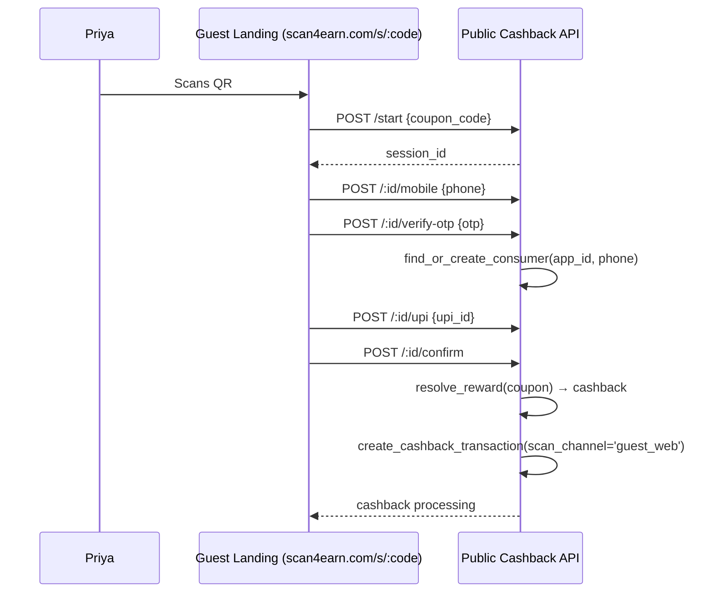
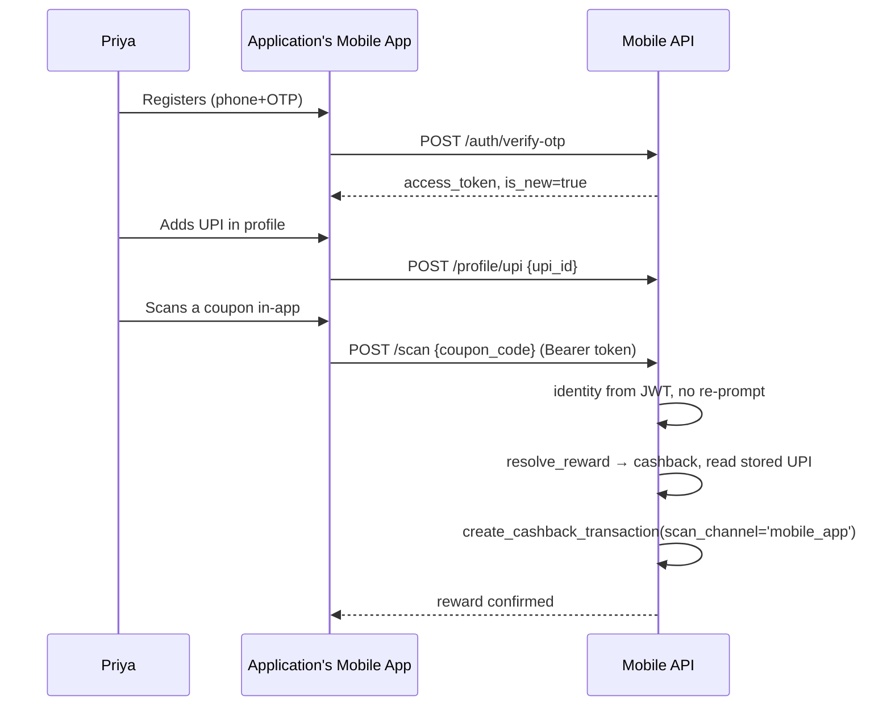
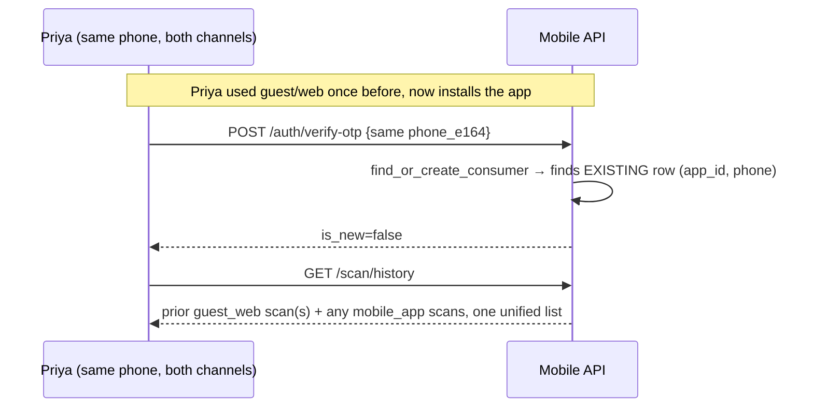
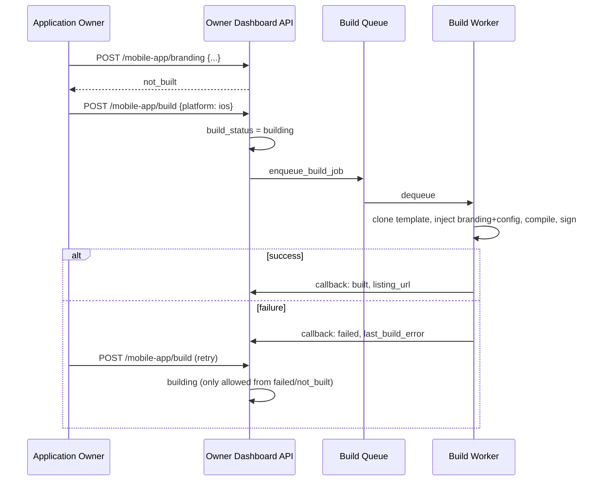

# Phase 9 — Low-Level Design: White-Labeled Mobile Apps & Authenticated Scan Channel

**Companion to:** `phases/phase9/prd.md` · Master `PRD.md` §6.12/§6.13 · `HLD.md` §9, §10, §11.3, §11.6

---

## 1. Scope

This LLD covers: (a) finalizing Channel 1 (guest/web scan — already functional, this phase adds the `scan_channel` tag and confirms the UPI-never-persisted rule), (b) Channel 2 (authenticated in-app scan with stored UPI), (c) the `application_mobile_apps` build-tracking model and branding/build/status endpoints, and (d) completing dealer-code removal in the mobile surface. **No dependency on Phase 5.** Phase 5 gates coupon-*batch creation* (`application_credit_balance` debit at batch-creation time); this phase concerns *scanning an already-active coupon*, which has never been credit-metered in the schema or the PRD (FR-13's gate is on `POST /coupon-batches`, not on `POST /mobile/scan` or the public cashback flow). This phase depends only on Phase 1 (identity/role foundation, and the `verification_app_id`→`application_id` tightening), Phase 2 (coupon lifecycle must exist for there to be anything to scan), and Phase 8 (the shared Consumer identity model both channels write into).

**Codebase reality check (important for implementers):** the current codebase has *two* overlapping scan-authenticated endpoints — `POST /api/mobile/v1/scan` (`mobileScan.routes.js` → `mobileScan.controller.scanCoupon`, unconditional) and `POST /api/mobile/v1/cashback/scan` (`cashbackMobile.routes.js` → `cashbackMobileController.scan`, gated behind `requireFeature('coupon_cashback.open_scanning')`). It also has two parallel reward ledgers already in the schema: `points_transactions` (EARN/REDEEM/EXPIRE/ADJUST, redeemable via `redemption_requests`) and `cashback_transactions` (direct UPI payout). Coupons already carry both `coupon_points` and `cashback_amount` columns, meaning **reward type is a per-coupon/batch property, not a per-Application property** — a single Application can issue both points-coupons and cashback-coupons. This LLD's decision (§5): `POST /mobile/scan` (`mobileScan.routes.js`) becomes the **one canonical Channel-2 scan endpoint**; internally it dispatches to the points ledger or the cashback ledger based on the scanned coupon's configured reward type. `cashbackMobile.routes.js`'s `/scan` is deprecated in favor of this (its `/upi`, `/balance`, `/history`, `/retry` sub-resources are retained and reused, just no longer duplicate the scan action itself).

---

## 2. Database Schema

### 2.1 Confirmed current state (read from `full_setup.sql` before writing this)
`scans`, `points_transactions`, and `cashback_transactions` already have a **nullable** `verification_app_id UUID REFERENCES verification_apps(id)` (added via `ALTER TABLE ... ADD COLUMN IF NOT EXISTS` further down `full_setup.sql`, lines ~2582–2586), with composite indexes already on `(tenant_id, verification_app_id, ...)`. Phase 1's DR-1 is responsible for making this column `NOT NULL` platform-wide. **This phase's migration assumes Phase 1's migration has already run** and does not re-touch that column's nullability — it only adds what's new here.

### 2.2 Migration file: `scan4earn-database/migrations/00X_phase9_scan_channel_and_mobile_apps.sql`
*(replace `00X` with the next sequential number after whatever Phases 1–8 have already claimed — coordinate at merge time; this file is written assuming it is applied after Phase 1's `application_id` tightening.)*

```sql
-- Phase 9: scan channel tagging + white-labeled mobile app tracking

-- DR-22: tag every scan/cashback record with its originating channel
ALTER TABLE scans
  ADD COLUMN IF NOT EXISTS scan_channel VARCHAR(20) NOT NULL DEFAULT 'guest_web'
  CHECK (scan_channel IN ('guest_web', 'mobile_app'));

ALTER TABLE cashback_transactions
  ADD COLUMN IF NOT EXISTS scan_channel VARCHAR(20) NOT NULL DEFAULT 'guest_web'
  CHECK (scan_channel IN ('guest_web', 'mobile_app'));

-- points_transactions also needs the tag since Channel-2 scans may award points
ALTER TABLE points_transactions
  ADD COLUMN IF NOT EXISTS scan_channel VARCHAR(20) NOT NULL DEFAULT 'guest_web'
  CHECK (scan_channel IN ('guest_web', 'mobile_app'));

CREATE INDEX IF NOT EXISTS idx_scans_channel ON scans (verification_app_id, scan_channel, scanned_at DESC);
CREATE INDEX IF NOT EXISTS idx_cashback_channel ON cashback_transactions (verification_app_id, scan_channel, created_at DESC);
CREATE INDEX IF NOT EXISTS idx_points_channel ON points_transactions (verification_app_id, scan_channel, created_at DESC);

-- DR-23: white-labeled mobile app tracking, one row per (Application, platform)
CREATE TABLE IF NOT EXISTS application_mobile_apps (
    id UUID PRIMARY KEY DEFAULT gen_random_uuid(),
    application_id UUID NOT NULL REFERENCES verification_apps(id) ON DELETE CASCADE,
    platform VARCHAR(10) NOT NULL CHECK (platform IN ('ios', 'android')),
    bundle_id VARCHAR(255) NOT NULL,
    app_store_listing_url TEXT,
    branding_config JSONB NOT NULL DEFAULT '{}'::jsonb,
    -- branding_config shape: { "app_name": string, "icon_url": string,
    --   "splash_url": string, "primary_color": "#RRGGBB", "secondary_color": "#RRGGBB" }
    build_status VARCHAR(20) NOT NULL DEFAULT 'not_built'
      CHECK (build_status IN ('not_built', 'building', 'built', 'failed')),
    last_build_error TEXT,
    last_built_at TIMESTAMP WITH TIME ZONE,
    version VARCHAR(20) NOT NULL DEFAULT '1.0.0',
    created_at TIMESTAMP WITH TIME ZONE DEFAULT CURRENT_TIMESTAMP,
    updated_at TIMESTAMP WITH TIME ZONE DEFAULT CURRENT_TIMESTAMP,
    CONSTRAINT unique_app_platform UNIQUE (application_id, platform),
    CONSTRAINT unique_bundle_id UNIQUE (bundle_id)
);

CREATE INDEX IF NOT EXISTS idx_application_mobile_apps_app ON application_mobile_apps (application_id);
CREATE INDEX IF NOT EXISTS idx_application_mobile_apps_status ON application_mobile_apps (build_status);

DROP TRIGGER IF EXISTS update_application_mobile_apps_updated_at ON application_mobile_apps;
CREATE TRIGGER update_application_mobile_apps_updated_at BEFORE UPDATE ON application_mobile_apps
    FOR EACH ROW EXECUTE FUNCTION update_updated_at_column();

-- Dealer removal completion check (idempotent — no-ops if Phase 1 already ran this)
DROP TABLE IF EXISTS dealer_point_transactions;
DROP TABLE IF EXISTS dealer_points;
DROP TABLE IF EXISTS dealers;
```

**Why `unique_app_platform` not `unique_app` alone:** an Application may publish both an iOS and an Android app — each is tracked as its own row with its own `build_status`/`bundle_id`/store listing.

**`user_upi_details` note:** DR-21's tenant→application rescoping is Phase 8's job (it owns the consumer-identity model). This phase's Channel-2 UPI-management endpoints (`/mobile/profile/upi`, `cashbackMobile`'s `/upi` GET/POST) assume Phase 8 has already added `application_id` to `user_upi_details`; if Phase 8 has not landed yet in a given environment, these endpoints must reject with `503 DEPENDENCY_NOT_READY` rather than silently writing tenant-scoped rows.

---

## 3. API Contracts

Base paths per the real `server.js` mounts (verified against source, not assumed):
- Public/guest: `/api/public/cashback/*` (Channel 1)
- Authenticated mobile: `/api/mobile/v1/auth/*`, `/api/mobile/v1/scan/*`, `/api/mobile/v1/points/*`, `/api/mobile/v1/transactions/*`, `/api/mobile/v1/cashback/*` (Channel 2, minus its deprecated `/scan`)
- Owner dashboard (this phase's new pieces): `/api/app/mobile-app/*`

### 3.1 Channel 1 — Guest/Web (`/api/public/cashback`, existing, unauthenticated, rate-limited 30 req/15min/IP)

| Method | Path | Request body | Response (200) | Errors |
|---|---|---|---|---|
| POST | `/start` | `{ "coupon_code": string }` | `{ "session_id": uuid, "application_branding": {...}, "expires_at": iso8601 }` | `404 COUPON_NOT_FOUND`, `409 COUPON_ALREADY_USED`, `403 APPLICATION_INACTIVE` (Phase 4 paywall gate) |
| POST | `/:sessionId/mobile` | `{ "phone_e164": string }` | `{ "otp_sent": true }` | `404 SESSION_NOT_FOUND`, `410 SESSION_EXPIRED`, `429 RATE_LIMITED` |
| POST | `/:sessionId/verify-otp` | `{ "otp": string }` | `{ "verified": true, "consumer_id": uuid }` — **this is where the Consumer row is found-or-created**, per Phase 8's model, scoped `(application_id, phone_e164)` | `400 INVALID_OTP`, `410 OTP_EXPIRED`, `429 TOO_MANY_ATTEMPTS` |
| POST | `/:sessionId/upi` | `{ "upi_id": string }` | `{ "accepted": true }` — **stored only in the session row, never written to `user_upi_details`** | `400 INVALID_UPI_FORMAT` (regex: `^[\w.\-]{2,256}@[a-zA-Z]{2,64}$`) |
| POST | `/:sessionId/confirm` | `{}` | `{ "cashback_transaction_id": uuid, "amount": number, "status": "PROCESSING" }` | `409 SESSION_ALREADY_CONFIRMED`, `422 PAYOUT_INITIATION_FAILED` |

### 3.2 Channel 2 — Mobile App (`/api/mobile/v1/*`, existing `authenticate` middleware = Bearer JWT from `/auth/verify-otp`)

| Method | Path | Request body | Response (200) | Errors | Codebase status |
|---|---|---|---|---|---|
| POST | `/auth/request-otp` | `{ "phone_e164": string }` | `{ "otp_sent": true }` | `429 RATE_LIMITED` (existing: 50/15min/IP+phone) | No Change |
| POST | `/auth/verify-otp` | `{ "phone_e164": string, "otp": string }` | `{ "access_token": string, "refresh_token": string, "consumer_id": uuid, "is_new": boolean }` | `400 INVALID_OTP` | Needs Modification *(remove the two `dealer*` sibling exports — §8)* |
| POST | `/auth/refresh` | `{ "refresh_token": string }` | `{ "access_token": string }` | `401 INVALID_REFRESH_TOKEN` | No Change |
| POST | `/auth/logout` | `{}` | `{ "logged_out": true }` | — | No Change |
| GET | `/auth/me` (→ rename to `/auth/context` for HLD naming consistency, or alias both) | — | `{ "consumer_id": uuid, "application_id": uuid, "phone_e164": string, "has_upi": boolean }` | `401` | Needs Modification *(alias, no logic change)* |
| GET | `/profile` | — | `{ "consumer_id": uuid, "phone_e164": string, "name": string\|null, "upi_id": string\|null, "upi_verified": boolean }` | `401` | New *(thin wrapper reading `user_upi_details`)* |
| PUT | `/profile` | `{ "name"?: string }` | `{ "updated": true }` | `400` | New |
| POST | `/profile/upi` | `{ "upi_id": string }` | `{ "upi_id": string, "is_verified": false }` | `400 INVALID_UPI_FORMAT`, `409 UPI_ALREADY_EXISTS` | New *(writes `user_upi_details`, `is_primary=true`, unique per `(user_id, application_id, upi_id)`)* |
| POST | `/scan` | `{ "coupon_code": string, "latitude"?: number, "longitude"?: number }` | `{ "scan_id": uuid, "reward_type": "points"\|"cashback", "reward_value": number, "new_balance": number }` | `404 COUPON_NOT_FOUND`, `409 COUPON_ALREADY_USED`, `403 COUPON_WRONG_APPLICATION` (cross-Application rejection), `422 NO_UPI_ON_FILE` (cashback-type coupon, no stored UPI — instructs client to call `/profile/upi` first) | Needs Modification *(this becomes the canonical dispatch point — §5)* |
| GET | `/scan/history` | `?page&limit` | `{ "scans": [...], "pagination": {...} }` — includes `scan_channel` on every row | `401` | Needs Modification *(add `scan_channel` to the projection)* |
| GET | `/scan/:id` | — | scan detail | `404` | No Change |
| GET | `/scan/stats/summary` | — | `{ "total_scans": n, "total_earned": n }` | — | No Change |
| GET | `/points/transactions` | `?page&limit&type` | points ledger | — | No Change |
| POST | `/points/redeem` | `{ "points": n, "notes"?: string }` | redemption request created | `422 INSUFFICIENT_POINTS` | No Change |
| GET | `/points/redemptions` | `?status` | list | — | No Change |
| GET | `/transactions` | `?page&limit&type` | unified scan+redeem feed | — | Needs Modification *(this is the base for FR-46's unified history — must also union in `cashback_transactions`, which it currently does not per the existing controller's "scan + redeem" comment; verify/extend)* |
| GET | `/cashback/upi` | — | `{ "upi_id": string\|null }` | — | No Change *(kept as an alias of `/profile`; retained for backward compatibility)* |
| POST | `/cashback/upi` | `{ "upi_id": string }` | saved | `400` | No Change *(alias of `/profile/upi`)* |
| GET | `/cashback/history` | — | cashback ledger | — | No Change |
| GET | `/cashback/balance` | — | `{ "balance": number }` | — | No Change |
| POST | `/cashback/retry/:transactionId` | — | retry a stuck payout | `409 NOT_RETRYABLE` (status ≠ FAILED) | No Change |
| ~~POST~~ | ~~`/cashback/scan`~~ | — | — | — | **Deprecated** — returns `410 { "message": "Use POST /api/mobile/v1/scan" }`; remove the `open_scanning` feature gate's coupling to this specific route (§8) |

### 3.3 Owner dashboard — white-label app management (`/api/app/mobile-app/*`, Owner JWT, per HLD §11.3)

| Method | Path | Request body | Response (200) | Errors |
|---|---|---|---|---|
| POST | `/branding` | `{ "platform": "ios"\|"android", "app_name": string, "bundle_id": string, "icon_url": string, "splash_url": string, "primary_color": "#RRGGBB", "secondary_color": "#RRGGBB" }` | `{ "application_mobile_app_id": uuid, "build_status": "not_built" }` (upserts the row for that platform) | `400 INVALID_BUNDLE_ID` (must match `^[a-z][a-z0-9_]*(\.[a-z][a-z0-9_]*)+$`), `409 BUNDLE_ID_TAKEN` |
| POST | `/build` | `{ "platform": "ios"\|"android" }` | `{ "build_status": "building" }` | `409 BUILD_ALREADY_IN_PROGRESS`, `422 NO_BRANDING_SUBMITTED` (must POST `/branding` first) |
| GET | `/status` | `?platform` | `{ "platform": string, "build_status": string, "last_built_at": iso8601\|null, "last_build_error": string\|null, "app_store_listing_url": string\|null, "version": string }` | `404 NOT_YET_CONFIGURED` |

---

## 4. State Machines

### 4.1 `application_mobile_apps.build_status`

| From | Event | To | Guard |
|---|---|---|---|
| `not_built` | `POST /build` | `building` | branding_config is non-empty |
| `building` | build pipeline succeeds (webhook/callback) | `built` | — |
| `building` | build pipeline fails | `failed` | sets `last_build_error` |
| `built` | `POST /branding` (any field changes) | `building` | re-triggers automatically, or owner must call `POST /build` again — **decision: require an explicit `POST /build` call after a branding change**, do not auto-rebuild, so the owner controls when a fresh app-store submission cycle starts |
| `failed` | `POST /build` (retry) | `building` | — |
| `building` | `POST /build` called again while already building | *(no transition)* | rejected with `409 BUILD_ALREADY_IN_PROGRESS` |

### 4.2 Scan-channel-agnostic coupon consumption (existing `coupons.status`, unchanged this phase: `draft→printed→active→used/inactive/expired/exhausted`) — both channels write to the same state machine, differing only in which controller path triggers the transition and what `scan_channel` value is stamped.

---

## 5. Business Logic / Algorithms

### 5.1 Channel divergence (exact pseudocode)

```
function channel1_confirm(session):
    # Guest/Web — public cashback session, no persistent UPI
    assert session.otp_verified == true
    consumer = find_or_create_consumer(application_id=session.application_id, phone=session.phone_e164)
    # UPI lives ONLY on `session.upi_id` (in-memory/session-table field) — never touches user_upi_details
    coupon = lock_and_validate_coupon(session.coupon_code, application_id=session.application_id)
    reward = resolve_reward(coupon)  # points or cashback, per coupon config
    if reward.type == 'cashback':
        txn = create_cashback_transaction(consumer.user_id, application_id, reward.amount,
                                           upi_id=session.upi_id, scan_channel='guest_web')
        trigger_payout(txn)  # ALWAYS from the Super Admin's own payout account — never from any credit ledger
    else:
        award_points(consumer.user_id, application_id, reward.points, scan_channel='guest_web')
    mark_coupon_used(coupon)
    record_scan(consumer.user_id, application_id, coupon.id, scan_channel='guest_web')
    # session.upi_id is discarded after this call — nothing persists it

function channel2_scan(consumer_session, coupon_code):
    # Mobile App — authenticated, identity from JWT, UPI from stored profile
    consumer = consumer_session.consumer  # resolved from JWT, no re-auth
    coupon = lock_and_validate_coupon(coupon_code, application_id=consumer.application_id)
    if coupon.application_id != consumer.application_id:
        raise Error(403, 'COUPON_WRONG_APPLICATION')
    reward = resolve_reward(coupon)
    if reward.type == 'cashback':
        upi = get_primary_upi(consumer.user_id, consumer.application_id)  # reads user_upi_details
        if upi is None:
            raise Error(422, 'NO_UPI_ON_FILE')
        txn = create_cashback_transaction(consumer.user_id, consumer.application_id, reward.amount,
                                           upi_id=upi.upi_id, scan_channel='mobile_app')
        trigger_payout(txn)
    else:
        award_points(consumer.user_id, consumer.application_id, reward.points, scan_channel='mobile_app')
    mark_coupon_used(coupon)
    record_scan(consumer.user_id, consumer.application_id, coupon.id, scan_channel='mobile_app')

function resolve_reward(coupon):
    # Reward type is per-coupon, set at batch-creation time (Phase 2/5), not per-Application
    if coupon.cashback_amount > 0:
        return Reward(type='cashback', amount=coupon.cashback_amount)
    return Reward(type='points', points=coupon.coupon_points)
```

### 5.2 Unified-history proof query (FR-46/47)

```sql
-- One consumer's full activity across both channels, one Application
SELECT 'scan' AS kind, id, scanned_at AS occurred_at, scan_channel, NULL AS amount
FROM scans WHERE user_id = :consumer_user_id AND verification_app_id = :application_id
UNION ALL
SELECT 'cashback', id, created_at, scan_channel, amount
FROM cashback_transactions WHERE user_id = :consumer_user_id AND verification_app_id = :application_id
UNION ALL
SELECT 'points', id, created_at, scan_channel, points
FROM points_transactions WHERE user_id = :consumer_user_id AND verification_app_id = :application_id
ORDER BY occurred_at DESC;
```
This is the query `GET /mobile/transactions` and `GET /mobile/scan/history` must run (or equivalent per-table calls merged app-side) — the proof that a guest-then-app consumer sees continuous history is simply that all three tables key on the *same* `(user_id, verification_app_id)` pair regardless of `scan_channel`, since Channel 1 and Channel 2 both resolve identity through the same Phase-8 `find_or_create_consumer`.

### 5.3 Branding → build pipeline hand-off

Concrete decision: a queue-based build system (e.g. a dedicated `mobile_build_jobs` processing queue backed by the existing job-runner infrastructure, or a simple polling worker if none exists yet).

```
POST /app/mobile-app/build:
    validate application_mobile_apps.branding_config is complete (app_name, bundle_id, icon_url, splash_url set)
    UPDATE application_mobile_apps SET build_status = 'building' WHERE id = :id
    enqueue_build_job({
        application_mobile_app_id: id,
        platform: platform,
        branding_config: branding_config,        # icon/splash URLs, colors, name
        template_repo: "scan4earn/mobile-app-template",  # ONE shared codebase, per FR-50
        api_base_url: application.effective_primary_url,  # per HLD §4 host resolution
        api_key: application.mobile_api_key
    })

Build worker (out of process):
    clone template_repo at a pinned tag
    inject branding_config as build-time constants (app name string, color theme file, icon/splash asset replacement)
    inject api_base_url + api_key as compile-time config (never runtime-fetched, since FR-48 requires a fully separate binary, not a runtime-reskinned shell)
    run platform build (Fastlane for iOS, Gradle for Android)
    on success: sign binary, upload to object storage, callback → build_status='built', last_built_at=now(), app_store_listing_url set once submitted
    on failure: callback → build_status='failed', last_build_error=<log tail>
```

---

## 6. Sequence Diagrams









---

## 7. Validation & Error Catalog

| Code | HTTP | Condition |
|---|---|---|
| `COUPON_NOT_FOUND` | 404 | Coupon code doesn't exist |
| `COUPON_ALREADY_USED` | 409 | `coupons.status` already `used`/`inactive`/`expired`/`exhausted` |
| `COUPON_WRONG_APPLICATION` | 403 | Coupon's `verification_app_id` ≠ the authenticated consumer's/session's Application — cross-Application scan rejection |
| `APPLICATION_INACTIVE` | 403 | Phase 4 paywall gate — Application's subscription not active |
| `INVALID_OTP` | 400 | OTP mismatch |
| `OTP_EXPIRED` | 410 | Past TTL |
| `TOO_MANY_ATTEMPTS` | 429 | OTP verify attempt cap exceeded |
| `INVALID_UPI_FORMAT` | 400 | Fails `^[\w.\-]{2,256}@[a-zA-Z]{2,64}$` |
| `UPI_ALREADY_EXISTS` | 409 | Duplicate on `(user_id, application_id, upi_id)` |
| `NO_UPI_ON_FILE` | 422 | Channel-2 cashback-type scan with no stored UPI |
| `INSUFFICIENT_POINTS` | 422 | Redemption request exceeds balance |
| `NOT_RETRYABLE` | 409 | Retry attempted on a non-`FAILED` cashback transaction |
| `INVALID_BUNDLE_ID` | 400 | Fails reverse-DNS bundle ID pattern |
| `BUNDLE_ID_TAKEN` | 409 | Unique constraint violation on `application_mobile_apps.bundle_id` |
| `BUILD_ALREADY_IN_PROGRESS` | 409 | `build_status = 'building'` |
| `NO_BRANDING_SUBMITTED` | 422 | `POST /build` called with `branding_config = '{}'` |
| `NOT_YET_CONFIGURED` | 404 | `GET /status` for a platform with no `application_mobile_apps` row |
| `DEPENDENCY_NOT_READY` | 503 | Phase 8's `user_upi_details.application_id` column not yet migrated in this environment |

---

## 8. File/Module Plan

| File | Action | Purpose |
|---|---|---|
| `scan4earn-database/migrations/00X_phase9_scan_channel_and_mobile_apps.sql` | New | §2.2 migration |
| `scan4earn-server/src/routes/mobileAuth.routes.js` | Modify | Delete `router.post('/dealer/request-otp', ...)` and `router.post('/dealer/verify-otp', ...)` lines |
| `scan4earn-server/src/controllers/mobileAuth.controller.js` | Modify | Delete `exports.dealerRequestOtp`, `exports.dealerVerifyOtp`, and the dealer branch inside `resolveApp`/`_verifyOtpRecord` if any |
| `scan4earn-server/src/routes/dealer.routes.js` | **Delete** | Dealer role removed entirely (DR-4) |
| `scan4earn-server/src/routes/dealerMobile.routes.js` | **Delete** | Same |
| `scan4earn-server/src/server.js` | Modify | Remove `app.use('/api/v1/tenants/:tenantId/dealers', dealerRoutes)` and `app.use('/api/mobile/v1/dealer', dealerMobileRoutes)` mount lines |
| `scan4earn-server/src/routes/mobileScan.routes.js` | Modify | `POST /` (`scanCoupon`) becomes the canonical dispatch point (§5.1) |
| `scan4earn-server/src/controllers/mobileScan.controller.js` | Modify | Implement `resolve_reward` dispatch (points vs cashback), stamp `scan_channel='mobile_app'`, add cross-Application check |
| `scan4earn-server/src/routes/cashbackMobile.routes.js` | Modify | Remove `/scan` route (return 410 pointing to `/mobile/v1/scan`); keep `/upi`, `/balance`, `/history`, `/retry` |
| `scan4earn-server/src/controllers/cashbackMobile.controller.js` | Modify | Remove `scan` export; keep the rest; expose its UPI/balance/history logic as shared functions `mobileScan.controller.js` can call |
| `scan4earn-server/src/routes/publicCashback.routes.js` | Modify | Add `scan_channel='guest_web'` stamping in `confirmCashback` |
| `scan4earn-server/src/controllers/publicCashback.controller.js` | Modify | Same; confirm UPI is read only from the session record, never written to `user_upi_details` |
| `scan4earn-server/src/routes/mobilePoints.routes.js`, `mobileTransactions.routes.js` | Modify | Add `scan_channel` to response projections |
| `scan4earn-server/src/routes/appMobileApp.routes.js` | **New** | §3.3 owner dashboard endpoints |
| `scan4earn-server/src/controllers/appMobileApp.controller.js` | **New** | Branding CRUD, build trigger, status |
| `scan4earn-server/src/services/mobileBuild.service.js` | **New** | §5.3 queue/worker interface |
| `scan4earn-server/src/routes/publicScan.routes.js` | No Change | Already correctly retired (410 stub) — leave as-is |

---

## 9. Configuration

| Env var | Purpose | Example |
|---|---|---|
| `MOBILE_BUILD_QUEUE_URL` | Build job queue connection | `redis://...` or SQS URL |
| `MOBILE_BUILD_TEMPLATE_REPO` | Shared app codebase location | `git@github.com:scan4earn/mobile-app-template.git` |
| `MOBILE_BUILD_TEMPLATE_TAG` | Pinned version the build pulls | `v1.0.0` |
| `IOS_SIGNING_CERT_PATH` / `ANDROID_KEYSTORE_PATH` | Signing credentials for the build worker | (secret-store reference, never committed) |
| `APP_STORE_CONNECT_API_KEY` / `PLAY_CONSOLE_SERVICE_ACCOUNT` | Store submission credentials | (secret-store reference) |
| `UPI_FORMAT_REGEX` | Overridable UPI validation pattern | `^[\w.\-]{2,256}@[a-zA-Z]{2,64}$` |

---

## 10. Test Plan

Mapped to Phase 9's Definition of Done:

1. **"Guest/web scan never persists UPI beyond the transaction"** → integration test: complete a Channel-1 flow with UPI `test@upi`, then query `user_upi_details` for that phone/application — assert zero rows.
2. **"Test Application's app can be branded and built"** → submit `/branding`, call `/build`, mock the worker callback to `built`, assert `GET /status` reflects it.
3. **"Consumer registered in-app has UPI on file, scans without re-entry"** → register, `POST /profile/upi`, then `POST /scan` for a cashback-type coupon — assert no UPI field required in the scan request and the transaction's `upi_id` matches the stored one.
4. **"Guest-then-app unified history"** → run a Channel-1 flow for phone X, then register via Channel 2 with the same phone, call `GET /scan/history` — assert both entries present, correctly tagged.
5. **"Every scan/cashback record tags scan_channel"** → assert on both flows' resulting rows.
6. **"Two Applications' apps are genuinely separate"** → build both, assert distinct `bundle_id`, distinct `application_mobile_apps` rows, and that template injection produced different `api_base_url`/`api_key` compiled into each (cannot literally test compiled binaries in CI — assert the build-job payload differs per Application, which is the observable proxy).

**Additional edge cases:**
- Cross-Application scan attempt → `403 COUPON_WRONG_APPLICATION`.
- `POST /build` called twice back-to-back → second call gets `409 BUILD_ALREADY_IN_PROGRESS`.
- Branding updated after a successful build → `build_status` stays `built` until owner explicitly calls `/build` again (no auto-rebuild, per §4.1's decision).
- Cashback-type scan with no stored UPI in Channel 2 → `422 NO_UPI_ON_FILE`, and confirm this never happens on Channel 1 (UPI always collected inline there).
- Points-type coupon scanned via either channel → `points_transactions` row created, no cashback transaction, `scan_channel` still correctly tagged.
- Legacy `POST /api/mobile/v1/cashback/scan` call → `410 Gone` pointing to the new canonical path.

---

## 11. Open Questions / Assumptions

1. **Assumed:** `POST /mobile/scan` (not `POST /cashback/scan`) becomes canonical — this is a real consolidation decision over existing duplicated code, not something the PRD specified explicitly. Flag to the team before implementing; if `cashbackMobile`'s route has callers/analytics tied to it already, a deprecation window may be needed instead of an immediate 410.
2. **Assumed:** no auto-rebuild on branding change (§4.1) — the PRD doesn't specify this either way; picked the more conservative option (owner controls when app-store review cycles start) consistent with NFR-12's cost framing.
3. **Assumed:** a queue+worker build pipeline shape (§5.3) — HLD only specifies the pipeline's *existence*, not its concrete technology. If the team already has CI infrastructure (e.g. GitHub Actions), that's a valid, likely-cheaper substitute for a bespoke queue; this LLD's job/payload contract should still hold either way.
4. **Depends on Phase 8 landing first** for `user_upi_details.application_id` — this LLD's `DEPENDENCY_NOT_READY` error code is a safety net, not a substitute for sequencing Phase 8 before this phase in an actual rollout.
